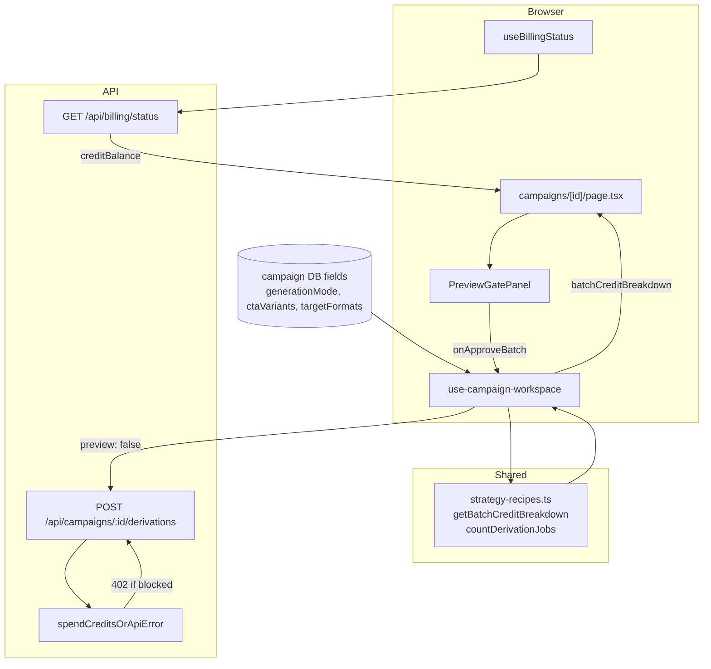

# Phase 80: Credit Estimate Transparency - Research

**Researched:** 2026-06-07  
**Domain:** Preview-gate credit UX, billing balance wiring, batch estimate accuracy  
**Confidence:** HIGH

## Summary

Phase 80 extends the existing v11.8 F-01 `PreviewGatePanel` credit box with a **mode-aware batch formula** (`N × 5 = total`), **always-visible workspace balance**, and a **client-side insufficient-credit gate** that disables "Approve batch" before the API is called. No new billing APIs or packages are required — the work is wiring `getBatchCreditBreakdown` (planned in 80-01) from persisted campaign config, `useBillingStatus()` for `creditBalance`, and i18n under `strategyRecipes.previewGate`.

The critical implementation risk is **estimate drift**: `use-campaign-workspace.ts` builds `RecipeGenerationConfig` differently from the derivations POST handler in edge cases (empty CTAs, `format_adaptation` with missing `targetFormats`). Server-side `spendCreditsOrApiError` in `derivations/route.ts` remains the 402 backstop; UI blocking is CRED-02 happy-path only.

**Primary recommendation:** Single source of truth via `getBatchCreditBreakdown` + align campaign→config builder with server job counting (especially format mode empty formats); wire `useBillingStatus()` on the campaign page; implement formula/balance/block UI in `PreviewGatePanel` per locked CONTEXT decisions.

<user_constraints>
## User Constraints (from CONTEXT.md)

### Locked Decisions

#### Batch estimate breakdown (CRED-01)
- Show **compact formula**, not a per-piece list: `N × 5 créditos = total` (reuse `countDerivationJobs` × `IMAGE_DERIVATION_CREDIT_COST`).
- **Replace** the current single `batchCost` line with the formula + total (inline in the credit box).
- **Mode-aware label:**
  - `art_variation` → count CTAs (e.g. `3 CTAs × 5 créditos = 15`)
  - `format_adaptation` → count formats (e.g. `2 formatos × 5 créditos = 10`)
- **Preview spend stays separate** from batch breakdown: keep existing `previewSpent` line above batch formula (do not combine into one running total).

#### Insufficient balance (CRED-02)
- When `saldo < estimativa do batch`: **disable** "Aprovar batch" button.
- Show explicit copy: **estimativa X · saldo Y** (localized PT-BR / EN).
- Server-side `spendCreditsOrApiError` / 402 remains as backstop — UI must prevent the happy-path click when blocked.

#### Balance visibility
- **Always** show workspace credit balance in the preview gate credit section (alongside preview spent + batch formula).
- Balance source: wire from existing workspace/billing data (dashboard stats or equivalent) — planner chooses fetch path; no new billing subsystem.

#### Preview disclaimer (CRED-04)
- **Keep subtle tone** — existing muted `creditEstimateNote` style; ensure PT-BR and EN strings are consistent and present.
- No extra alert icon or aggressive warning treatment in this phase.

### Claude's Discretion
- Exact i18n key names and layout spacing within `PreviewGatePanel` credit box.
- How `batchCreditEstimate`, job count, and `generationMode` are passed from `page.tsx` / `use-strategy-recipe` / `use-campaign-workspace`.
- Whether to show formula only when `batchCredits > 0` or also handle `batchCostPending` edge case with copy-only state.

### Deferred Ideas (OUT OF SCOPE)
- Per-CTA/per-format line-item list in breakdown — user chose compact formula instead.
- Combined running total (preview + batch) — keep separate lines.
- Stronger disclaimer with alert styling — out of scope for this phase.
- Credit surprise ranking / event payload changes — Phase 81 (CRED-03).
</user_constraints>

<phase_requirements>
## Phase Requirements

| ID | Description | Research Support |
|----|-------------|------------------|
| CRED-01 | User sees credit estimate breakdown before confirming batch derivation | `getBatchCreditBreakdown` + mode-aware i18n (`batchFormulaCta` / `batchFormulaFormat`); data from `use-campaign-workspace` campaign config |
| CRED-02 | Batch gate blocks with clear reason when balance is insufficient | `creditBalance` from `useBillingStatus()`; disable approve + `insufficientCredits` copy; server 402 in `derivations/route.ts` as backstop |
| CRED-04 | Preview gate shows credits already spent plus estimate disclaimer | Existing `previewSpent` + `creditEstimateNote` (already in PT/EN); keep separate from batch formula |
</phase_requirements>

## Architectural Responsibility Map

| Capability | Primary Tier | Secondary Tier | Rationale |
|------------|-------------|----------------|-----------|
| Job count / credit math | API / Backend (`strategy-recipes.ts`) | Browser (import shared pure functions) | `countDerivationJobs` and `IMAGE_DERIVATION_CREDIT_COST` already live server-side; client imports for display only |
| Credit spend enforcement | API / Backend (`gates.ts` → `credits.ts`) | — | `spendCreditsOrApiError` on derivations POST; dev-admin bypass in `canSpend` |
| Balance display | Browser (`PreviewGatePanel`) | API (`/api/billing/status`) | UI renders balance; `useBillingStatus` fetches `creditBalance` |
| Insufficient-credit block (happy path) | Browser (`PreviewGatePanel`) | API (402 backstop) | Client disables approve; race conditions handled server-side |
| i18n copy | CDN / Static (message JSON) | Browser (`next-intl`) | Keys under `strategyRecipes.previewGate` |
| Beta cockpit events | Browser (`useRecordBetaEvent`) | — | Unchanged `cockpit_stage_*` on preview gate |

## Standard Stack

### Core

| Library | Version | Purpose | Why Standard |
|---------|---------|---------|--------------|
| `next-intl` | (project dep) | Preview gate + formula i18n | Already used in `PreviewGatePanel`, `StrategyRecipePanel` [VERIFIED: codebase] |
| `@tanstack/react-query` | ^5.100.1 | `useBillingStatus` cache | Existing billing hook pattern [VERIFIED: `app/package.json`] |
| `vitest` + `@testing-library/react` | (project dep) | Unit/component tests | Existing `PreviewGatePanel.test.tsx`, `strategy-recipes.test.ts` [VERIFIED: codebase] |

### Supporting

| Library | Version | Purpose | When to Use |
|---------|---------|---------|-------------|
| `lucide-react` | (project dep) | `Coins` icon in credit box | Already in panel — no change |
| Pure imports from `@/server/ai/strategy-recipes` | — | Breakdown math in client hook | Same pattern as `estimateCreditCost` in `use-campaign-workspace.ts` |

### Alternatives Considered

| Instead of | Could Use | Tradeoff |
|------------|-----------|----------|
| `useBillingStatus()` | `/api/dashboard/stats` `creditsRemaining` | Heavier payload; same number available via billing status [VERIFIED: `billing/status/route.ts`, `repositories/dashboard.ts`] |
| Client-side block only | Server-only 402 | Violates CRED-02 UX requirement; mission-insight friction fires too late |

**Installation:** None — no new packages.

## Architecture Patterns

### System Architecture Diagram



### Current Props / Data Flow (as of research)

**`PreviewGatePanel` props today** [VERIFIED: `PreviewGatePanel.tsx`, `page.tsx`]:

| Prop | Source | Notes |
|------|--------|-------|
| `campaignId` | route param | Beta events |
| `preview` | `previewDerivation` mapped fields | `creditCost` from derivation `cost/100` or fallback |
| `previewCreditsSpent` | `previewDerivation.creditCost ?? 5` | Panel prefers `preview.creditCost` when set |
| `batchCredits` | `batchCreditEstimate ?? 0` from workspace hook | Single total only — no formula/mode |
| `isApproving` | `createDerivationsPending` | Disables buttons while mutating |
| `onReviseRecipe` | opens chooser + `goToDerivation` | Emits `cockpit_stage_abandoned` |
| `onApproveBatch` | `approvePreviewToBatch` | Emits `cockpit_stage_completed` then queues batch |

**`batchCreditEstimate` computation** [VERIFIED: `use-campaign-workspace.ts:375-392`]:

```typescript
const config: RecipeGenerationConfig = {
  generationMode: campaign.generationMode === "format_adaptation" ? "format_adaptation" : "art_variation",
  creativeLevel: campaign.creativeLevel ?? "balanced",
  ctaVariants: (campaign.ctaVariants ?? []).map(trim).filter(Boolean),
  targetFormats: campaign.targetFormats ?? ["1:1", "4:5", "9:16"], // ⚠ drift risk
  preservationEmphasis: "medium",
};
return estimateCreditCost(config); // jobCount * 5
```

**`onApprovePreviewBatch` flow** [VERIFIED: `use-campaign-workspace.ts:330-333`, `use-derivations.ts:99-114`]:

1. `approvePreviewToBatch()` → `handleGenerateDerivations()` (no `{ preview: true }`)
2. `POST /api/campaigns/:id/derivations` with `{ preview: false }`
3. Route builds `jobs[]` from **persisted campaign** (not strategy-recipe overrides)
4. `jobsToCreate = isPreview ? jobs.slice(0,1) : jobs` → full batch
5. `spendCreditsOrApiError({ action: "image_derivation", amount: jobsToCreate.length * 5, ... })`
6. On success: create derivations + Inngest events; client invalidates derivations/campaigns/dashboard queries

**Balance source** [VERIFIED: `use-billing.ts`, `billing/status/route.ts`, `server/billing/access.ts`]:

- `useBillingStatus()` → `GET /api/billing/status` → `billing.creditBalance`
- Dev-admin workspaces: `creditBalance: 999_999` (`DEV_ADMIN_CREDIT_BALANCE`)
- `staleTime: STALE_TIME.SEMI_STATIC` (60s) — balance can be up to 1 minute stale on campaign page

### Recommended Project Structure

```
app/src/
├── server/ai/strategy-recipes.ts      # getBatchCreditBreakdown (80-01)
├── lib/hooks/use-campaign-workspace.ts # batchCreditBreakdown memo + config builder fix
├── lib/hooks/use-billing.ts           # useBillingStatus (unchanged)
├── app/(dashboard)/campaigns/[id]/page.tsx  # wire billing + breakdown props
├── components/workspace/PreviewGatePanel.tsx  # formula, balance, block (80-02)
└── messages/{pt-BR,en}.json           # previewGate keys
```

### Pattern 1: Typed batch breakdown (single source of truth)

**What:** Export `getBatchCreditBreakdown(config)` returning `{ jobCount, unitCost, totalCredits, generationMode }`; delegate `estimateCreditCost` to `totalCredits`.

**When to use:** Any UI showing batch cost (preview gate now; optional StrategyRecipePanel alignment later).

**Example:**

```typescript
// Source: planned 80-01; aligns with existing countDerivationJobs [VERIFIED: strategy-recipes.ts]
export function getBatchCreditBreakdown(config: RecipeGenerationConfig): BatchCreditBreakdown {
  const jobCount = countDerivationJobs(config);
  const unitCost = IMAGE_DERIVATION_CREDIT_COST;
  return { jobCount, unitCost, totalCredits: jobCount * unitCost, generationMode: config.generationMode };
}
```

### Pattern 2: Insufficient-credit gate (client)

**What:** Compute `insufficient` only when balance is a known number and batch total > 0.

```typescript
const insufficient =
  typeof creditBalance === "number" &&
  batchBreakdown.totalCredits > 0 &&
  creditBalance < batchBreakdown.totalCredits;
```

**When to use:** CRED-02 — disable approve, show `insufficientCredits` with `{ estimate, balance }`.

### Pattern 3: i18n (match StrategyRecipePanel tone)

**What:** `strategyRecipes` namespace — preview gate uses `previewGate.*`; recipe modal uses sibling keys `creditPreview`, `creditBatchEstimate` (aggregate, not formula).

**When to use:** New formula keys under `previewGate`; do not change `StrategyRecipePanel` in this phase (deferred alignment).

**Example PT keys (proposed):**

```json
"balanceRemaining": "Saldo: {balance} créditos",
"batchFormulaCta": "{count} CTAs × {unit} créditos = {total}",
"batchFormulaFormat": "{count} formatos × {unit} créditos = {total}",
"insufficientCredits": "Estimativa {estimate} · saldo {balance}"
```

### Anti-Patterns to Avoid

- **Defaulting `targetFormats` for `format_adaptation` when campaign has none:** Inflates estimate vs server 400 — use `[]` so `jobCount === 0` and `batchCostPending` shows.
- **Treating `creditBalance === undefined` as 0 for insufficient check:** Would false-block during loading — disable approve while loading instead.
- **Combining preview + batch into one total:** Explicitly deferred in CONTEXT.
- **Removing `cockpit_stage_*` events:** Regression risk; existing tests lock behavior.

## Don't Hand-Roll

| Problem | Don't Build | Use Instead | Why |
|---------|-------------|-------------|-----|
| Job count for batch | Re-count CTAs/formats in UI | `countDerivationJobs` / `getBatchCreditBreakdown` | Must match server charge `jobsToCreate.length * 5` |
| Credit balance fetch | New endpoint or dashboard poll | `useBillingStatus()` | Same field as settings `BillingTab` |
| 402 enforcement | Client-only block | `spendCreditsOrApiError` (keep) | Race conditions, inactive subscription, dev-admin bypass |
| Formula strings | Hardcoded PT/EN in JSX | `next-intl` `strategyRecipes.previewGate` | Project convention |

**Key insight:** Display math must trace to the same pure functions the server uses for `amount`; any divergence becomes a CRED-01/02 trust bug.

## Common Pitfalls

### Pitfall 1: Estimate drift on `format_adaptation` with empty formats

**What goes wrong:** UI shows `3 formatos × 5 = 15` (default formats in hook) but POST returns `400 invalidTargetFormats`.

**Why it happens:** `use-campaign-workspace` defaults `targetFormats` to `["1:1","4:5","9:16"]`; derivations route requires `campaign.targetFormats?.length > 0` with no default [VERIFIED: `derivations/route.ts:182-185`, `use-campaign-workspace.ts:388`].

**How to avoid:** For `format_adaptation`, use `campaign.targetFormats ?? []` when building config for breakdown.

**Warning signs:** `batchCredits > 0` but batch approve fails with 400 not 402.

### Pitfall 2: Empty CTAs (`jobCount === 0`)

**What goes wrong:** `batchCostPending` shown, approve button **enabled**, click fails with `400 noCtasProvided`.

**Why it happens:** `countDerivationJobs` returns 0; insufficient check requires `totalCredits > 0` [VERIFIED: `countDerivationJobs`, planned 80-02 insufficient formula].

**How to avoid:** Also disable approve when `jobCount === 0` (not in current 80-02 plan — **recommended plan add**).

**Warning signs:** User can click approve with pending estimate copy.

### Pitfall 3: Billing loading state

**What goes wrong:** Flash of enabled approve or wrong insufficient state while `useBillingStatus` loads.

**Why it happens:** `creditBalance` undefined until query resolves; `isLoading` not wired to panel.

**How to avoid:** Pass `isBalanceLoading` or treat `undefined` balance as: show `—` for balance line, **disable approve** until resolved (conservative, matches 80-02 discretion).

**Warning signs:** Approve clickable for ~100ms then disables.

### Pitfall 4: Dev-admin unlimited credits

**What goes wrong:** None for blocking — dev-admin gets `creditBalance: 999_999` from API and `canSpend` always allows [VERIFIED: `access.ts:42-51`, `credits.ts:145-150`].

**Why it happens:** By design.

**How to avoid:** No special UI branch needed; insufficient check never triggers with 999k balance.

### Pitfall 5: `isInsufficientCreditsError` may not detect 402 on batch approve

**What goes wrong:** Mission-insight `credit_friction` may not fire on server 402 because `createDerivations` throws `err.error` (translated message) without "insufficient credits" substring [VERIFIED: `use-derivations.ts:108-110`, `helpers.ts:1-7`, `errors` namespace lacks `insufficient_credits` key].

**Why it happens:** Pre-existing client error mapping gap.

**How to avoid:** Out of scope for Phase 80; UI block reduces occurrence. Phase 81+ could check `err.code === 'insufficient_credits'`.

### Pitfall 6: Strategy recipe modal vs preview gate estimate mismatch

**What goes wrong:** `use-strategy-recipe` uses `mapRecipeToGenerationConfig` (recipe-aware CTA slicing); preview gate uses raw campaign fields after patch.

**Why it happens:** Different config builders [VERIFIED: `use-strategy-recipe.ts` vs `use-campaign-workspace.ts`].

**How to avoid:** After preview flow, campaign is patched via `configureAndGenerate` — gate should match persisted campaign. Mismatch only if user edits campaign elsewhere without revising recipe.

## Code Examples

### Server 402 path on batch approve

```typescript
// Source: app/src/app/api/campaigns/[id]/derivations/route.ts [VERIFIED]
const creditError = await spendCreditsOrApiError({
  workspaceId: workspace.id,
  action: "image_derivation",
  amount: jobsToCreate.length * 5,
  idempotencyKey: `derivations:${campaignId}:${isPreview ? "preview" : "batch"}:...`,
  metadata: { campaignId, count: jobsToCreate.length, preview: isPreview },
  userId: user.id,
});
if (creditError) return creditError; // 402 + { code, details: check }
```

### Current credit box (to replace batch line)

```typescript
// Source: PreviewGatePanel.tsx [VERIFIED]
<p>{t("previewSpent", { credits: spentCredits })}</p>
<p className="font-medium">
  {batchCredits > 0 ? t("batchCost", { credits: batchCredits }) : t("batchCostPending")}
</p>
<p className="text-[var(--text-muted)]">{t("creditEstimateNote")}</p>
```

### Existing i18n disclaimer (CRED-04 — keep)

| Locale | `creditEstimateNote` |
|--------|---------------------|
| EN | "Estimates may differ from actual spend — check credits after preview before approving batch." |
| PT | "Estimativas podem diferir do gasto real — confira créditos após a prévia antes de aprovar o lote." |

[VERIFIED: `app/messages/en.json`, `app/messages/pt-BR.json`]

### Test mock pattern (extend, don't replace)

```typescript
// Source: PreviewGatePanel.test.tsx [VERIFIED]
vi.mock("next-intl", () => ({
  useTranslations: () => (key: string, values?: Record<string, unknown>) =>
    values ? `${key}:${JSON.stringify(values)}` : key,
}));
```

## State of the Art

| Old Approach | Current Approach | When Changed | Impact |
|--------------|------------------|--------------|--------|
| Single `batchCost` line | Mode-aware formula + balance + block | Phase 80 (planned) | CRED-01/02 |
| No balance on campaign page | `useBillingStatus` on campaign workspace | Phase 80-01 (planned) | CRED-02 |
| Analytics estimate delta | Phase 81 `operation_key` + delta on events | Phase 81 | Out of scope |

**Deprecated/outdated:**
- `batchCost` i18n key in UI (may remain in JSON for compat; panel stops rendering it per 80-02 plan).

## Assumptions Log

| # | Claim | Section | Risk if Wrong |
|---|-------|---------|---------------|
| A1 | `useBillingStatus` on campaign page won't cause meaningful perf regression | Balance visibility | Extra request per campaign view — mitigated by 60s staleTime + likely cached from settings visits |
| A2 | Persisted campaign fields at preview gate match server job builder in normal flow | Drift analysis | User could see wrong N if campaign stale — rare after preview patch |

**If empty:** N/A — two low-risk assumptions documented.

## Open Questions

1. **Disable approve when `jobCount === 0`?**
   - What we know: Server returns 400; insufficient UI only blocks when `totalCredits > 0` [VERIFIED: derivations route, planned CRED-02 formula].
   - **RESOLVED (recommendation):** Yes — disable approve when `jobCount === 0`; keep `batchCostPending` copy. **Plan change for 80-02.**

2. **Can `estimateCreditCost` drift from actual spend on batch approve?**
   - What we know: Server charges `jobsToCreate.length * 5` where jobs built from campaign at POST time [VERIFIED: derivations route].
   - **RESOLVED:** Drift possible if (a) `format_adaptation` + empty `targetFormats` (UI over-estimates), (b) campaign changed between render and click, (c) concurrent balance spend (server 402). Fix (a) in config builder; (b)(c) acceptable with server backstop.
   - **Plan change for 80-01:** Fix `targetFormats` default for format mode.

3. **Inactive subscription with positive `creditBalance`?**
   - What we know: `canSpend` returns `inactive_subscription` when `!hasSpendAccess` regardless of balance [VERIFIED: `credits.ts:159-166`].
   - What's unclear: Whether this state occurs in production for campaign users.
   - Recommendation: CRED-02 scope is insufficient credits only; server 402 still handles `inactive_subscription`. Optional follow-up: disable approve when `billing.access.kind === 'none'` — **not in current plans**.

4. **Invalidate billing query after successful batch queue?**
   - What we know: `useCreateDerivations` invalidates derivations/campaigns/dashboard, not `["billing","status"]` [VERIFIED: `use-derivations.ts:158-165`].
   - Recommendation: Optional `invalidateQueries({ queryKey: ["billing","status"] })` on success — improves balance accuracy; low priority.

5. **Align `StrategyRecipePanel` `creditBatchEstimate` with formula?**
   - **RESOLVED:** Out of scope per CONTEXT / deferred; preview gate only.

## Environment Availability

Step 2.6: SKIPPED — phase is code/config-only; no new external tools. Existing stack: Node, Vitest, Next.js app in `app/`.

| Dependency | Required By | Available | Version | Fallback |
|------------|------------|-----------|---------|----------|
| Node + npm | tests/build | ✓ | (project standard) | — |
| Vitest | unit tests | ✓ | via `config/vitest.config.ts` | — |

## Validation Architecture

### Test Framework

| Property | Value |
|----------|-------|
| Framework | Vitest + Testing Library [VERIFIED: `app/package.json`, `config/vitest.config.ts`] |
| Config file | `app/config/vitest.config.ts` |
| Quick run command | `cd app && npm test -- src/server/ai/strategy-recipes.test.ts src/components/workspace/PreviewGatePanel.test.tsx` |
| Full suite command | `cd app && npm test` |

### Phase Requirements → Test Map

| Req ID | Behavior | Test Type | Automated Command | File Exists? |
|--------|----------|-----------|-------------------|-------------|
| CRED-01 | Breakdown jobCount × unit = total; mode-aware formula keys | unit + component | `cd app && npm test -- src/server/ai/strategy-recipes.test.ts` | ✅ extend |
| CRED-01 | CTA vs format formula rendering | component | `cd app && npm test -- src/components/workspace/PreviewGatePanel.test.tsx` | ✅ extend |
| CRED-02 | Approve disabled when balance < total | component | same | ✅ extend |
| CRED-02 | `insufficientCredits` copy with estimate/balance | component | same | ✅ extend |
| CRED-04 | `creditEstimateNote` visible | component | same | ✅ exists |
| CRED-04 | `previewSpent` uses derivation creditCost | component | same | ✅ exists |
| — | `cockpit_stage_*` events unchanged | component | same | ✅ exists |

### Sampling Rate

- **Per task commit:** `cd app && npm test -- src/server/ai/strategy-recipes.test.ts` (80-01) or `PreviewGatePanel.test.tsx` (80-02)
- **Per wave merge:** both files + `npm run build`
- **Phase gate:** `cd app && npm test && npm run lint && npm run build`

### Wave 0 Gaps

- [ ] `getBatchCreditBreakdown` tests in `strategy-recipes.test.ts` — empty CTAs, format mode 2 formats
- [ ] `format_adaptation` + empty `targetFormats` → jobCount 0 test (config builder fix)
- [ ] `PreviewGatePanel.test.tsx` — balance line, insufficient block, format formula, `jobCount === 0` disable
- [ ] Optional: `use-campaign-workspace` integration test for breakdown export — not required if covered via strategy-recipes + page compile

## Security Domain

### Applicable ASVS Categories

| ASVS Category | Applies | Standard Control |
|---------------|---------|-----------------|
| V2 Authentication | no | N/A — uses existing session on billing/derivations routes |
| V3 Session Management | no | N/A |
| V4 Access Control | yes (read-only) | `requireWorkspaceAccess` on derivations + billing routes [VERIFIED] |
| V5 Input Validation | no new input | Display-only UI; server validates campaign before job creation |
| V6 Cryptography | no | N/A |

### Known Threat Patterns

| Pattern | STRIDE | Standard Mitigation |
|---------|--------|---------------------|
| Client bypass of credit check | Elevation | Server `spendCreditsOrApiError` on every spend [VERIFIED] |
| Balance tampering in UI | Spoofing | UI is advisory; server uses grant ledger [VERIFIED: `credits.ts`] |
| Dev-admin credit bypass abuse | Elevation | `workspaceHasDevAdminOwner` env-gated [VERIFIED: `dev-admin.ts`] |

## Sources

### Primary (HIGH confidence)

- Codebase: `app/src/server/ai/strategy-recipes.ts`, `derivations/route.ts`, `PreviewGatePanel.tsx`, `use-campaign-workspace.ts`, `use-billing.ts`, `gates.ts`, `credits.ts`, `access.ts`
- Codebase: `app/messages/en.json`, `pt-BR.json` (`strategyRecipes.previewGate`)
- Codebase: `80-CONTEXT.md`, `80-01-PLAN.md`, `80-02-PLAN.md`

### Secondary (MEDIUM confidence)

- Existing plans 80-01/80-02 align with research; amendments noted in RESEARCH COMPLETE below

### Tertiary (LOW confidence)

- None requiring validation

## Metadata

**Confidence breakdown:**
- Standard stack: HIGH — no new dependencies; patterns verified in repo
- Architecture: HIGH — full data flow traced through hooks, page, API route
- Pitfalls: HIGH — drift scenarios verified against route vs hook line-by-line

**Research date:** 2026-06-07  
**Valid until:** 2026-07-07 (stable domain; billing constants may change independently)

---

## RESEARCH COMPLETE

**Phase:** 80 - Credit Estimate Transparency  
**Confidence:** HIGH

### Key Findings

- **Data path:** `campaign` → `use-campaign-workspace` `estimateCreditCost` → `page.tsx` `batchCredits` → `PreviewGatePanel`; balance not wired yet — use `useBillingStatus().data?.creditBalance`.
- **402 backstop:** `POST derivations` calls `spendCreditsOrApiError` with `amount: jobsToCreate.length * 5` before creating rows [VERIFIED].
- **Drift bug:** `format_adaptation` + missing `targetFormats` shows 15 credits in hook but server returns 400 — fix config builder in 80-01.
- **Edge cases:** Empty CTAs → jobCount 0 (disable approve, not just insufficient copy); dev-admin balance 999999; billing loading → disable approve until balance known.
- **i18n:** CRED-04 disclaimer already present PT/EN; add formula/balance/insufficient under `previewGate`; `StrategyRecipePanel` aggregate copy unchanged this phase.
- **Tests:** Extend `strategy-recipes.test.ts` + `PreviewGatePanel.test.tsx`; preserve five existing cockpit event tests.

### File Created

`.planning/phases/80-credit-estimate-transparency/80-RESEARCH.md`

### Confidence Assessment

| Area | Level | Reason |
|------|-------|--------|
| Standard Stack | HIGH | Existing vitest, next-intl, react-query — no new packages |
| Architecture | HIGH | End-to-end flow read from source |
| Pitfalls | HIGH | Drift scenarios matched route vs hook |

### Recommended Plan Changes vs 80-01 / 80-02

| Plan | Change | Rationale |
|------|--------|-----------|
| **80-01** | Fix `RecipeGenerationConfig` builder: for `format_adaptation`, use `targetFormats: campaign.targetFormats ?? []` (do **not** default to 3 formats) | Matches `derivations/route.ts` job builder; prevents false CRED-01 estimate |
| **80-01** | Add unit test: `format_adaptation` + `targetFormats: []` → `jobCount 0` | Locks drift fix |
| **80-02** | Disable approve when `jobCount === 0` (in addition to insufficient + `isGenerating`/`isApproving`) | Prevents 400 `noCtasProvided` happy-path click |
| **80-02** | Disable approve while `creditBalance === undefined` (billing loading); show muted `—` on balance line | Avoids flash of wrong state |
| **80-02** | No dev-admin special case needed | API returns 999999; insufficient never triggers |
| **80-01/02** | Optional: invalidate `["billing","status"]` on successful `createDerivations` | Fresher balance after batch queue — not blocking |
| **80-02** | Keep `batchCredits` prop deprecated/derived as `batchBreakdown.totalCredits` for minimal page churn | Plans already imply this |

### Open Questions (unresolved)

- Whether to block approve for `inactive_subscription` (`access.kind === 'none'`) in addition to insufficient balance — server already 402s; product call optional.

### Ready for Planning

Research complete. Existing 80-01/80-02 plans are sound with the amendments above. Planner can proceed to execute or update PLAN tasks for config-builder drift + `jobCount === 0` approve disable.
