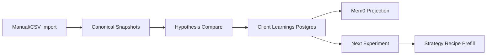

# v12.1 Memória Criativa e Aprendizado de Performance — Milestone Audit

## Summary

| Area | Result |
|------|--------|
| Phases executed | 6/6 (103–108) |
| Requirements | 31/31 complete (QA-13 fully evidenced: automated + human UAT) |
| Release gate | ✅ 1182 tests (1 skipped), lint 0 errors, build OK |
| Migrations | ✅ Applied to `adscale_db` (local); 44 tables; 0037–0040 v12.1 tables present |
| Browser UAT | ✅ Product-pure re-UAT (2026-06-12): PATCH profile → import → compare → learnings → recommendation → UI Accept → Strategy Recipe dialog |
| Deploy readiness | ⚠️ Staging/prod `npm run db:migrate` still pending (local DB has schema drift / empty journal) |

## Phase Summary

| Phase | Name | Requirements | Status |
|-------|------|--------------|--------|
| 103 | Performance Data Foundation | PERF-13–16 | ✅ Complete |
| 104 | Manual and CSV Result Import | IMPT-01–06 | ✅ Complete |
| 105 | Creative Hypotheses and Variant Comparison | HYPO-01–03, COMP-05–08 | ✅ Complete |
| 106 | Client Performance Memory and Mem0 | MEM-01–06 | ✅ Complete |
| 107 | Learning to Next Experiment | NEXT-01–04 | ✅ Complete |
| 108 | Performance Learning Release Gate | QA-10–13 | ✅ Complete (automated + UAT sign-off) |

## Requirements Coverage

| ID | Phase | Status | Notes |
|----|-------|--------|-------|
| PERF-13–16 | 103 | ✅ | Canonical snapshots, metrics, source keys, workspace isolation |
| IMPT-01–06 | 104 | ✅ | Manual + CSV import, preview, dedup, batch audit |
| HYPO-01–03 | 105 | ✅ | Controlled hypotheses linked to derivations |
| COMP-05–08 | 105 | ✅ | Deterministic verdicts, honest evidence states |
| MEM-01–06 | 106 | ✅ | Postgres canonical learnings + Mem0 projection |
| NEXT-01–04 | 107 | ✅ | Explainable recommendation + editable recipe prefill |
| QA-10 | 108 | ✅ | Import regression inventory — see `108-VERIFICATION.md` |
| QA-11 | 108 | ✅ | Comparison + contradiction regression |
| QA-12 | 108 | ✅ | Mem0 CRUD + non-blocking failure |
| QA-13 | 108 | ✅ | Automated gate green; product-pure re-UAT via `scripts/re-uat-v12.1-product.mjs` (no SQL shortcuts) |

## Integration Flow (verified by tests)

## Release Gate Evidence

| Gate | Result | Date |
|------|--------|------|
| `npm test` | 221 files / 1182 passed | 2026-06-12 |
| `npm run lint` | 0 errors | 2026-06-12 |
| `npm run build` | OK | 2026-06-12 |

Evidence: `.planning/phases/108-performance-learning-release-gate/108-VERIFICATION.md`

## Caveats (deploy gate)

1. **Staging/prod migrations** — Local `adscale_db` has schema drift (44 tables, empty journal). Fixed migrator refuses replay; staging/prod with proper journal should apply pending migrations normally.

## Integration Findings

1. **Migrations 0037–0040** — ✅ Applied to local Postgres during UAT (44 tables). Staging/prod apply remains operator gate.
2. **`drizzle-kit migrate` silent failure on existing schema** — **Fixed (2026-06-12):** `migrate-with-retry.mjs` uses `drizzle-orm/node-postgres/migrator` with `CREATE SCHEMA IF NOT EXISTS` preflight and fails if pending migrations are not recorded.
3. **PATCH `/api/campaigns/[id]` did not persist `clientProfileId`** — **Fixed (2026-06-12):** PATCH/POST DTOs accept `clientProfileId` with workspace validation; regression test added.
4. **Mem0 optional** — System degrades to Postgres-only when `MEM0_ENABLED` unset; projection failures are non-blocking.
5. **BillingTab status badge** — Pre-existing v12.0 follow-up; unrelated to v12.1 learning loop.
6. **Lint warnings (69)** — Pre-existing; zero errors at release gate.

## Human Gates Before Ship

| Gate | Action |
|------|--------|
| Migration apply on staging/prod | `cd app && npm run db:migrate` (fixed migrator; local DB has journal drift) |
| UAT sign-off | ✅ Product-pure re-UAT (2026-06-12, `re-uat-v12.1-product.mjs`) |
| Milestone archive | Run `gsd-complete-milestone` after staging migrate |

## Verdict

**passed_with_caveats** — All requirements evidenced including product-pure human UAT. Staging/prod migration apply is the remaining deploy gate before `complete-milestone`.
