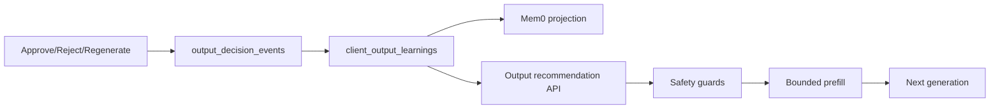

# v12.4 Milestone Audit: Aprendizado de Qualidade dos Outputs

**Result:** Passed. Output learning loop is evidenced end-to-end with separated quality/factual metrics and no v12.3 factual regression.

## Scope Audited

Phases 124–128 from `.planning/ROADMAP.md`:

| Phase | Name | Status |
|-------|------|--------|
| 124 | Output Signal Capture | Complete |
| 125 | Canonical Output Learnings | Complete |
| 126 | Next-Generation Recommendation Application | Complete |
| 127 | Safety, Boundaries, and Explainability | Complete |
| 128 | Evaluation and Release Gate | Complete |

## Commands Run

| Command | Result |
|---|---|
| `cd app && npm run output-learning-release-gate` | **PASS** |
| `node app/scripts/check-output-learning-evidence.mjs` | **PASS** — qualityImprovementPathRate 1.0, safetyGuardPassRate 1.0 |
| `cd app && npm test -- gate-failure-matrix creative-quality-gate` | **PASS** — 68 tests (EVAL-03) |
| `cd app && npm test` | **PASS** — 258 files, 1550 passed, 1 skipped |
| `cd app && npm run lint` | **PASS** — 0 errors |
| `cd app && npm run build` | **PASS** |

## Requirement Coverage

| Group | Count | Status |
|---|---|---|
| SIGNAL-01–04 | 4 | Satisfied (Phase 124) |
| LEARN-01–05 | 5 | Satisfied (Phase 125) |
| APPLY-01–04 | 4 | Satisfied (Phase 126) |
| SAFE-01–04 | 4 | Satisfied (Phase 127) |
| EVAL-01–04 | 4 | Satisfied (Phase 128) |

**Final score: 21/21 requirements satisfied.**

## EVAL Evidence (Phase 128)

Evidence: `.planning/phases/128-evaluation-and-release-gate/128-EVIDENCE.json`

### Quality metrics (EVAL-01, EVAL-02)

| Metric | Value | Threshold |
|---|---:|---:|
| evalScenarioCount | 8 | — |
| qualitySignalScenarioCount | 5 | — |
| qualityImprovementPathRate | 1.000 | ≥1.0 |
| rejectionRegenerationCaptureVerified | true | true |

Fixed eval matrix: `app/scripts/output-learning-eval-matrix.ts`  
Pipeline tests: `app/tests/unit/output-learning/output-learning-pipeline-eval.test.ts`

### Factual metrics (EVAL-02, EVAL-03)

| Metric | Value | Threshold |
|---|---:|---:|
| factualIntegrityScenarioCount | 3 | — |
| safetyGuardPassRate | 1.000 | ≥1.0 |
| v12_3RegressionSubset | pass | pass |

v12.3 factual subset: `gate-failure-matrix.test.ts`, `creative-quality-gate.test.ts` — no regression in hard-failure protections.

## Integration Flow

## Accepted Gaps (inherited)

| ID | Status | Note |
|---|---|---|
| QA-19 (v12.3) | accepted_gap | meanQualityScore 70.17 < 75 — not in v12.4 scope |
| EVAL-01 human corpus | deferred | Fixture pipeline proves improvement path; live human re-score not re-run |

## Release Gate

| Gate | Command | Result |
|---|---|---|
| Output learning release | `npm run output-learning-release-gate` | PASS |
| Evidence check | `node app/scripts/check-output-learning-evidence.mjs` | PASS |

## Verdict

**passed** — v12.4 shipped 2026-06-17. Learning loop from human output decisions through canonical learnings to bounded prefill is evidenced with factual integrity guards intact.
