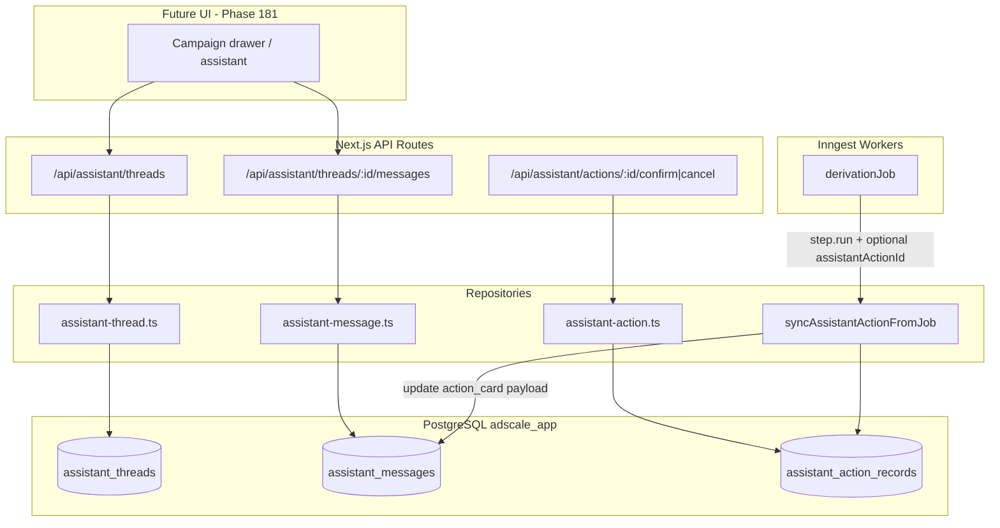

# Phase 178: Conversation Persistence - Research

**Researched:** 2026-06-25
**Domain:** PostgreSQL/Drizzle persistence layer, REST API routes, Inngest job status correlation
**Confidence:** HIGH

## Summary

Phase 178 is a **greenfield backend persistence layer** for the v13.5 assistant. No assistant/thread/conversation code exists in the app today [VERIFIED: codebase grep]. The phase must introduce Drizzle tables, repositories, and REST APIs that downstream phases (179–181) consume, while proving EXEC-02: long-running Inngest jobs can update persisted assistant action status.

The codebase already establishes the patterns this phase should follow: `adscale_app` schema via `pgSchema`, workspace-scoped tables with cascade FKs and workspace indexes, repositories in `app/src/server/repositories/`, Zod-validated API routes using `requireWorkspaceAccess`, colocated Vitest tests with mocked `db`, and Inngest jobs that mutate domain entities inside `step.run()` (see `derivation.ts`). Phase 177 delivered multi-`clientProfileId` isolation — every thread query must include `workspaceId` + `clientProfileId`, and campaign threads must validate `campaign.clientProfileId` alignment.

**Primary recommendation:** Add three tables (`assistant_threads`, `assistant_messages`, `assistant_action_records`), repositories with strict workspace/profile scoping, REST routes under `/api/assistant/` and nested client/campaign paths, and an `syncAssistantActionFromJob()` helper wired into `derivationJob` when optional `assistantActionId` is present in event data.

<user_constraints>
## User Constraints (from CONTEXT.md)

### Locked Decisions

#### Hierarquia de threads (Cliente > Campanha > Thread)

- Threads podem existir em **nível de cliente** e em **nível de campanha** — ambos coexistem.
- Antes de existir campanha, o chat começa em uma **thread do cliente**; quando a campanha for criada, a thread deve ser **vinculada ou migrada** para o contexto da campanha (não bloquear o usuário até ter campanha).
- Cada campanha suporta **múltiplas threads nomeadas** (ex.: conversas separadas de restyling vs. revisão de batch).
- Ao abrir o assistente pelo **drawer da campanha** (CHAT-04), retomar automaticamente a **thread padrão** daquela campanha.
- Toda thread deve respeitar isolamento por `workspaceId` + `clientProfileId` (herdado da Fase 177).

#### Modelo de mensagens e action cards

- Histórico é um **stream cronológico único** com entradas tipadas: `user`, `assistant`, `tool`, `action_card`.
- **Action card é um tipo de mensagem** no stream — confirmação/cancelamento aparecem inline no histórico.
- **Tool calls:** persistir apenas **nome da tool + resumo sanitizado** — sem args crus, payloads internos ou reasoning do provider.
- **Nunca persistir** reasoning/thinking do provider (decisão v13.5 — reforçada aqui).
- Mensagens do assistente são **persistidas somente após o streaming completar** (uma linha final por resposta).
- Cards pendentes são **imutáveis** até confirmar ou cancelar.

#### Ciclo de vida de ações

- Estados completos no registro de ação: `pending` → `confirmed` → `running` → `completed` | `failed` | `canceled`.
- Falha ou cancelamento **atualiza o action-card in-place** com status e erro seguro para o usuário (sem vazar detalhes internos).
- Registro de ação armazena **`jobId`(s)** vinculados; jobs Inngest **atualizam o estado da ação** (EXEC-02). UI de status em tempo real fica para fases posteriores; esta fase garante persistência e mutação de estado.

### Claude's Discretion

- Semântica exata de "thread padrão" por campanha (ex.: mais recente ativa vs. flag `isDefault`) — desde que o drawer sempre retome a mesma thread de forma determinística.
- Estratégia de migração/vínculo thread-do-cliente → campanha (update de FK vs. nova thread com referência à anterior).
- Schema exato (tabelas, JSONB vs. colunas) desde que respeite as decisões acima.
- APIs REST vs. server actions — seguir padrões existentes do app.

### Deferred Ideas (OUT OF SCOPE)

- **UI `/assistant`** e árvore cliente/campanha/thread — Fase 181.
- **Contratos de ação** (classificação de intent, inputs obrigatórios, política de confirmação) — Fase 180.
- **Adapter MiniMax e tool policy** — Fase 179.
- **Mensagens de progresso leves no stream** para transições de job (além de mutar o action record) — pode entrar em fase posterior se a UI precisar; Fase 178 foca em `jobId` + estado persistido.
- **Retenção/arquivamento/deleção de threads** — não discutido; usar defaults sensatos (soft delete opcional, sem política de retenção agressiva neste milestone).
- **Edição de inputs em cards pendentes** — explicitamente **não** neste milestone; card imutável até confirmar/cancelar.
</user_constraints>

<phase_requirements>
## Phase Requirements

| ID | Description | Research Support |
|----|-------------|------------------|
| EXEC-02 | Long-running actions use existing pipeline/Inngest job behavior and show status in the assistant thread. | `assistant_action_records` with `jobRefs` + lifecycle states; `syncAssistantActionFromJob()` called from `derivationJob` `step.run()` blocks; action_card message payload updated in-place on status change; REST read APIs return current job status in thread history. |
</phase_requirements>

## Architectural Responsibility Map

| Capability | Primary Tier | Secondary Tier | Rationale |
|------------|-------------|----------------|-----------|
| Thread CRUD + default resolution | API / Backend | Database | Workspace auth and profile/campaign validation belong server-side; UI (Phase 181) only consumes APIs. |
| Message stream persistence | API / Backend | Database | Write boundary must sanitize tool summaries and block reasoning persistence before insert. |
| Action record lifecycle | API / Backend | Database | Confirm/cancel mutations are server-authoritative; pending immutability enforced in repository. |
| Job status reflection | API / Backend (Inngest worker) | Database | Inngest `step.run()` updates action records — same pattern as `derivationJob` updating `derivations.status` [VERIFIED: `derivation.ts`]. |
| Realtime job progress UI | — (deferred) | Inngest realtime channels | `derivationChannel` exists for live UI; Phase 178 persists state only per CONTEXT.md. |
| Thread list/navigation UI | Browser (Phase 181) | API | Out of scope for 178; APIs must expose scoped lists. |

## Standard Stack

### Core

| Library | Version | Purpose | Why Standard |
|---------|---------|---------|--------------|
| drizzle-orm | 0.45.2 (installed) / 0.45.2 (registry) [VERIFIED: npm registry] | Schema + queries | Project standard ORM; all domain tables in `schema.ts` use `adscaleSchema` [VERIFIED: codebase]. |
| drizzle-kit | 0.31.10 (installed) [VERIFIED: package.json] | Migrations | Incremental SQL in `app/drizzle/`; journal currently ends at `0056` [VERIFIED: `_journal.json`]. |
| zod | 4.4.3 (registry) [VERIFIED: npm registry] | API input validation | All API routes validate body/query with Zod [VERIFIED: `campaigns/[id]/route.ts`]. |
| inngest | 4.4.0 (installed) / 4.11.0 (registry latest) [VERIFIED: npm registry] | Long-running jobs | Existing derivation pipeline; `step.run()` for durable DB updates [CITED: /inngest/inngest-js]. |
| vitest | ^4.1.5 (installed) [VERIFIED: package.json] | Unit/route tests | `npm test` via `config/vitest.config.ts`. |

### Supporting

| Library | Version | Purpose | When to Use |
|---------|---------|---------|-------------|
| @neondatabase/serverless | ^1.1.0 | Postgres driver | Production DB access (existing). |
| next | 16.2.6 | API route host | REST handlers in `app/src/app/api/`. |

### Alternatives Considered

| Instead of | Could Use | Tradeoff |
|------------|-----------|----------|
| 3 normalized tables | Single JSONB thread blob | Normalized tables match existing repo patterns (`derivations`, `feedback_reports`), enable indexed job lookups and workspace scoping. |
| Server Actions | REST API routes | REST is established pattern for workspace-scoped resources; no server-action precedent for domain CRUD. |
| Inngest run ID as jobId | Domain entity ID (e.g. `derivationId`) | Domain IDs match existing event payloads (`derivation.generate` sends `derivationId`) and are stable across retries [VERIFIED: `restyle/route.ts`]. |

**Installation:** No new packages required.

**Version verification:**
```bash
npm view drizzle-orm version   # 0.45.2
npm view inngest version       # 4.11.0 (project pins ^4.4.0)
npm view zod version           # 4.4.3
```

## Architecture Patterns

### System Architecture Diagram



### Recommended Project Structure

```
app/
├── drizzle/
│   └── 0057_assistant_conversation.sql      # new migration (+ journal entry)
├── src/
│   ├── server/
│   │   ├── db/schema.ts                     # assistant_* table definitions
│   │   ├── repositories/
│   │   │   ├── assistant-thread.ts
│   │   │   ├── assistant-thread.test.ts
│   │   │   ├── assistant-message.ts
│   │   │   ├── assistant-message.test.ts
│   │   │   ├── assistant-action.ts
│   │   │   ├── assistant-action.test.ts
│   │   │   └── assistant-job-sync.ts        # syncAssistantActionFromJob
│   │   └── jobs/
│   │       └── derivation.ts                # wire optional action sync
│   └── app/api/
│       ├── assistant/threads/...
│       ├── assistant/threads/[threadId]/messages/...
│       └── assistant/actions/[actionId]/...
```

### Pattern 1: Workspace-Scoped Drizzle Tables

**What:** Every assistant table carries `workspaceId` FK with cascade delete and a workspace index — mirrors `derivations`, `campaigns`, `client_profiles` [VERIFIED: `schema.ts`].

**When to use:** All new tables.

**Example:**
```typescript
// Pattern from existing schema + Drizzle docs [CITED: drizzle-team/drizzle-orm-docs schemas]
export const assistantThreads = adscaleSchema.table(
  "assistant_threads",
  {
    id: uuid("id").primaryKey().$defaultFn(() => crypto.randomUUID()),
    workspaceId: uuid("workspace_id")
      .notNull()
      .references(() => workspaces.id, { onDelete: "cascade" }),
    clientProfileId: uuid("client_profile_id")
      .notNull()
      .references(() => clientProfiles.id, { onDelete: "cascade" }),
    campaignId: uuid("campaign_id").references(() => campaigns.id, { onDelete: "set null" }),
    name: text("name").notNull(),
    isDefault: boolean("is_default").notNull().default(false),
    migratedFromThreadId: uuid("migrated_from_thread_id"),
    createdAt: timestamp("created_at", { mode: "date" }).notNull().defaultNow(),
    updatedAt: timestamp("updated_at", { mode: "date" }).notNull().defaultNow(),
  },
  (table) => [
    index("assistant_threads_workspace_id_idx").on(table.workspaceId),
    index("assistant_threads_client_profile_id_idx").on(table.clientProfileId),
    index("assistant_threads_campaign_id_idx").on(table.campaignId),
  ]
);
```

**Recommended discretion resolution:** Use `isDefault` boolean + partial unique index per `(workspace_id, campaign_id)` where `is_default = true` and `campaign_id IS NOT NULL`. For client-level threads (`campaign_id IS NULL`), no default semantics needed until campaign link.

### Pattern 2: Chronological Message Stream with Typed Payload

**What:** Single `assistant_messages` table ordered by `(thread_id, sequence)` or `(thread_id, created_at, id)`. `type` enum column; `content` for display text; `payload` JSONB for type-specific sanitized data.

**Payload shapes (recommended):**

| type | content | payload |
|------|---------|---------|
| `user` | user text | `{}` |
| `assistant` | final streamed text | `{}` |
| `tool` | optional short label | `{ toolName: string, summary: string }` |
| `action_card` | card title/summary | `{ actionRecordId: string, status: ActionStatus, display: {...} }` |

**Write guard:** Repository rejects payloads containing keys like `reasoning`, `thinking`, `rawArgs`, `signedUrl`, `internalEvidence` [locked decision].

### Pattern 3: Action Record + Linked Message (1:1)

**What:** `assistant_action_records` holds lifecycle state and `jobRefs`; the `action_card` message references `actionRecordId`. Status mutations update **both** the action record and the linked message's `payload.status` for in-place card display.

**jobRefs shape:**
```typescript
type JobRef = { kind: "derivation" | "inngest_run"; id: string };
// Store as jsonb array; primary correlation uses domain IDs (derivationId)
```

### Pattern 4: API Route Handler

**What:** `requireWorkspaceAccess` + Zod + repository + `handleApiError` — matches `client-profiles/[id]/references/route.ts` [VERIFIED: codebase].

**Example:**
```typescript
export async function GET(request: Request, { params }: { params: Promise<{ threadId: string }> }) {
  try {
    const [{ workspace }, { threadId }] = await Promise.all([
      requireWorkspaceAccess(request),
      params,
    ]);
    const thread = await getAssistantThreadById(workspace.id, threadId);
    if (!thread) return apiError("threadNotFound", 404);
    const messages = await listAssistantMessages(workspace.id, threadId);
    return NextResponse.json({ thread, messages });
  } catch (error) {
    return handleApiError(error, "assistant.threads.[id].GET");
  }
}
```

### Pattern 5: Inngest Job Status Sync

**What:** Optional `assistantActionId` on job event data; helper called inside existing `step.run("mark-processing"|"mark-completed"|"mark-failed")` blocks — same durability guarantees as derivation status updates [CITED: /inngest/inngest-js step.run].

**Example:**
```typescript
// In derivationJob, after mark-processing:
if (event.data.assistantActionId) {
  await syncAssistantActionFromJob({
    workspaceId,
    actionId: event.data.assistantActionId,
    status: "running",
    jobRef: { kind: "derivation", id: derivationId },
  });
}
```

### Anti-Patterns to Avoid

- **Storing provider reasoning in messages:** Violates AI-05 and locked decision; enforce at repository write boundary, not only UI.
- **Querying threads without workspaceId:** Every SELECT/UPDATE must include `eq(table.workspaceId, workspaceId)` — matches derivation repository [VERIFIED: `derivation.ts` repository].
- **Mutating pending action card display fields:** Only `status`, `safeError`, `jobRefs`, timestamps may change until confirmed; input snapshot is immutable.
- **Hand-rolling migration journal entries:** Follow Phase 177 lesson — register new migration in `app/drizzle/meta/_journal.json` or `drizzle-kit check` fails [VERIFIED: 177-01-SUMMARY.md].

## Don't Hand-Roll

| Problem | Don't Build | Use Instead | Why |
|---------|-------------|-------------|-----|
| SQL migrations | Raw ALTER scripts without Drizzle | `drizzle-kit generate` + journal | Project uses numbered migrations `0000`–`0056`; journal consistency is mandatory. |
| Auth/workspace gate | Custom session parsing | `requireWorkspaceAccess` | Centralized 401/403 handling [VERIFIED: `workspace.ts`]. |
| Job durability | Fire-and-forget async | Inngest `step.run()` | Retries, crash recovery already proven in derivation pipeline. |
| Input validation | Manual typeof checks | Zod schemas per route | Consistent `apiError("invalidInput", 400)` pattern. |
| Message ordering | Client-side sort only | DB `sequence` column or `created_at` + monotonic insert | Stable pagination for thread history. |
| Realtime status | Custom WebSocket server | Persist to DB now; optional `derivationChannel` later | Phase 178 scope is persistence; realtime deferred. |

**Key insight:** The app already solved long-running job status for derivations — EXEC-02 is extending that pattern to assistant action records, not inventing a new job system.

## Common Pitfalls

### Pitfall 1: Missing workspaceId on messages

**What goes wrong:** Messages queried by `threadId` alone leak across workspaces if threadId is guessed.

**Why it happens:** FK from message→thread feels sufficient; developers omit denormalized workspace filter.

**How to avoid:** Denormalize `workspaceId` on `assistant_messages` (matches `derivations` pattern) and always filter both `threadId` AND `workspaceId`.

**Warning signs:** Repository functions accepting only `threadId` without `workspaceId`.

### Pitfall 2: Multi-profile ambiguity without clientProfileId

**What goes wrong:** Thread created for wrong client when workspace has multiple profiles.

**Why it happens:** Phase 177 removed workspace-level profile uniqueness [VERIFIED: migration 0056].

**How to avoid:** Require explicit `clientProfileId` on thread create; validate via `getClientProfile(workspaceId, id)`; for campaign threads also validate `resolveCampaignClientProfileId` alignment.

**Warning signs:** Thread create endpoint without `clientProfileId` in body.

### Pitfall 3: Persisting streaming partial assistant messages

**What goes wrong:** Multiple incomplete rows per assistant turn; history polluted.

**Why it happens:** Saving on each stream chunk.

**How to avoid:** Phase 179 orchestration calls `appendAssistantMessage` only after stream completes; 178 repository can expose `createAssistantMessage` but document caller contract.

**Warning signs:** API endpoint accepting assistant messages without `streamComplete: true` guard or dedicated post-stream method.

### Pitfall 4: Leaking internal errors on action failure

**What goes wrong:** Inngest `error.message` or stack traces stored in action card.

**Why it happens:** Copying derivation job failure handling verbatim (`prompt: message` on derivations).

**How to avoid:** Map to `safeError` user string; log full error via `logger.error`; never persist raw Inngest internals on action records.

**Warning signs:** `safeError` field receiving `error.stack` or provider response bodies.

### Pitfall 5: Default thread non-determinism

**What goes wrong:** Campaign drawer opens different thread each time (CHAT-04 broken later).

**Why it happens:** "Most recent thread" heuristic without migration rules.

**How to avoid:** `isDefault` flag + `getOrCreateDefaultCampaignThread()`; unset previous default in same transaction when promoting a new default.

**Warning signs:** Default resolution using `ORDER BY created_at DESC LIMIT 1` without `is_default` filter.

### Pitfall 6: Journal drift on migration

**What goes wrong:** `drizzle-kit check` fails in CI.

**Why it happens:** SQL file added without `_journal.json` entry (Phase 177 deviation) [VERIFIED: 177-01-SUMMARY.md].

**How to avoid:** Add `0057_assistant_conversation` to journal in same commit as SQL.

## Code Examples

### Scoped Repository Query

```typescript
// Pattern from derivation repository [VERIFIED: repositories/derivation.ts]
export async function getAssistantThreadById(workspaceId: string, threadId: string) {
  const [row] = await db
    .select()
    .from(assistantThreads)
    .where(and(
      eq(assistantThreads.id, threadId),
      eq(assistantThreads.workspaceId, workspaceId),
    ))
    .limit(1);
  return row ?? null;
}
```

### Action Lifecycle Transition

```typescript
const ACTION_TRANSITIONS: Record<ActionStatus, ActionStatus[]> = {
  pending: ["confirmed", "canceled"],
  confirmed: ["running", "canceled"],
  running: ["completed", "failed", "canceled"],
  completed: [],
  failed: [],
  canceled: [],
};

export async function transitionAssistantAction(
  workspaceId: string,
  actionId: string,
  nextStatus: ActionStatus,
  patch?: { safeError?: string; jobRef?: JobRef }
) {
  // 1. Load action + validate transition
  // 2. Update assistant_action_records
  // 3. Update linked action_card message payload.status in-place
}
```

### Inngest Event Send (existing pattern)

```typescript
// Source: campaigns/[id]/restyle/route.ts [VERIFIED]
await inngest.send({
  name: "derivation.generate",
  data: {
    derivationId: derivation.id,
    campaignId,
    workspaceId: workspace.id,
    assistantActionId, // NEW optional field for EXEC-02
    triggeredByUserId: user.id,
    // ...
  },
});
```

## State of the Art

| Old Approach | Current Approach | When Changed | Impact |
|--------------|------------------|--------------|--------|
| One client profile per workspace | Multiple profiles per workspace | Phase 177 / migration 0056 | Thread APIs must require `clientProfileId`. |
| No assistant persistence | Normalized thread/message/action tables | Phase 178 (this) | Greenfield — no migration of legacy data. |
| Derivation status only in `derivations` table | + assistant action record correlation | Phase 178 | Optional `assistantActionId` on job events. |

**Deprecated/outdated:**
- Workspace-unique `client_profiles.workspace_id` constraint — dropped in 0056; do not assume single profile.

## Assumptions Log

| # | Claim | Section | Risk if Wrong |
|---|-------|---------|---------------|
| A1 | `jobId` means domain entity ID (e.g. `derivationId`), not Inngest internal run ID | Pattern 3 | Job correlation queries fail if product expects Inngest run IDs |
| A2 | FK update (set `campaign_id`) is acceptable migration strategy vs. copy-to-new-thread | Pattern 1 | UX may differ if history should split on campaign creation |
| A3 | `isDefault` + partial unique index is chosen for default thread semantics | Pattern 1 | CHAT-04 behavior changes if user prefers "most recent" heuristic |

## Open Questions

1. **Should thread link-to-campaign copy messages or just update FK?**
   - What we know: CONTEXT allows discretion; user should not be blocked before campaign exists.
   - What's unclear: Whether marketing wants separate histories after campaign creation.
   - Recommendation: Default to **FK update** (`campaign_id` set on existing client thread) with `migrated_from_thread_id` audit; planner can add `linkThreadToCampaign()` task.

2. **Confirm/cancel API auth — member vs owner?**
   - What we know: Most campaign routes use `requireWorkspaceAccess` without role gate.
   - What's unclear: Whether action confirmation should require owner/admin (credit impact comes in Phase 180).
   - Recommendation: Match existing campaign mutation pattern (`requireWorkspaceAccess` only) for 178; Phase 180 adds confirmation policy.

## Environment Availability

| Dependency | Required By | Available | Version | Fallback |
|------------|------------|-----------|---------|----------|
| Node.js | Build/test | ✓ | v25.9.0 | — |
| npm | Package scripts | ✓ | (bundled) | — |
| PostgreSQL/Neon | Drizzle persistence | ✓ (project configured) | — | Tests use mocked `db` |
| psql CLI | Local DB inspection | ✗ | — | Use `npm run db:studio` or Neon console |
| Inngest dev | Job integration manual test | ✓ | inngest-cli via `npm run inngest:dev` | Unit-test job sync with mocks |
| vitest | Automated tests | ✓ | ^4.1.5 | — |

**Missing dependencies with no fallback:**
- None blocking — phase is code + migration + mocked tests.

**Missing dependencies with fallback:**
- `psql` — use Drizzle Studio or existing `test:db:setup` scripts if integration tests added later.

## Validation Architecture

### Test Framework

| Property | Value |
|----------|-------|
| Framework | vitest ^4.1.5 |
| Config file | `app/config/vitest.config.ts` |
| Quick run command | `cd app && npx vitest run src/server/repositories/assistant-action.test.ts -x` |
| Full suite command | `cd app && npm test` |

### Phase Requirements → Test Map

| Req ID | Behavior | Test Type | Automated Command | File Exists? |
|--------|----------|-----------|-------------------|-------------|
| EXEC-02 | Action record stores jobRefs and transitions running→completed | unit | `npx vitest run src/server/repositories/assistant-action.test.ts -x` | ❌ Wave 0 |
| EXEC-02 | `syncAssistantActionFromJob` updates action + message payload | unit | `npx vitest run src/server/repositories/assistant-job-sync.test.ts -x` | ❌ Wave 0 |
| EXEC-02 | derivationJob calls sync when `assistantActionId` present | unit | `npx vitest run src/server/jobs/derivation.test.ts -x -t assistant` | ❌ Wave 0 (extend existing) |
| EXEC-02 | Thread scoped by workspace + clientProfileId | unit | `npx vitest run src/server/repositories/assistant-thread.test.ts -x` | ❌ Wave 0 |
| EXEC-02 | Messages reject reasoning/thinking in payload | unit | `npx vitest run src/server/repositories/assistant-message.test.ts -x` | ❌ Wave 0 |
| EXEC-02 | API returns thread + messages with action status | route | `npx vitest run src/app/api/assistant/threads/\\[threadId\\]/route.test.ts -x` | ❌ Wave 0 |

### Sampling Rate

- **Per task commit:** `npx vitest run <changed-file>.test.ts -x`
- **Per wave merge:** `cd app && npm test`
- **Phase gate:** Targeted assistant tests green + `npm run build` + `drizzle-kit check`

### Wave 0 Gaps

- [ ] `app/src/server/repositories/assistant-thread.test.ts` — thread scoping, default thread, campaign link
- [ ] `app/src/server/repositories/assistant-message.test.ts` — stream ordering, sanitization guard
- [ ] `app/src/server/repositories/assistant-action.test.ts` — lifecycle transitions, pending immutability
- [ ] `app/src/server/repositories/assistant-job-sync.test.ts` — job status sync
- [ ] `app/src/app/api/assistant/threads/[threadId]/route.test.ts` — auth + 404 paths
- [ ] Migration `0057` + `_journal.json` entry
- [ ] Extend `derivation.test.ts` with assistant action sync case

## Security Domain

### Applicable ASVS Categories

| ASVS Category | Applies | Standard Control |
|---------------|---------|------------------|
| V2 Authentication | yes | `requireWorkspaceAccess` on all routes |
| V3 Session Management | yes | Better Auth session via existing middleware |
| V4 Access Control | yes | workspaceId + clientProfileId on all queries; validate campaign ownership |
| V5 Input Validation | yes | Zod schemas; repository sanitization for tool/action payloads |
| V6 Cryptography | no | No new crypto in this phase |

### Known Threat Patterns for {stack}

| Pattern | STRIDE | Standard Mitigation |
|---------|--------|---------------------|
| Cross-tenant thread access | Elevation of privilege | Always filter `workspaceId`; return 404 not 403 for missing threads |
| Sensitive data in persisted messages | Information disclosure | Denylist `reasoning`, `thinking`, raw tool args, signed URLs at write boundary |
| Internal error leakage on failed jobs | Information disclosure | `safeError` mapping; log internals server-side only |
| IDOR on action confirm/cancel | Tampering | Scope action mutations to `workspaceId`; verify action belongs to thread/profile |

## Project Constraints (from .cursor/rules/)

- **Render platform:** DB persistence required (ephemeral filesystem) — assistant data must live in Postgres, not local files [from render-platform.mdc].
- **Context7:** Use for library docs when implementing (already used for Drizzle/Inngest in this research).
- **No root-folder artifacts:** Migrations in `app/drizzle/`, repos in `app/src/server/repositories/`, tests colocated [from AGENTS.md / user rules].

## Sources

### Primary (HIGH confidence)

- Codebase: `app/src/server/db/schema.ts` — Drizzle table patterns
- Codebase: `app/src/server/repositories/derivation.ts` — workspace-scoped repository pattern
- Codebase: `app/src/server/jobs/derivation.ts` — Inngest `step.run()` status updates
- Codebase: `app/src/app/api/campaigns/[id]/route.ts` — API route pattern
- `/drizzle-team/drizzle-orm-docs` — pgSchema, FK, indexes
- `/inngest/inngest-js` — `step.run()` durable execution

### Secondary (MEDIUM confidence)

- `.planning/milestones/v13.5-phases/177-multi-client-foundation/177-01-SUMMARY.md` — migration journal lesson
- `.planning/ROADMAP.md` — Phase 178 success criteria

### Tertiary (LOW confidence)

- None requiring validation — core patterns verified in codebase.

## Metadata

**Confidence breakdown:**
- Standard stack: HIGH — matches installed dependencies and existing patterns
- Architecture: HIGH — greenfield but mirrors derivations/feedback/beta-sessions precedents
- Pitfalls: HIGH — derived from Phase 177 multi-profile behavior and derivation job code

**Research date:** 2026-06-25
**Valid until:** 2026-07-25 (stable stack; assistant domain is new)

## RESEARCH COMPLETE

**Phase:** 178 - Conversation Persistence
**Confidence:** HIGH

### Key Findings

- No assistant code exists — fully greenfield; next migration is `0057`.
- Follow `workspaceId` + `clientProfileId` scoping from Phase 177 on all thread/message/action queries.
- Use 3 normalized tables with `action_card` messages linked 1:1 to `assistant_action_records` for EXEC-02 job status.
- Wire `syncAssistantActionFromJob()` into `derivationJob` via optional `assistantActionId` event field — extends proven Inngest pattern.
- Vitest mocked-db tests (brand-kit pattern) cover phase; 6 new test files needed in Wave 0.

### File Created

`.planning/milestones/v13.5-phases/178-conversation-persistence/178-RESEARCH.md`

### Confidence Assessment

| Area | Level | Reason |
|------|-------|--------|
| Standard Stack | HIGH | Verified package versions and existing usage |
| Architecture | HIGH | Codebase patterns directly applicable |
| Pitfalls | HIGH | Grounded in Phase 177 + derivation job code |

### Open Questions

- Thread-to-campaign migration: FK update vs copy (recommend FK update)
- Confirm/cancel role gates (recommend defer to Phase 180)

### Ready for Planning

Research complete. Planner can now create PLAN.md files.
