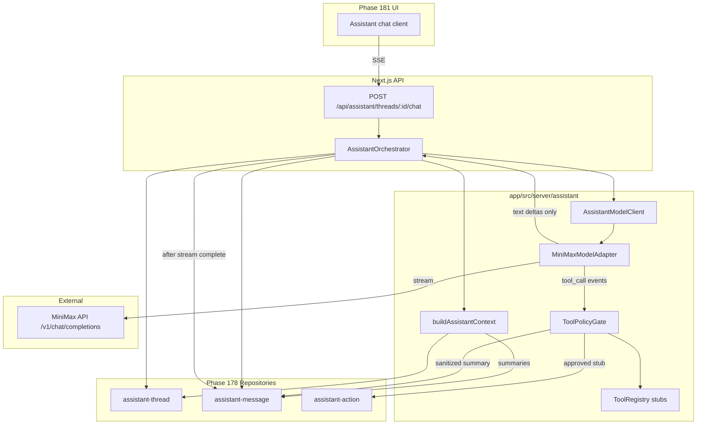

# Phase 179: Model Adapter and Tool Policy - Research

**Researched:** 2026-06-25
**Domain:** Provider-agnostic assistant orchestration, MiniMax M3 streaming adapter, allowlisted context builder, deny-by-default tool policy
**Confidence:** HIGH

## Summary

Phase 179 is **greenfield assistant orchestration** on top of Phase 178 persistence. No `AssistantModelClient`, MiniMax adapter, context builder, or tool policy exists today [VERIFIED: codebase grep]. The phase must introduce a provider-agnostic internal boundary (`AssistantModelClient`), a MiniMax M3 adapter with HTTP streaming to the client, an allowlisted context builder scoped by `workspaceId` + `clientProfileId` + `threadId`, and a server-side tool gate that validates every tool call before side effects.

MiniMax M3 exposes an **OpenAI-compatible** Chat Completions API at `https://api.minimax.io/v1` with model id `MiniMax-M3`, SSE streaming via `stream: true`, and standard `tools` / `tool_calls` for function calling [CITED: platform.minimax.io/docs/api-reference/text-openai-api]. The project already depends on `openai@^6.34.0` (registry latest 6.45.0) [VERIFIED: package.json, npm registry] — reuse it with `baseURL` override rather than adding a MiniMax-specific SDK. M3 emits reasoning in separate fields (`reasoning_details`, `reasoning_content`) when `reasoning_split` is enabled, and thinking is on by default unless `thinking.type` is `disabled` [CITED: platform.minimax.io/docs/api-reference/text-openai-api]. The adapter must strip all reasoning/thinking deltas before SSE output and before `createAssistantMessage`, complementing Phase 178's `PERSISTENCE_DENYLIST` [VERIFIED: `assistant-types.ts`].

Phase 178 repositories are ready: `createAssistantMessage` documents that assistant messages persist **after** stream completion; tool messages accept only `toolName` + `summary`; `createAssistantAction` is the sole path for action cards [VERIFIED: `assistant-message.ts`, `assistant-action.ts`]. The orchestrator wires: persist user message → build context → stream via adapter → run tool policy on tool calls → persist tool summaries / stub action cards → persist final assistant message.

**Primary recommendation:** Add `app/src/server/assistant/` with `AssistantModelClient` interface, `MiniMaxModelAdapter` using existing OpenAI client + env-validated singleton, `buildAssistantContext()` allowlist, `ToolPolicyGate` + explicit registry with Zod schemas, and `POST /api/assistant/threads/[threadId]/chat` returning SSE — all covered by Vitest unit tests proving reasoning never appears in stream or persistence.

<user_constraints>
## User Constraints (from CONTEXT.md)

### Locked Decisions

#### Provider e interface (AI-01, AI-02)

- `AssistantModelClient` é a fronteira interna — orquestração do assistente não importa SDK do provider diretamente.
- **MiniMax M3** é o primeiro adapter com **streaming de texto** para o cliente HTTP (SSE ou equivalente no servidor).
- OpenAI existente (`app/src/server/ai/*`) permanece para pipelines criativos legados; o assistente conversacional usa caminho separado via `AssistantModelClient`.
- Credenciais MiniMax via env (`MINIMAX_API_KEY` ou equivalente) — nunca hardcoded.

#### Context builder (AI-03)

- Contexto enviado ao provider é **amplo mas allowlistado** por categoria (cliente, campanha, thread, brand kit resumido, etc.).
- **Excluir sempre:** segredos, URLs assinadas brutas, payloads de evidência interna, dados de outros clientes no mesmo workspace.
- Context builder lê escopo de `workspaceId` + `clientProfileId` + `threadId` da Fase 178.
- Reasoning/thinking do provider **não entra** no payload persistido nem na resposta ao cliente.

#### Tool policy (AI-04)

- **Deny-by-default:** nenhuma tool executa sem passar pelo gate server-side.
- Validações obrigatórias antes de execução ou criação de action card: schema Zod, role gate, scope check (`workspaceId`/`clientProfileId`), política de confirmação (stub até Fase 180 — policy retorna `requiresConfirmation` sem executar writes).
- Tools registradas em registry explícito — sem tools dinâmicas do provider sem mapeamento.
- Tool calls aprovados persistem via Fase 178 (`tool` message type com nome + resumo sanitizado apenas).

#### Reasoning / thinking (AI-05)

- Campos `reasoning`, `thinking`, `chain_of_thought` ou equivalentes do provider são **descartados** no adapter antes de streaming/persistência.
- Testes devem provar: (1) não aparecem na resposta HTTP streamada ao cliente; (2) não são gravados em `assistant_messages`.

#### Integração com persistência (Fase 178)

- Orquestrador usa repositórios `assistant-thread`, `assistant-message`, `assistant-action` — não duplica schema.
- Streaming: mensagem `assistant` persistida **após** stream completar (decisão Fase 178).
- Action cards criados via `createAssistantAction` — não via POST `/messages` com `action_card`.

### Claude's Discretion

- SDK MiniMax exato e formato de streaming (fetch vs SDK oficial).
- Estrutura de pastas: `app/src/server/assistant/` recomendado.
- Lista inicial de tools stub (ex.: `get_thread_context`, `propose_action`) — sem execução de writes nesta fase.
- Formato SSE vs chunked response para API route de chat.

### Deferred Ideas (OUT OF SCOPE)

- Classificação de intent e contratos de ação completos — Fase 180
- UI de chat e drawer — Fase 181
- Execução real de writes/créditos via tools — Fase 180+
- Suporte a providers adicionais além de MiniMax — pós-v13.5
- Exibir progresso de job em tempo real no stream — Fase 181+
</user_constraints>

<phase_requirements>
## Phase Requirements

| ID | Description | Research Support |
|----|-------------|------------------|
| AI-01 | `AssistantModelClient` abstracts the model provider from assistant orchestration. | Interface in `app/src/server/assistant/model/client.ts`; orchestrator depends only on interface; MiniMax adapter implements it behind factory/DI. |
| AI-02 | MiniMax M3 is implemented as the first assistant model adapter with text streaming. | `MiniMaxModelAdapter` uses OpenAI SDK + `baseURL: https://api.minimax.io/v1`, model `MiniMax-M3`, `stream: true`; SSE route forwards text deltas. |
| AI-03 | Context sent to the provider is broad but allowlisted; excludes secrets, signed URLs, internal evidence, out-of-scope customer data. | `buildAssistantContext()` composes summaries from scoped repos + `getBrandMemoryContext()`; explicit denylist serializer; workspace/profile/thread validation. |
| AI-04 | Tool calls validated server-side with deny-by-default, role gates, schema validation, scope checks, confirmation requirements. | `ToolPolicyGate` + `ToolRegistry`; Zod per tool; `requireRole`; scope match on thread; stub `requiresConfirmation` without writes. |
| AI-05 | Provider reasoning/thinking not displayed or persisted. | Adapter strips `reasoning_details`, `reasoning_content`, `thinking` from stream chunks; tests assert SSE + `createAssistantMessage` payloads are clean. |
</phase_requirements>

## Architectural Responsibility Map

| Capability | Primary Tier | Secondary Tier | Rationale |
|------------|-------------|----------------|-----------|
| Chat streaming to browser | API / Backend | — | Route handler owns SSE; client (Phase 181) only consumes events. |
| Provider API calls (MiniMax) | API / Backend | — | Keys and provider SDK live server-side only; never exposed to browser. |
| Context assembly | API / Backend | Database | Reads scoped repos/Mem0 summaries; must enforce workspace + clientProfile isolation before provider call. |
| Tool policy enforcement | API / Backend | — | Deny-by-default gate runs server-side between adapter tool events and repo writes. |
| Message persistence | API / Backend | Database | Orchestrator calls Phase 178 repos after stream completes (assistant) or after policy approval (tool/action). |
| Reasoning stripping | API / Backend (adapter) | — | Sanitization at adapter boundary — not UI responsibility. |
| Legacy creative OpenAI pipelines | API / Backend (Inngest) | — | Unchanged in `app/src/server/ai/*` and `derivation.ts` — separate path per CONTEXT. |

## Standard Stack

### Core

| Library | Version | Purpose | Why Standard |
|---------|---------|---------|--------------|
| openai | ^6.34.0 installed / 6.45.0 registry [VERIFIED: package.json, npm registry] | MiniMax M3 HTTP client | MiniMax documents OpenAI SDK compatibility with `baseURL` swap [CITED: platform.minimax.io/docs/api-reference/text-openai-api]; avoids new dependency. |
| zod | 4.4.3 registry [VERIFIED: npm registry] | Tool arg schemas, API body, env | Project boundary validation standard [VERIFIED: assistant API routes]. |
| vitest | ^4.1.5 installed [VERIFIED: package.json] | Unit/integration tests | `npm test` via `config/vitest.config.ts`. |
| next | 16.2.6 [VERIFIED: package.json] | Route Handler SSE host | App Router `ReadableStream` + `Response` pattern [CITED: vercel/next.js streaming guide]. |

### Supporting

| Library | Version | Purpose | When to Use |
|---------|---------|---------|-------------|
| drizzle-orm | 0.45.2 [VERIFIED: package.json] | Thread/message reads for context | Context builder loads campaign/thread history via existing repos. |
| mem0ai | ^2.4.6 [VERIFIED: package.json] | Brand memory summaries | `getBrandMemoryContext()` — trimmed text only, scoped by `clientProfileId` [VERIFIED: `brand-memory-context.ts`]. |

### Alternatives Considered

| Instead of | Could Use | Tradeoff |
|------------|-----------|----------|
| openai + baseURL | Anthropic SDK (`https://api.minimax.io/anthropic`) | MiniMax recommends Anthropic SDK for new integrations [CITED: platform.minimax.io/docs/guides/text-generation], but project already ships OpenAI SDK; OpenAI path is documented and sufficient for M3 streaming + tools. |
| Raw `fetch` to MiniMax | openai SDK | Raw fetch works [CITED: platform.minimax.io], but SDK handles SSE chunk parsing, tool_call deltas, and retries — don't hand-roll. |
| Vercel AI SDK (`ai` package) | Native ReadableStream SSE | Not in dependencies; adding it is out of scope unless planner chooses it for ergonomics — Web Streams + OpenAI async iterator is sufficient. |
| Chunked `text/plain` stream | SSE (`text/event-stream`) | SSE supports typed events (`text_delta`, `done`, `error`) for Phase 181 UI; Next.js documents SSE via ReadableStream [CITED: vercel/next.js]. |

**Installation:**

```bash
# No new runtime packages required for MiniMax adapter.
# Add env var only:
# MINIMAX_API_KEY=<from MiniMax platform>
```

**Version verification:**

```bash
npm view openai version   # 6.45.0
npm view zod version      # 4.4.3
```

## Architecture Patterns

### System Architecture Diagram



### Recommended Project Structure

```
app/src/server/assistant/
├── model/
│   ├── client.ts              # AssistantModelClient interface + types
│   ├── minimax-client.ts      # getMiniMaxClient() singleton (mirrors getOpenAI)
│   └── minimax-adapter.ts     # MiniMaxModelAdapter implements stream + tool events
├── context/
│   ├── context-builder.ts     # buildAssistantContext()
│   ├── allowlist.ts           # category definitions + deny rules
│   └── sanitize.ts            # strip signed URLs, secrets, cross-profile data
├── tools/
│   ├── registry.ts            # explicit tool definitions
│   ├── policy.ts              # ToolPolicyGate (deny-by-default)
│   └── stubs/
│       ├── get-thread-context.ts
│       └── propose-action.ts
├── orchestrator.ts            # runAssistantTurn() — wires repos + adapter + policy
└── stream/
    └── sse.ts                 # encodeAssistantSseEvent()
app/src/app/api/assistant/threads/[threadId]/chat/
└── route.ts                   # POST handler
```

### Pattern 1: Provider-Agnostic Model Client (AI-01)

**What:** Internal interface decouples orchestration from MiniMax/OpenAI SDK types.

**When to use:** Any code that triggers assistant turns — only import from `assistant/model/client.ts`.

**Example:**

```typescript
// app/src/server/assistant/model/client.ts
export type AssistantStreamEvent =
  | { type: "text_delta"; text: string }
  | { type: "tool_call"; id: string; name: string; argumentsJson: string }
  | { type: "done"; usage?: { promptTokens: number; completionTokens: number } };

export interface AssistantModelRequest {
  systemPrompt: string;
  messages: Array<{ role: "user" | "assistant"; content: string }>;
  tools?: Array<{ name: string; description: string; parameters: Record<string, unknown> }>;
}

export interface AssistantModelClient {
  stream(request: AssistantModelRequest): AsyncIterable<AssistantStreamEvent>;
}
```

### Pattern 2: MiniMax Adapter via OpenAI SDK (AI-02)

**What:** Lazy singleton with env validation; stream with reasoning fields stripped.

**When to use:** Default production adapter for v13.5.

**Example:**

```typescript
// Source: platform.minimax.io/docs/api-reference/text-openai-api
import OpenAI from "openai";
import { env } from "@/server/validation/env";

let _minimax: OpenAI | undefined;

export function getMiniMaxClient(): OpenAI {
  if (!_minimax) {
    _minimax = new OpenAI({
      apiKey: env.MINIMAX_API_KEY,
      baseURL: "https://api.minimax.io/v1",
      timeout: 120_000,
    });
  }
  return _minimax;
}

// In adapter stream loop — NEVER forward these to SSE or persistence:
const REASONING_KEYS = ["reasoning_details", "reasoning_content", "thinking"] as const;

const stream = await client.chat.completions.create({
  model: "MiniMax-M3",
  messages: [...],
  tools: [...],
  stream: true,
  // Optional: reduce provider-side thinking generation
  // @ts-expect-error MiniMax extension
  extra_body: { thinking: { type: "disabled" } },
});

for await (const chunk of stream) {
  const delta = chunk.choices[0]?.delta;
  if (!delta) continue;
  for (const key of REASONING_KEYS) {
    if (key in delta) continue; // strip — do not yield
  }
  if (delta.content) yield { type: "text_delta", text: delta.content };
  if (delta.tool_calls) { /* accumulate + yield tool_call events */ }
}
```

[CITED: platform.minimax.io/docs/api-reference/text-openai-api] — `MiniMax-M3`, `stream: true`, `thinking.type: disabled`, `reasoning_split` separates thinking into `reasoning_details` (must be discarded for AI-05).

### Pattern 3: Allowlisted Context Builder (AI-03)

**What:** Compose provider context from scoped reads; serialize only approved categories.

**When to use:** Every orchestrator turn before `AssistantModelClient.stream()`.

**Allowlist categories (recommended initial set):**

| Category | Source | Included shape |
|----------|--------|----------------|
| Client profile | `getClientProfile(workspaceId, clientProfileId)` | name, industry, tone — no internal IDs beyond thread scope |
| Campaign | `getCampaignById` when `thread.campaignId` set | name, objective, audience, platforms, status — no asset URLs |
| Thread metadata | `getAssistantThreadById` | name, campaign link |
| Recent messages | `listAssistantMessages` (last N) | role + content only — types `user`/`assistant`; tool summaries without raw args |
| Brand kit summary | `getBrandKit(workspaceId, clientProfileId)` | voice/tone bullets — no file paths |
| Brand memory | `getBrandMemoryContext()` | `block` string (already trimmed to 320 chars/item, max 6) [VERIFIED: brand-memory-context.ts] |

**Always exclude:** `signedUrl`, presigned R2 URLs, `internalEvidence`, API keys, other `clientProfileId` data, full Mem0 raw payloads, derivation diagnostics, stack traces.

### Pattern 4: Tool Policy Gate (AI-04)

**What:** Registry lookup → Zod parse → role check → scope check → confirmation policy → execute stub.

**When to use:** On every `tool_call` event from adapter before repo writes.

**Example:**

```typescript
export interface ToolPolicyContext {
  workspaceId: string;
  clientProfileId: string;
  threadId: string;
  userId: string;
  role: WorkspaceMemberRole;
}

export interface ToolPolicyResult {
  allowed: boolean;
  requiresConfirmation: boolean;
  sanitizedSummary: string;
  denialReason?: string;
}

// Deny-by-default: unknown tool name → allowed: false
export async function evaluateToolCall(
  ctx: ToolPolicyContext,
  call: { name: string; argumentsJson: string }
): Promise<ToolPolicyResult> { /* ... */ }
```

**Initial stub tools:**

| Tool | Role gate | Writes | Phase 179 behavior |
|------|-----------|--------|-------------------|
| `get_thread_context` | member+ | No | Returns allowlisted context snapshot as tool summary |
| `propose_action` | member+ | Stub | `requiresConfirmation: true`; calls `createAssistantAction` with pending card — no job execution |

### Pattern 5: SSE Chat Route

**What:** `POST /api/assistant/threads/[threadId]/chat` persists user message, runs orchestrator, returns SSE.

**When to use:** Assistant conversational endpoint (UI in Phase 181).

**Example:**

```typescript
// Source: vercel/next.js streaming guide
export async function POST(request: Request, { params }: { params: Promise<{ threadId: string }> }) {
  const encoder = new TextEncoder();
  const stream = new ReadableStream({
    async start(controller) {
      try {
        for await (const event of runAssistantTurn(/* ... */)) {
          if (event.type === "text_delta") {
            controller.enqueue(
              encoder.encode(`event: text_delta\ndata: ${JSON.stringify({ text: event.text })}\n\n`)
            );
          }
        }
        controller.enqueue(encoder.encode(`event: done\ndata: {}\n\n`));
      } finally {
        controller.close();
      }
    },
  });

  return new Response(stream, {
    headers: {
      "Content-Type": "text/event-stream",
      "Cache-Control": "no-store",
    },
  });
}
```

[CITED: github.com/vercel/next.js — App Router ReadableStream SSE]

### Anti-Patterns to Avoid

- **Importing `getOpenAI()` in assistant orchestration:** Violates AI-01 separation; creative pipelines stay on OpenAI path.
- **Persisting assistant message mid-stream:** Phase 178 repo explicitly expects post-stream persistence [VERIFIED: `assistant-message.ts` comment].
- **Forwarding provider tool calls directly to execution:** Bypasses deny-by-default policy (AI-04).
- **Passing `reasoning_split: true` to client without stripping:** Exposes thinking on wire even if DB denylist catches persistence.
- **Registering provider-native tools not in registry:** Dynamic tools from model output must map to server registry or be rejected.

## Don't Hand-Roll

| Problem | Don't Build | Use Instead | Why |
|---------|-------------|-------------|-----|
| MiniMax HTTP + SSE parsing | Custom fetch loop | `openai` SDK with `baseURL` | Tool call delta assembly, auth headers, error shapes [CITED: MiniMax OpenAI compat docs] |
| Tool argument validation | Ad-hoc `typeof` checks | Zod schemas per registered tool | Composable errors, matches API route patterns |
| Reasoning field detection | Regex on content | Explicit delta key denylist + `containsDeniedPersistenceKeys` | Provider may embed thinking in structured fields, not plain text |
| SSE framing | Third-party polyfill | `TextEncoder` + `ReadableStream` | Native Next.js Route Handler pattern [CITED: vercel/next.js] |
| Brand memory retrieval | Raw Mem0 dump | `getBrandMemoryContext()` | Already scoped, trimmed, filtered by `clientProfileId` [VERIFIED: codebase] |
| Action card creation | Custom message insert | `createAssistantAction()` | Atomic action + action_card message [VERIFIED: assistant-action.ts] |

**Key insight:** The adapter's job is **normalization** (provider events → internal events) and **sanitization** (strip reasoning). Policy and persistence belong in orchestrator layers — not in the adapter alone.

## Common Pitfalls

### Pitfall 1: Reasoning Leakage via Stream

**What goes wrong:** `reasoning_details` deltas forwarded to SSE when `reasoning_split` is enabled or thinking is adaptive.

**Why it happens:** MiniMax M3 defaults thinking on; docs show separate reasoning fields in stream chunks [CITED: platform.minimax.io/docs/api-reference/text-openai-api].

**How to avoid:** Strip structured reasoning keys in adapter; add Vitest fixture with synthetic chunks containing `reasoning_details`; assert SSE output excludes them.

**Warning signs:** UI shows "thinking" blocks; `containsDeniedPersistenceKeys` fires on persist.

### Pitfall 2: Tool Call Bypass

**What goes wrong:** Orchestrator executes repo writes on unregistered tool names returned by model.

**Why it happens:** OpenAI-compatible APIs return arbitrary `tool_calls` when `tools` are passed.

**How to avoid:** Registry map keyed by name; default deny; log structured denial server-side.

**Warning signs:** Action records created without `ToolPolicyGate` audit trail.

### Pitfall 3: Cross-Profile Context Bleed

**What goes wrong:** Context builder loads another client's campaign or Mem0 entries in same workspace.

**Why it happens:** Workspace has multiple `clientProfileId` values after Phase 177 [VERIFIED: REQUIREMENTS CLIENT-01].

**How to avoid:** Every repo read includes `workspaceId` + thread's `clientProfileId`; Mem0 filter already supports `clientProfileId` metadata [VERIFIED: brand-memory-context.ts].

**Warning signs:** Provider prompt mentions wrong client name; scope check tests fail.

### Pitfall 4: Streaming Before User Message Persisted

**What goes wrong:** Provider call succeeds but user message lost on error — inconsistent history.

**Why it happens:** Race between stream start and DB insert.

**How to avoid:** Orchestrator order: validate thread → persist `user` message → stream → persist `assistant` message.

**Warning signs:** Missing sequence numbers; partial threads in DB.

### Pitfall 5: Env Validation Gap

**What goes wrong:** Runtime failure on first chat request when `MINIMAX_API_KEY` missing.

**Why it happens:** `env.ts` does not yet define MiniMax vars [VERIFIED: env.ts has OPENAI only].

**How to avoid:** Add `MINIMAX_API_KEY` + `MINIMAX_MODEL` (default `MiniMax-M3`) to `envSchema`; lazy singleton throws clear error in chat route.

**Warning signs:** Proxy env getter returns `undefined` in non-test environments.

## Code Examples

### MiniMax Streaming (OpenAI SDK)

```typescript
// Source: platform.minimax.io/docs/api-reference/text-openai-api
import OpenAI from "openai";

const client = new OpenAI({
  apiKey: process.env.MINIMAX_API_KEY,
  baseURL: "https://api.minimax.io/v1",
});

const completion = await client.chat.completions.create({
  model: "MiniMax-M3",
  messages: [{ role: "user", content: "Summarize this campaign direction." }],
  stream: true,
});

for await (const chunk of completion) {
  const text = chunk.choices[0]?.delta?.content;
  if (text) process.stdout.write(text);
}
```

### OpenAI-Compatible Tool Definitions

```typescript
// Source: platform.minimax.io/docs/api-reference/text-openai-api
const tools = [
  {
    type: "function" as const,
    function: {
      name: "get_thread_context",
      description: "Return sanitized thread and campaign context.",
      parameters: {
        type: "object",
        properties: {},
        additionalProperties: false,
      },
    },
  },
];
```

### Singleton Pattern (Match Existing OpenAI)

```typescript
// Source: app/src/server/ai/utils.ts (project pattern)
import OpenAI from "openai";
import { env } from "@/server/validation/env";

let _minimax: OpenAI | undefined;

export function getMiniMaxClient(): OpenAI {
  if (!_minimax) {
    _minimax = new OpenAI({
      apiKey: env.MINIMAX_API_KEY,
      baseURL: "https://api.minimax.io/v1",
      timeout: 120_000,
    });
  }
  return _minimax;
}
```

[VERIFIED: `app/src/server/ai/utils.ts` — lazy init + env-validated key]

## State of the Art

| Old Approach | Current Approach | When Changed | Impact |
|--------------|------------------|--------------|--------|
| Direct OpenAI for all AI | Separate assistant path via `AssistantModelClient` | v13.5 Phase 179 | Creative jobs unchanged; chat uses MiniMax M3 |
| Unbounded workspace context to model | Allowlisted context builder | v13.5 requirement AI-03 | Multi-client safety |
| Provider tool auto-execution | Deny-by-default server gate | v13.5 requirement AI-04 | Writes require confirmation (Phase 180+) |
| Persist provider reasoning | Strip at adapter + `PERSISTENCE_DENYLIST` | Phase 178 + 179 | Audit trail from messages/actions only |

**Deprecated/outdated:**

- Using `POST /messages` with `type: assistant` from client for streaming turns — chat route owns assistant message creation after stream [VERIFIED: Phase 178 API design].

## Assumptions Log

| # | Claim | Section | Risk if Wrong |
|---|-------|---------|---------------|
| A1 | `thinking: { type: "disabled" }` via `extra_body` is accepted by M3 OpenAI endpoint | Pattern 2 | Reasoning volume increases; stripping logic still required for AI-05 |
| A2 | `openai@6.x` `extra_body` passes MiniMax-specific fields | Pattern 2 | May need raw `fetch` fallback for `thinking` control |
| A3 | Tool calls use OpenAI `tool_calls` / `function` shape (not Anthropic-only) | Pattern 2 | Adapter may need format translation if OpenAI path differs from docs examples |

## Open Questions

1. **Should `MINIMAX_API_KEY` be required at app boot or only when chat route is hit?**
   - What we know: `OPENAI_API_KEY` is required globally in `envSchema` [VERIFIED: env.ts].
   - What's unclear: Whether dev environments without assistant testing should boot without MiniMax.
   - Recommendation: Required in production; allow optional with feature guard in dev/test (mirror `MEM0_*` optional pattern).

2. **SSE event schema for Phase 181 UI**
   - What we know: Phase 181 not in scope; need stable contract.
   - Recommendation: Document minimal events: `text_delta`, `tool_summary`, `action_card`, `done`, `error` — JSON payloads, one event type per SSE `event:` line.

## Environment Availability

| Dependency | Required By | Available | Version | Fallback |
|------------|------------|-----------|---------|----------|
| Node.js | Build/test/runtime | ✓ | v25.9.0 | — |
| npm | Package scripts | ✓ | 11.12.1 | — |
| openai package | MiniMax adapter | ✓ | ^6.34.0 installed | — |
| MINIMAX_API_KEY | MiniMax API calls | ✗ (not in env.ts yet) | — | Mock adapter in Vitest; skip live integration tests |
| PostgreSQL | Phase 178 repos | ✓ (project standard) | — | Mock db in unit tests |
| MiniMax API network | Live streaming | ✓ (assumed dev internet) | — | Contract tests with recorded fixtures |

**Missing dependencies with no fallback:**

- `MINIMAX_API_KEY` for manual/live verification — planner should add env schema + `.env.example` entry (not committed secrets).

**Missing dependencies with fallback:**

- Live MiniMax API — Vitest mocks `getMiniMaxClient()` and feeds synthetic stream chunks.

## Validation Architecture

### Test Framework

| Property | Value |
|----------|-------|
| Framework | vitest ^4.1.5 [VERIFIED: package.json] |
| Config file | `app/config/vitest.config.ts` |
| Quick run command | `cd app && npm test -- src/server/assistant --passWithNoTests` |
| Full suite command | `cd app && npm test` |

### Phase Requirements → Test Map

| Req ID | Behavior | Test Type | Automated Command | File Exists? |
|--------|----------|-----------|-------------------|-------------|
| AI-01 | Orchestrator imports interface only; adapter swappable | unit | `cd app && npm test -- src/server/assistant/orchestrator.test.ts -x` | ❌ Wave 0 |
| AI-02 | MiniMax adapter yields text deltas from stream chunks | unit | `cd app && npm test -- src/server/assistant/model/minimax-adapter.test.ts -x` | ❌ Wave 0 |
| AI-03 | Context builder excludes signed URLs and cross-profile fields | unit | `cd app && npm test -- src/server/assistant/context/context-builder.test.ts -x` | ❌ Wave 0 |
| AI-04 | Unknown tool denied; registered tool passes Zod + role gate | unit | `cd app && npm test -- src/server/assistant/tools/policy.test.ts -x` | ❌ Wave 0 |
| AI-05 | Reasoning fields stripped from SSE + persistence payloads | unit | `cd app && npm test -- src/server/assistant/model/reasoning-sanitizer.test.ts -x` | ❌ Wave 0 |
| AI-02/05 | Chat route returns SSE without reasoning | unit | `cd app && npm test -- src/app/api/assistant/threads/[threadId]/chat/route.test.ts -x` | ❌ Wave 0 |

### Sampling Rate

- **Per task commit:** `cd app && npm test -- src/server/assistant --passWithNoTests`
- **Per wave merge:** `cd app && npm test`
- **Phase gate:** Full suite green before `/gsd-verify-phase`

### Wave 0 Gaps

- [ ] `app/src/server/assistant/model/minimax-adapter.test.ts` — covers AI-02, AI-05 stream stripping
- [ ] `app/src/server/assistant/tools/policy.test.ts` — covers AI-04 deny-by-default
- [ ] `app/src/server/assistant/context/context-builder.test.ts` — covers AI-03 allowlist
- [ ] `app/src/server/assistant/orchestrator.test.ts` — covers AI-01 wiring + persist-after-stream
- [ ] `app/src/app/api/assistant/threads/[threadId]/chat/route.test.ts` — covers SSE contract
- [ ] `env.ts` — add `MINIMAX_API_KEY`, `MINIMAX_MODEL` validation
- [ ] Fixture: synthetic MiniMax stream chunks with `reasoning_details` for AI-05 regression

## Security Domain

### Applicable ASVS Categories

| ASVS Category | Applies | Standard Control |
|---------------|---------|------------------|
| V2 Authentication | yes | `requireWorkspaceAccess` on chat route [VERIFIED: existing assistant routes] |
| V3 Session Management | yes | better-auth session via workspace auth |
| V4 Access Control | yes | `requireRole` in tool policy; thread scoped to workspace + clientProfile |
| V5 Input Validation | yes | Zod on chat body, tool args, env vars |
| V6 Cryptography | yes | `MINIMAX_API_KEY` in env only; never log or stream secrets |

### Known Threat Patterns for This Stack

| Pattern | STRIDE | Standard Mitigation |
|---------|--------|---------------------|
| Prompt injection via user message | Tampering | System prompt boundaries; tool policy deny-by-default; no auto-execution |
| Cross-tenant data in context | Information disclosure | Allowlist + scope checks on every context repo read |
| Tool call privilege escalation | Elevation | Role gate per tool; reject if `clientProfileId` mismatch |
| Reasoning/thinking persistence | Information disclosure | Adapter strip + `PERSISTENCE_DENYLIST` [VERIFIED: assistant-types.ts] |
| Signed URL exfiltration to provider | Information disclosure | Context sanitizer removes raw URLs; summaries only |
| Unbounded provider payload | Denial of service | Cap message history (last N turns); trim brand memory block |

## Project Constraints (from .cursor/rules/)

No `.cursor/rules/` directory found in workspace [VERIFIED: glob]. Follow existing project patterns:

- Zod validation at API boundaries [VERIFIED: assistant routes]
- Repositories in `app/src/server/repositories/`
- Vitest with mocked `db` for unit tests [VERIFIED: assistant-message.test.ts]
- Never hardcode API keys [VERIFIED: AGENTS.md / env.ts pattern]
- `npm test` after code changes [VERIFIED: app/package.json]

## Sources

### Primary (HIGH confidence)

- `/websites/platform_minimax_io_api-reference` (Context7) — M3 streaming, `thinking`, `reasoning_split`, `tools`, OpenAI SDK examples
- `platform.minimax.io/docs/api-reference/text-openai-api` — Chat Completions, M3 parameters
- `platform.minimax.io/docs/guides/text-generation` — base URLs, model invocation
- `/vercel/next.js` (Context7) — ReadableStream SSE in Route Handlers
- Codebase: `assistant-*.ts`, `assistant-types.ts`, `ai/utils.ts`, `brand-memory-context.ts`, `env.ts`

### Secondary (MEDIUM confidence)

- WebSearch → verified against platform.minimax.io docs for `MiniMax-M3` model id and `https://api.minimax.io/v1` base URL

### Tertiary (LOW confidence)

- None retained — MiniMax integration claims verified via Context7 + official docs

## Metadata

**Confidence breakdown:**

- Standard stack: **HIGH** — OpenAI SDK compatibility documented by MiniMax; versions verified via npm registry; project already uses openai + zod + vitest
- Architecture: **HIGH** — Phase 178 repos and patterns inspected; clear integration points
- Pitfalls: **HIGH** — Reasoning field names documented by MiniMax; persistence denylist already in codebase

**Research date:** 2026-06-25
**Valid until:** 2026-07-25 (MiniMax API stable; re-check if M3 parameters change)

## RESEARCH COMPLETE

**Phase:** 179 - Model Adapter and Tool Policy
**Confidence:** HIGH

### Key Findings

- Reuse existing `openai` package with `baseURL: https://api.minimax.io/v1` and model `MiniMax-M3` — no new SDK required [CITED: MiniMax OpenAI API docs].
- Phase 178 repos enforce post-stream assistant persistence, tool summary-only payloads, and `PERSISTENCE_DENYLIST` for reasoning — orchestrator must respect these contracts.
- Adapter must strip `reasoning_details`, `reasoning_content`, and `thinking` from all stream chunks before SSE and DB writes (AI-05).
- Tool policy deny-by-default with explicit registry + Zod is mandatory before any `createAssistantAction` or write stub.
- SSE via Next.js `ReadableStream` is the recommended streaming transport (no `ai` package in project today).

### File Created

`.planning/milestones/v13.5-phases/179-model-adapter-and-tool-policy/179-RESEARCH.md`

### Confidence Assessment

| Area | Level | Reason |
|------|-------|--------|
| Standard Stack | HIGH | MiniMax OpenAI compat verified via Context7; openai already installed |
| Architecture | HIGH | Phase 178 integration points read from source |
| Pitfalls | HIGH | Reasoning field names from official docs; denylist exists in codebase |

### Open Questions

- Boot-time vs lazy requirement for `MINIMAX_API_KEY`
- Final SSE event schema naming for Phase 181 consumer

### Ready for Planning

Research complete. Planner can now create PLAN.md files.
