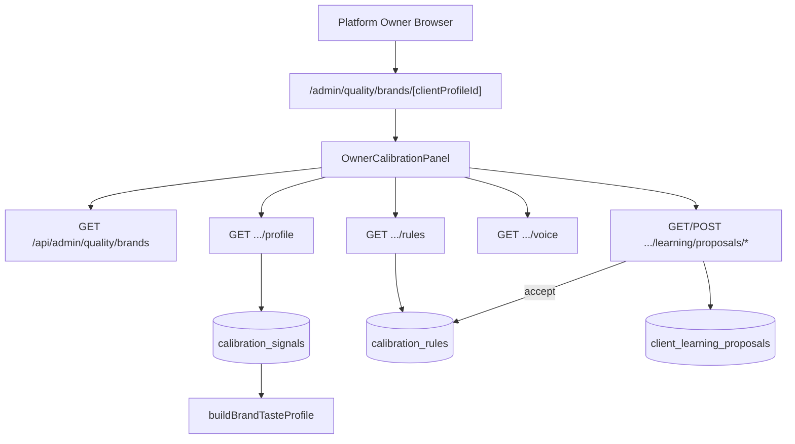

# Phase 165: Owner Calibration Panel — Research

**Researched:** 2026-06-24  
**Branch scouted:** `feat/corpus-learning-loop` @ `9d2368c6`  
**Domain:** Owner-only per-brand taste calibration UI + read APIs (profile, rules, proposals)  
**Confidence:** HIGH — gaps verified by codebase grep and file reads; no CONTEXT.md to constrain alternatives

## Summary

Phase 165 is an **integration and productization phase**, not a greenfield backend build. Phases 162–164 shipped the data plane: per-brand voice config, corpus learning proposals (LEARN-*), and prompt rule application (APPLY-*). The owner calibration **surface is fragmented**: voice inspect lives at `/admin/quality/brands/[clientProfileId]`; learning proposals live in `HumanQualityCorpusPanel` → Learning tab (workspace-scoped); `buildBrandTasteProfile()` and `listCalibrationRulesForClientProfile()` exist server-side but have **no owner HTTP APIs** and **no unified UI**.

The planner should **compose existing pieces** into one owner-only panel keyed by `clientProfileId`, add thin read APIs for taste profile + rules, wire proposal accept/reject with `clientProfileId` filter and fixture acknowledgment, and enforce honest evidence copy (PANEL-04) using existing `sourceComposition`, `evidenceLevel`, and `caveats` from `taste-profile.ts`. Full per-brand claims matrix UI/API depth is **Phase 166** (EVIDENCE-*); Phase 165 must not block on it but must avoid misleading “fully calibrated” language when `fixtureOnly` or low evidence.

**Primary recommendation:** Extend `/admin/quality/brands/[clientProfileId]` into a tabbed `OwnerCalibrationPanel` (Profile · Voice · Rules · Proposals), add `GET .../profile` and `GET .../rules` owner APIs, add `GET /api/admin/quality/brands` for cross-workspace brand picker, refactor `LearningProposalsTab` to accept `clientProfileId` + fixture ack — **do not rebuild** proposal accept/reject or taste-profile math.

## Architectural Responsibility Map

| Capability | Primary Tier | Secondary Tier | Rationale |
|------------|-------------|----------------|-----------|
| Brand taste profile (patterns, evidence, caveats) | API / Backend | Browser | `buildBrandTasteProfile` aggregates `calibration_signals` server-side; UI renders JSON |
| Approved + pending calibration rules | API / Backend | Browser | `listCalibrationRulesForClientProfile` scoped by `(workspaceId, clientProfileId)` |
| Learning proposal list/accept/reject | API / Backend | Browser | APIs exist under `/api/admin/quality/learning/proposals/*`; UI orchestrates |
| Voice/Olhar constitution inspect | API / Backend | Browser | Phase 162 `GET .../voice` already owner-gated |
| Source composition + honest status copy | API / Backend (data) + Browser (copy rules) | — | Profile payload carries truth; UI must not override with marketing labels |
| Owner access enforcement | API / Backend | Browser (403 UX) | `requirePlatformOwner` on every `/api/admin/quality/*` route; page shows forbidden state |
| `clientProfileId` selection | API / Backend (list) + Browser | — | Owner operates cross-workspace; workspace-scoped `/api/client-profiles` is insufficient |

## Existing vs Gap

| Area | Status | Location | PANEL |
|------|--------|----------|-------|
| Voice inspect API + panel | ✅ Exists | `api/admin/quality/brands/[id]/voice`, `BrandVoiceInspectPanel`, page | Partial (voice only, not full panel) |
| `buildBrandTasteProfile` + evidence levels | ✅ Exists | `server/brand-taste/taste-profile.ts` | PANEL-01 (no API/UI) |
| `listCalibrationRulesForClientProfile` | ✅ Exists | `server/repositories/calibration-rule.ts` | PANEL-02 (no API/UI) |
| Learning proposals list/accept/reject/generate | ✅ Exists | `api/admin/quality/learning/proposals/*`, `LearningProposalsTab` | PANEL-03 (not in unified panel; workspace-only filter) |
| `clientProfileId` filter on proposals API | ✅ Exists | `proposals/route.ts` query param | Not wired in UI |
| Fixture ack on accept | ✅ Exists | `accept/route.ts` + `proposals.ts` | UI does not send `acknowledgeFixtureOnly` |
| `requirePlatformOwner` on admin quality APIs | ✅ Exists | All `api/admin/quality/**` routes | PANEL-05 (API); page route unguarded |
| Unified owner calibration page | ❌ Gap | — | PANEL-01..04 |
| `GET .../profile` taste API | ❌ Gap | — | PANEL-01 |
| `GET .../rules` calibration rules API | ❌ Gap | — | PANEL-02 |
| Owner cross-workspace brand list | ❌ Gap | — | PANEL-01 selector |
| Honest calibration status copy | ❌ Gap | — | PANEL-04 |
| Panel + route access tests | ❌ Gap | voice route test only | PANEL-05 |
| Full per-brand claims matrix API | ⏸ Phase 166 | `calibration-evidence.ts` | EVIDENCE-02 (out of 165 scope) |

### Recommended build order

1. **Read APIs** — `GET /api/admin/quality/brands` (list), `GET .../profile`, `GET .../rules` with `requirePlatformOwner` + workspace resolution from `client_profiles`
2. **Unified panel component** — tabs: Profile, Voice (reuse `BrandVoiceInspectPanel`), Rules, Proposals (refactor `LearningProposalsTab`)
3. **Proposals UX hardening** — `clientProfileId` prop, fixture-only ack checkbox/modal before accept, pass `acknowledgeFixtureOnly: true` in POST body
4. **Evidence honesty** — status banner from `evidenceLevel` + `sourceComposition`; block “fully calibrated” / “customer-validated” strings when `fixtureOnly` or `claimsBlocked` includes `validated_against_customer_real`
5. **Access tests** — route 403 for non-owner; component forbidden states; optional Playwright capture route update in `capture-ui-screenshots.ts`

## Phase Requirements

<phase_requirements>
## Phase Requirements

| ID | Description | Research Support |
|----|-------------|------------------|
| PANEL-01 | Owner can select a `clientProfileId` and view brand taste profile (patterns, evidence level, caveats) | New `GET .../profile` wrapping `listCalibrationSignalsForClientProfile` + `buildBrandTasteProfile`; brand list API for selector; `OwnerCalibrationPanel` Profile tab |
| PANEL-02 | Owner can view approved and pending calibration rules for selected brand | New `GET .../rules` using `listCalibrationRulesForClientProfile` (status filter or grouped response); Rules tab table |
| PANEL-03 | Owner can accept/reject client learning proposals from same panel | Reuse `LearningProposalsTab` + existing accept/reject APIs; add `clientProfileId` query filter; embed in Proposals tab |
| PANEL-04 | Panel shows source composition; blocks misleading “fully calibrated” copy when fixture-only | Render `sourceComposition` + `caveats`; copy rules from `evaluateClaimsMatrix` / `buildEvidenceCaveats`; no green “calibrated” badge when `real_customer === 0` |
| PANEL-05 | Non-owner cannot access panel routes or APIs | Extend `requirePlatformOwner` pattern to new routes; component 403 handling like `BrandVoiceInspectPanel`; route tests mirroring `voice/route.test.ts` |
</phase_requirements>

## Standard Stack

### Core

| Library | Version | Purpose | Why Standard |
|---------|---------|---------|--------------|
| Next.js App Router | 16.2.9 (project) | Page at `(dashboard)/admin/quality/brands/[clientProfileId]` | Existing admin route pattern [VERIFIED: app/package.json] |
| React + TanStack Query | 5.101.1 | Panel data fetching | Used by `BrandVoiceInspectPanel`, `LearningProposalsTab` [VERIFIED: codebase] |
| Vitest + Testing Library | 4.1.9 / 16.3.2 | Unit + component tests | Project test runner [VERIFIED: app/package.json, vitest.config.ts] |
| Drizzle ORM | (project) | Profile/rules queries | Existing repositories [VERIFIED: codebase] |
| Zod | (project) | Route param/query validation | Pattern in `voice/route.ts` [VERIFIED: codebase] |

### Supporting

| Library | Version | Purpose | When to Use |
|---------|---------|---------|-------------|
| Existing layout primitives | — | `PageFrame`, `PageHeader`, `Panel` | Match `brands/[clientProfileId]/page.tsx` |
| `evaluateClaimsMatrix` | — | Blocked/allowed claim keys for banner | PANEL-04 honesty without duplicating Phase 166 report |

### Alternatives Considered

| Instead of | Could Use | Tradeoff |
|------------|-----------|----------|
| New profile/rules APIs | Single `GET .../calibration` aggregator | Aggregator reduces round-trips but couples cache invalidation; acceptable if planner prefers one fetch |
| Extend `HumanQualityCorpusPanel` tab | Dedicated `/admin/quality/brands/*` route | Corpus panel is workspace-global analytics; per-brand governance belongs on brand route (design intent) |
| Workspace picker + `/api/client-profiles` | Owner global brands list | Workspace API requires membership; owner is cross-workspace [VERIFIED: client-profiles/route.ts] |

**Installation:** No new npm packages required.

## Architecture Patterns

### System Architecture Diagram



### Recommended Project Structure

```
app/src/
├── app/(dashboard)/admin/quality/
│   ├── brands/page.tsx                    # optional index + selector
│   └── brands/[clientProfileId]/page.tsx  # unified panel shell
├── app/api/admin/quality/brands/
│   ├── route.ts                           # GET list (owner)
│   └── [clientProfileId]/
│       ├── profile/route.ts               # GET taste profile
│       └── rules/route.ts                 # GET rules by status
├── components/admin/
│   ├── BrandVoiceInspectPanel.tsx         # reuse as Voice tab
│   ├── OwnerCalibrationPanel.tsx          # new orchestrator
│   ├── BrandTasteProfilePanel.tsx         # new Profile tab
│   └── BrandCalibrationRulesPanel.tsx     # new Rules tab
└── components/feedback/
    └── LearningProposalsTab.tsx           # extend: clientProfileId, fixture ack
```

### Pattern 1: Owner read API with profile workspace resolution

**What:** Resolve `workspaceId` from `client_profiles` by PK, then scope all queries — never trust client-supplied workspace.  
**When to use:** Every new `brands/[clientProfileId]/*` route.  
**Example:**

```typescript
// Pattern from app/src/app/api/admin/quality/brands/[clientProfileId]/voice/route.ts
await requirePlatformOwner(request);
const [profile] = await db.select({ id, workspaceId }).from(clientProfiles)
  .where(eq(clientProfiles.id, clientProfileId)).limit(1);
if (!profile) return apiError("not_found", 404);
const signals = await listCalibrationSignalsForClientProfile({
  workspaceId: profile.workspaceId,
  clientProfileId: profile.id,
});
const tasteProfile = buildBrandTasteProfile({ ...profile, signals });
```

### Pattern 2: API-first owner gate with client 403 UX

**What:** Routes throw `WorkspaceAuthError` forbidden; components treat `403` as non-error empty state.  
**When to use:** All panel sections and PANEL-05.  
**Example:** `BrandVoiceInspectPanel` returns “restrita a proprietários” on `forbidden` [VERIFIED: codebase].

### Pattern 3: Fixture-only proposal accept

**What:** When `evidenceRefs.fixtureOnly === true`, UI requires explicit operator acknowledgment before POST.  
**When to use:** PANEL-03 + PANEL-04 intersection.  
**Example:**

```typescript
// API expects body — app/src/app/api/admin/quality/learning/proposals/[id]/accept/route.ts
await apiFetch(`/api/admin/quality/learning/proposals/${id}/accept`, {
  method: "POST",
  headers: { "content-type": "application/json" },
  body: JSON.stringify({ acknowledgeFixtureOnly: true }),
});
```

### Anti-Patterns to Avoid

- **Duplicating taste-profile math in UI:** Always consume `buildBrandTasteProfile` output; thresholds live in `taste-profile.ts`.
- **Workspace-scoped brand picker for owner:** `/api/client-profiles` requires `requireWorkspaceAccess` — wrong tier for global owner.
- **Marketing labels tied to `seed_calibrated`:** `seed_calibrated` with 100% `synthetic_fixture` is not “fully calibrated” (PANEL-04 / pitfall #5).
- **Page-only auth without API tests:** Admin pages have no middleware; API 403 is the real enforcement [VERIFIED: no middleware.ts].

## Don't Hand-Roll

| Problem | Don't Build | Use Instead | Why |
|---------|-------------|-------------|-----|
| Evidence level computation | Custom UI thresholds | `computeEvidenceLevel` + `buildEvidenceCaveats` | Single source of truth with prompt gating |
| Rule listing queries | Ad-hoc SQL in routes | `listCalibrationRulesForClientProfile` | Status filters, ordering already defined |
| Proposal accept materialization | New accept path | `acceptClientLearningProposal` | Cap enforcement, fixture ack, cooldown already wired |
| Owner auth | Custom header checks | `requirePlatformOwner` | Consistent with all admin quality routes |
| Claims blocking logic | Hardcoded string list in UI | `evaluateClaimsMatrix` keys + `caveats[]` | Aligns with Phase 166 evidence gate |

**Key insight:** Phase 165 is a **read-mostly composition layer** over Phase 162–164 services; hand-rolling business logic here creates drift from prompt-time behavior.

## Common Pitfalls

### Pitfall 1: Cross-workspace brand selection missing

**What goes wrong:** Owner must paste UUIDs; panel unusable in practice.  
**Why it happens:** Only workspace-scoped profile list exists.  
**How to avoid:** `GET /api/admin/quality/brands` joining `client_profiles` + workspace name, owner-only.  
**Warning signs:** PANEL-01 satisfied only by direct URL navigation.

### Pitfall 2: Learning tab stays workspace-global

**What goes wrong:** Proposals from other brands appear when reviewing one brand.  
**Why it happens:** `LearningProposalsTab` only passes `workspaceId`.  
**How to avoid:** Pass `clientProfileId` to query `?status=proposed&clientProfileId=...`.  
**Warning signs:** Accept on wrong brand’s proposal.

### Pitfall 3: Fixture accept without acknowledgment UI

**What goes wrong:** Accept fails with `fixture_ack_required` or operator bypasses via API.  
**Why it happens:** `LearningProposalsTab` POSTs empty body.  
**How to avoid:** Checkbox + confirm when `proposal.evidenceRefs.fixtureOnly`.  
**Warning signs:** 422 errors in network tab on accept.

### Pitfall 4: Misleading “calibrated” copy

**What goes wrong:** Operator believes brand is customer-validated.  
**Why it happens:** `seed_calibrated` label sounds complete; Cenbrap is fixture-only.  
**How to avoid:** Show source composition bar; use neutral labels (“Operator decisions only — no customer-real corpus”); hide superlatives when `real_customer === 0`.  
**Warning signs:** PANEL-04 manual QA fails on Cenbrap profile.

### Pitfall 5: UI-only access control

**What goes wrong:** Non-owner sees empty panel but APIs leak if misconfigured.  
**Why it happens:** No Next.js middleware for admin routes.  
**How to avoid:** Every new route uses `requirePlatformOwner`; copy `voice/route.test.ts` 403 cases.  
**Warning signs:** Missing route tests for new endpoints.

## Code Examples

### Build taste profile for API response

```typescript
// Source: app/src/server/brand-taste/prompt-calibration-loader.ts (pattern)
import { buildBrandTasteProfile } from "@/server/brand-taste/taste-profile";
import { listCalibrationSignalsForClientProfile } from "@/server/repositories/calibration-signal";

const signals = await listCalibrationSignalsForClientProfile({
  workspaceId: profile.workspaceId,
  clientProfileId: profile.id,
});
return buildBrandTasteProfile({
  clientProfileId: profile.id,
  workspaceId: profile.workspaceId,
  signals,
});
```

### Map rules for panel display

```typescript
// Source: app/src/server/brand-taste/calibration-rules.ts
import { mapRuleRowToCandidate } from "@/server/brand-taste/calibration-rules";
import { listCalibrationRulesForClientProfile } from "@/server/repositories/calibration-rule";

const rows = await listCalibrationRulesForClientProfile({
  workspaceId,
  clientProfileId,
  // omit status for all; or split approved vs candidate in response
});
const rules = rows.map(mapRuleRowToCandidate);
```

### Honest status banner (PANEL-04)

```typescript
// Source: app/src/server/brand-taste/taste-profile.ts + calibration-evidence.ts
function calibrationStatusLabel(profile: BrandTasteProfile): string {
  const fixtureOnly =
    profile.sourceComposition.real_customer === 0 && profile.decisionCount > 0;
  if (fixtureOnly) {
    return "Fixture/operator evidence only — not customer-validated";
  }
  return profile.evidenceLevel; // display mapped PT-BR labels in UI
}
// Never render "Totalmente calibrada" when fixtureOnly || evidenceLevel === "uncalibrated"
```

## State of the Art

| Old Approach | Current Approach | When Changed | Impact |
|--------------|------------------|--------------|--------|
| Cenbrap-only voice hardcode | DB voice per `clientProfileId` | Phase 162 | Voice tab ready; taste profile still signal-based |
| Proposals only in corpus Learning tab | Unified brand panel (this phase) | Phase 165 | Operator workflow per brand |
| Score calibration tab = brand taste | Separate concerns | v13.0+ | `/admin/quality/calibration` in admin design = workspace score audit, not brand taste — do not merge |

**Deprecated/outdated:**
- Treating `HumanQualityCorpusPanel` Calibration tab as brand taste UI — it is score-calibration / rubric adjustments [VERIFIED: HumanQualityCorpusPanel CalibrationTabContent].

## Assumptions Log

| # | Claim | Section | Risk if Wrong |
|---|-------|---------|---------------|
| A1 | Phase 165 route is `/admin/quality/brands/[clientProfileId]` not full admin shell refactor | Summary | Planner may scope admin-panel-design migration — confirm with user if `(admin)` layout expected |
| A2 | `calibration_signals` are sufficient for taste profile (corpus evals not yet merged into signals) | PANEL-01 | Profile may under-represent corpus-only brands until corpus→signal bridge (deferred FEATURES.md) |
| A3 | “Pending rules” means `status: candidate` plus `proposed` learning proposals, not a third entity | PANEL-02 | UX may need two subsections: rule candidates vs corpus proposals |
| A4 | Portuguese UI copy for operator (matches existing panels) | Patterns | [ASSUMED] — existing panels use PT-BR |

## Open Questions

1. **Brand index route vs deep-link only?**
   - What we know: Only `[clientProfileId]` page exists; screenshot script deep-links first DB profile.
   - What's unclear: Whether `/admin/quality/brands` index is required for PANEL-01 or combobox on panel suffices.
   - Recommendation: Ship list API + combobox on panel page; optional index redirect.

2. **Corpus-derived evidence in taste profile for v13.2?**
   - What we know: Taste profile reads `calibration_signals` only; corpus evaluations feed proposals separately.
   - What's unclear: Whether PANEL-04 source composition should include corpus eval sources.
   - Recommendation: Phase 165 uses signal `sourceComposition`; Phase 166 can extend evidence report — document caveat in Profile tab if `decisionCount === 0` but corpus evals exist.

3. **Deprecate Learning tab proposals after unify?**
   - What we know: `LearningProposalsTab` embedded in `HumanQualityCorpusPanel`.
   - Recommendation: Keep corpus Learning tab for workspace-wide ops; brand panel uses filtered instance — avoid duplicate accept paths with divergent UX.

## Environment Availability

Step 2.6: SKIPPED — no external dependencies beyond existing Next.js app, Postgres, and `PLATFORM_OWNER_EMAILS` env for owner auth.

| Dependency | Required By | Available | Version | Fallback |
|------------|------------|-----------|---------|----------|
| Node + npm | Vitest, dev server | ✓ | project standard | — |
| Postgres | Profile/rules APIs | ✓ | Neon (project) | TEST_DATABASE_URL for integration |
| PLATFORM_OWNER_EMAILS | Owner gate | ✓ | env | Dev admin emails via `parseDevAdminEmails` [VERIFIED: platform-owner.ts] |

## Validation Architecture

### Test Framework

| Property | Value |
|----------|-------|
| Framework | Vitest 4.1.9 [VERIFIED: npm registry 2026-06-24] |
| Config file | `app/config/vitest.config.ts` |
| Quick run command | `cd app && npm test -- --run src/components/admin/ src/app/api/admin/quality/brands/` |
| Full suite command | `cd app && npm test` |

### Phase Requirements → Test Map

| Req ID | Behavior | Test Type | Automated Command | File Exists? |
|--------|----------|-----------|-------------------|-------------|
| PANEL-01 | Profile API returns patterns, evidenceLevel, caveats | unit/route | `cd app && npm test -- --run src/app/api/admin/quality/brands/` | ❌ Wave 0 |
| PANEL-01 | Profile tab renders evidence + patterns | component | `cd app && npm test -- --run src/components/admin/OwnerCalibrationPanel.test.tsx` | ❌ Wave 0 |
| PANEL-02 | Rules API returns approved + candidate scoped to profile | unit/route | same brands API suite | ❌ Wave 0 |
| PANEL-02 | Rules tab lists categories/status | component | OwnerCalibrationPanel.test.tsx | ❌ Wave 0 |
| PANEL-03 | Proposals filtered by clientProfileId; accept sends fixture ack | component | `cd app && npm test -- --run src/components/feedback/LearningProposalsTab.test.tsx` | ❌ Wave 0 |
| PANEL-04 | No “fully calibrated” when fixture-only | component | OwnerCalibrationPanel.test.tsx | ❌ Wave 0 |
| PANEL-05 | Non-owner gets 403 on new APIs | unit/route | mirror `voice/route.test.ts` | ❌ Wave 0 |
| PANEL-05 | Non-owner sees forbidden panel copy | component | OwnerCalibrationPanel.test.tsx | ❌ Wave 0 |

### Sampling Rate

- **Per task commit:** `cd app && npm test -- --run <touched-test-files> -x`
- **Per wave merge:** `cd app && npm test -- --run src/app/api/admin/quality/ src/components/admin/ src/components/feedback/LearningProposalsTab.test.tsx`
- **Phase gate:** Full `cd app && npm test` green before `/gsd-verify-work`

### Wave 0 Gaps

- [ ] `src/app/api/admin/quality/brands/route.ts` + test — owner brand list for PANEL-01 selector
- [ ] `src/app/api/admin/quality/brands/[clientProfileId]/profile/route.ts` + test
- [ ] `src/app/api/admin/quality/brands/[clientProfileId]/rules/route.ts` + test
- [ ] `src/components/admin/OwnerCalibrationPanel.tsx` + `OwnerCalibrationPanel.test.tsx`
- [ ] `src/components/feedback/LearningProposalsTab.test.tsx` — clientProfileId filter + fixture ack (or extend HumanQualityCorpusPanel.test.tsx)
- [ ] Optional: update `app/scripts/capture-ui-screenshots.ts` route name to “Owner Calibration Panel”

## Security Domain

### Applicable ASVS Categories

| ASVS Category | Applies | Standard Control |
|---------------|---------|------------------|
| V2 Authentication | yes | Session via `getSessionFromHeaders` in `requirePlatformOwner` |
| V3 Session Management | yes | Existing session cookies |
| V4 Access Control | yes | `requirePlatformOwner` on all `/api/admin/quality/*`; server-resolved `workspaceId` from `clientProfileId` |
| V5 Input Validation | yes | Zod UUID on `clientProfileId` params and query filters |
| V6 Cryptography | no | Read-only panel phase |

### Known Threat Patterns

| Pattern | STRIDE | Standard Mitigation |
|---------|--------|---------------------|
| Cross-brand data leak via API | Information disclosure | Scope all queries by resolved `(workspaceId, clientProfileId)` [pitfall #10 PITFALLS.md] |
| Non-owner panel access | Elevation | API 403 + UI forbidden state; route tests |
| IDOR on `clientProfileId` | Information disclosure | Profile must exist; owner can see any workspace’s brand (intended global owner scope) |
| Fixture-only false confidence | Repudiation | `acknowledgeFixtureOnly` + honest copy (PANEL-04) |

## Phase Boundary (165 vs 166)

| Concern | Phase 165 (PANEL) | Phase 166 (EVIDENCE) |
|---------|-------------------|----------------------|
| Show `evidenceLevel` + `sourceComposition` | ✅ Required | Extends derivation rules |
| Per-brand claims matrix API + withheld claims report | Basic banner only | Full EVIDENCE-02..03 |
| Fixture caveat in UI | ✅ PANEL-04 | EVIDENCE-04 formalizes |
| Automated fixture vs mixed-source withholding tests | Smoke in panel tests | EVIDENCE-05 dedicated suite |

## Sources

### Primary (HIGH confidence)

- Codebase on `feat/corpus-learning-loop` — paths listed in Existing vs Gap
- `.planning/REQUIREMENTS.md` PANEL-01..05
- `.planning/phases/164-prompt-rule-application/164-VERIFICATION.md` — owner panel deferred note
- `docs/superpowers/specs/2026-06-21-corpus-learning-loop-design.md` §9 APIs, §11 Admin UI
- `.planning/research/FEATURES.md` — owner profile + rules UI dependency map
- `.planning/research/PITFALLS.md` #5, #10, #12

### Secondary (MEDIUM confidence)

- `docs/superpowers/specs/2026-06-21-admin-panel-design.md` — aspirational `/admin/quality/*` split; not fully implemented [VERIFIED: only `brands/[id]` page exists under admin quality]

### Tertiary (LOW confidence)

- A1 route choice vs full AdminShell migration — needs product confirmation

## Metadata

**Confidence breakdown:**
- Standard stack: HIGH — no new dependencies; patterns verified in-tree
- Architecture: HIGH — clear gap analysis vs shipped 162–164
- Pitfalls: HIGH — documented in PITFALLS.md and confirmed in LearningProposalsTab / accept route

**Research date:** 2026-06-24  
**Valid until:** 2026-07-24 (stable domain; UI composition only)
