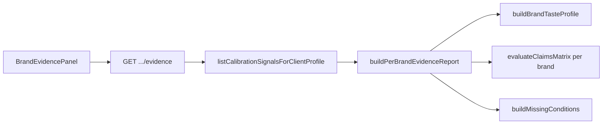

# Phase 166: Per-Brand Evidence Gate — Research

**Researched:** 2026-06-24  
**Branch scouted:** `feat/corpus-learning-loop`  
**Domain:** Per-brand evidence levels, claims matrix, missing-conditions report, fixture honesty  
**Confidence:** HIGH — core math exists; gaps are per-brand scoping, API surface, and UI depth

## Summary

Phase 166 is a **hardening and productization phase** for evidence honesty at the brand (`clientProfileId`) grain. Phases 162–165 shipped voice config, learning proposals, prompt application, and an owner calibration panel with basic `evidenceLevel`, `sourceComposition`, `fixtureOnly`, and status banners (PANEL-04). The server already computes evidence levels in `taste-profile.ts` and claim keys in `calibration-evidence.ts`, but **per-brand claims are not exposed**: `buildCalibrationEvidenceReport` evaluates claims once using `profiles[0]?.evidenceLevel` and global `fixtureOnly` across all signals — unsuitable for multi-brand honesty.

The planner should **extend `calibration-evidence.ts`** with a per-brand report builder (mirror `global-evidence.ts` patterns from v13.1), add `GET /api/admin/quality/brands/[clientProfileId]/evidence`, and add an **Evidência** tab in `OwnerCalibrationPanel` showing claims allowed/blocked, missing conditions, and mandatory fixture caveats. Reuse `evaluateClaimsMatrix`, `computeEvidenceLevel`, `buildEvidenceCaveats`, and Phase 165 profile route patterns — **do not duplicate thresholds**.

**Primary recommendation:** Two-wave plan — Wave 1 server + unit tests (EVIDENCE-01..03, EVIDENCE-05 core); Wave 2 UI tab + component tests (EVIDENCE-04, EVIDENCE-05 integration).

## Architectural Responsibility Map

| Capability | Primary Tier | Secondary Tier | Rationale |
|------------|-------------|----------------|-----------|
| Evidence level derivation | API / Backend | — | `computeEvidenceLevel` in `taste-profile.ts` [VERIFIED] |
| Per-brand claims matrix | API / Backend | Browser (display) | `evaluateClaimsMatrix` exists; must be invoked per brand with brand-scoped metrics |
| Missing conditions report | API / Backend | Browser (display) | Extend `buildOperatorDependencies` pattern; name exact gates per `clientProfileId` |
| Fixture-only detection | API / Backend | Browser (banner) | Per-brand: `real_customer === 0 && decisionCount > 0` (Phase 165 profile route) |
| Evidence HTTP contract | API / Backend | — | Owner-only route mirroring `profile/route.ts` |
| Evidence UI | Browser | API | New `BrandEvidencePanel`; Evidência tab on `OwnerCalibrationPanel` |
| Global corpus evidence | — | Reference only | `global-evidence.ts` / `global-corpus-evidence` route — do not conflate with per-brand gate |

## Existing vs Gap

| Area | Status | Location | EVIDENCE |
|------|--------|----------|----------|
| `computeEvidenceLevel` (4 levels) | ✅ Exists | `taste-profile.ts` | EVIDENCE-01 (in profile payload; formalize in evidence report) |
| `buildEvidenceCaveats` | ✅ Exists | `taste-profile.ts` | EVIDENCE-03 partial |
| `evaluateClaimsMatrix` | ✅ Exists | `calibration-evidence.ts` | EVIDENCE-02 (not per-brand yet) |
| `buildCalibrationEvidenceReport` | ⚠️ Partial | `calibration-evidence.ts` | Multi-brand aggregate; uses first profile for claims — **not per-brand** |
| Profile API `fixtureOnly` + `caveats` | ✅ Exists | `profile/route.ts` | EVIDENCE-04 partial (banner in `calibration-status-copy.ts`) |
| `getCalibrationStatusDisplay` fixture banner | ✅ Exists | `calibration-status-copy.ts` | EVIDENCE-04 partial |
| Global corpus evidence API | ✅ Exists | `global-corpus-evidence/route.ts` | Reference pattern only (v13.1) |
| `GET .../evidence` per-brand API | ❌ Gap | — | EVIDENCE-01..03 |
| `buildPerBrandEvidenceReport` | ❌ Gap | — | EVIDENCE-01..03 |
| `missingConditions` per `clientProfileId` | ❌ Gap | — | EVIDENCE-03 |
| Evidência tab + claims UI | ❌ Gap | — | EVIDENCE-02, EVIDENCE-04 |
| Fixture vs mixed-source withholding tests | ⚠️ Partial | `calibration-evidence.test.ts` (3 cases) | EVIDENCE-05 needs per-brand builder + API + UI coverage |

### Recommended build order

1. **Per-brand evidence builder** — `buildPerBrandEvidenceReport` wrapping `buildBrandTasteProfile` + per-brand `evaluateClaimsMatrix` + `buildMissingConditions`
2. **Evidence read API** — `GET /api/admin/quality/brands/[clientProfileId]/evidence` with `requirePlatformOwner`
3. **Unit tests** — extend `calibration-evidence.test.ts` with fixture-only vs mixed-source matrix cases
4. **Evidência UI** — `BrandEvidencePanel` + tab on `OwnerCalibrationPanel`; reinforce fixture caveat (EVIDENCE-04)
5. **Component tests** — withheld claims visible; fixture banner always when `fixtureOnly`

## Phase Requirements

<phase_requirements>
## Phase Requirements

| ID | Description | Research Support |
|----|-------------|------------------|
| EVIDENCE-01 | Each brand profile exposes evidence level from decision count + source composition | Already in `buildBrandTasteProfile`; evidence report must echo `evidenceLevel`, `decisionCount`, `sourceComposition` per `clientProfileId` |
| EVIDENCE-02 | Per-brand claims matrix blocks customer-real and quality-improvement claims when gates fail | `evaluateClaimsMatrix` per brand with brand-scoped `fixtureOnly`, `comparableCount`, `agreementRate` |
| EVIDENCE-03 | Evidence report names exact missing conditions per `clientProfileId` when insufficient | New `missingConditions: string[]` derived from thresholds in `taste-profile.ts` + blocked claims |
| EVIDENCE-04 | Fixture-only brands always carry explicit caveat in profile and panel UI | Extend profile payload `fixtureCaveat` if needed; Evidência tab + existing `getCalibrationStatusDisplay` banner |
| EVIDENCE-05 | Tests cover evidence withholding for fixture-only vs mixed-source brands | Unit tests on builder + route; component tests on `BrandEvidencePanel` |
</phase_requirements>

## Standard Stack

| Library | Version | Purpose |
|---------|---------|---------|
| Vitest | 4.1.9 | Unit + route + component tests |
| Next.js App Router | 16.2.9 | Evidence API route |
| TanStack Query | 5.101.1 | Panel data fetch |
| Existing brand-taste modules | — | No new npm packages |

## Architecture Patterns

### Per-brand evidence flow



### Pattern source (mirror)

| Pattern | Source file | Reuse in 166 |
|---------|-------------|--------------|
| Owner-gated brand GET | `profile/route.ts` | Evidence route structure |
| Claims evaluation | `global-evidence.ts` `evaluateGlobalCorpusClaims` | `dependsOnOperator` + `withheldClaims` shape |
| Per-brand claims | `calibration-evidence.ts` `evaluateClaimsMatrix` | Invoke with brand-local inputs |
| Fixture honesty UI | `calibration-status-copy.ts` | Same banner text in Evidência tab |
| Threshold constants | `taste-profile.ts` `SEED_CALIBRATION_MIN`, etc. | Import — do not duplicate |

## Key Implementation Notes

### Per-brand vs global bug (must fix)

`buildCalibrationEvidenceReport` currently:

```typescript
const fixtureOnly = input.allSignals.every((s) => s.sourceLabel === "synthetic_fixture");
// ...
evidenceLevel: input.profiles[0]?.evidenceLevel ?? "uncalibrated",
```

Phase 166 adds **`buildPerBrandEvidenceReport`** for single-brand scope. Leave multi-brand report unchanged unless callers need migration (out of scope).

### Proposed `PerBrandEvidenceReport` shape

```typescript
interface PerBrandEvidenceReport {
  schemaVersion: 1;
  capturedAt: string;
  clientProfileId: string;
  workspaceId: string;
  evidenceLevel: EvidenceLevel;
  decisionCount: number;
  comparableCount: number;
  agreementRate: number | null;
  sourceComposition: Record<CalibrationSourceLabel, number>;
  fixtureOnly: boolean;
  fixtureCaveat: string | null; // PT-BR when fixtureOnly
  claimsAllowed: string[];
  claimsBlocked: string[];
  withheldClaims: string[];
  missingConditions: string[];
  caveats: string[];
}
```

### Missing conditions (EVIDENCE-03)

Derive from blocked claims + thresholds:

- `decisionCount < 5` → seed calibration gate
- `real_customer < 3` when pursuing `evidence_backed` → customer-real sample gate
- `decisionCount < 10` when below `assisted` → assisted gate
- `fixtureOnly` → customer-real validation blocked
- `comparableCount < 5` → agreement rate gate

Use PT-BR operator-facing strings consistent with `buildOperatorDependencies` and global evidence `dependsOnOperator`.

### Phase boundary (165 vs 166)

| Concern | Phase 165 | Phase 166 |
|---------|-----------|-----------|
| Show `evidenceLevel` + `sourceComposition` | ✅ Profile tab | Formal evidence report |
| Claims matrix API | Basic banner only | Full EVIDENCE-02 |
| Missing conditions | — | EVIDENCE-03 |
| Fixture caveat | PANEL-04 banner | EVIDENCE-04 Evidência tab + API field |
| Dedicated withholding tests | Smoke | EVIDENCE-05 suite |

## Validation Architecture

### Test Framework

| Property | Value |
|----------|-------|
| Framework | Vitest 4.1.9 |
| Config file | `app/config/vitest.config.ts` |
| Quick run command | `cd app && npm test -- --run tests/unit/brand-taste/calibration-evidence.test.ts src/app/api/admin/quality/brands/` |
| Full suite command | `cd app && npm test` |
| Estimated runtime | ~15s quick / ~120s full |

### Phase Requirements → Test Map

| Req ID | Behavior | Test Type | Automated Command | File Exists? |
|--------|----------|-----------|-------------------|-------------|
| EVIDENCE-01 | Evidence report exposes 4 evidence levels | unit | `calibration-evidence.test.ts` | ✅ extend |
| EVIDENCE-02 | Claims blocked when gates fail | unit | `calibration-evidence.test.ts` | ✅ extend |
| EVIDENCE-03 | `missingConditions` lists exact gaps | unit | `calibration-evidence.test.ts` | ❌ Wave 0 |
| EVIDENCE-04 | Fixture caveat in API + UI | route + component | evidence route test + `BrandEvidencePanel.test.tsx` | ❌ Wave 0 |
| EVIDENCE-05 | Fixture-only vs mixed withholding | unit + component | `calibration-evidence.test.ts` + panel test | ⚠️ partial |

### Sampling Rate

- **Per task commit:** `cd app && npm test -- --run <touched-test-files> -x`
- **Per wave merge:** `cd app && npm test -- --run tests/unit/brand-taste/ src/app/api/admin/quality/brands/ src/components/admin/BrandEvidencePanel.test.tsx`
- **Phase gate:** Full `cd app && npm test` green before `/gsd-verify-work`

### Wave 0 Gaps

- [ ] `buildPerBrandEvidenceReport` + `buildMissingConditions` in `calibration-evidence.ts`
- [ ] `src/app/api/admin/quality/brands/[clientProfileId]/evidence/route.ts` + test
- [ ] `src/components/admin/BrandEvidencePanel.tsx` + test
- [ ] Extend `OwnerCalibrationPanel` with Evidência tab

## Security Domain

| Threat | Mitigation |
|--------|------------|
| Cross-brand leak | Resolve `workspaceId` from `client_profiles` PK; scope signal query |
| Non-owner access | `requirePlatformOwner` + 403 tests mirroring `profile/route.test.ts` |
| False confidence (fixture) | `fixtureCaveat` always set when `fixtureOnly`; blocked claims in UI |

## Open Questions

| # | Question | Resolution |
|---|----------|------------|
| 1 | Separate evidence tab vs extend Profile tab? | **Evidência tab** — keeps profile patterns readable; matches global corpus Coverage tab pattern |
| 2 | New API vs extend profile payload? | **Dedicated `GET .../evidence`** — avoids bloating profile cache; claims matrix is distinct concern |
| 3 | Reuse global claim key strings? | **Yes** — same keys as `evaluateClaimsMatrix` / `global-evidence.ts` for traceability |
| 4 | PT-BR vs EN for operator strings? | **PT-BR** — match Phase 165 `calibration-status-copy` and profile `corpusSignalsNote` |

## RESEARCH COMPLETE
