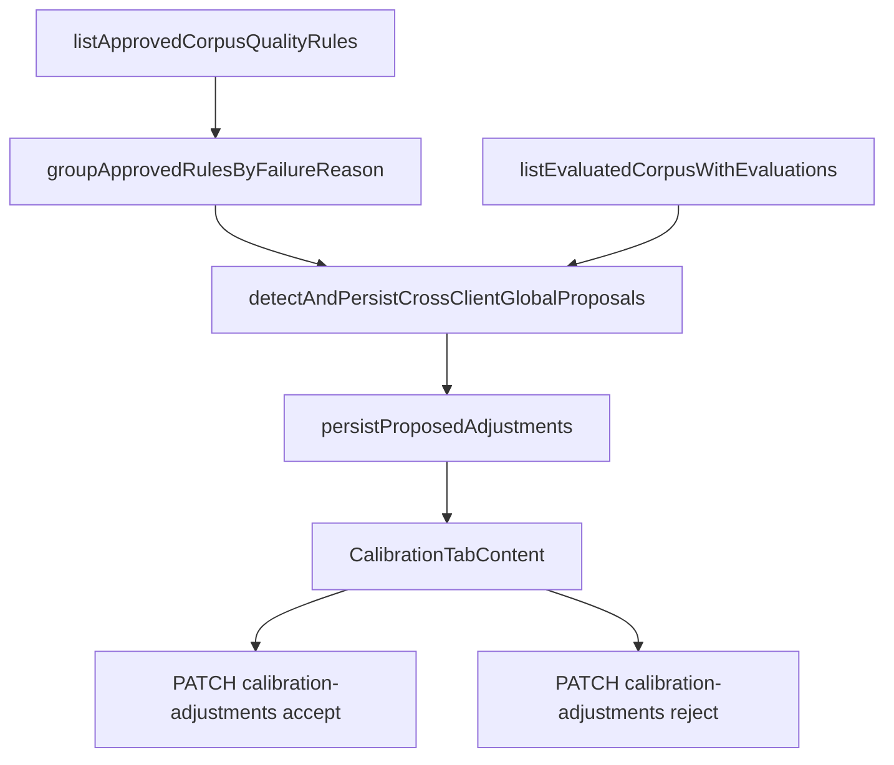

# Phase 167: Global Cross-Client Promotion — Research

**Researched:** 2026-06-24  
**Branch scouted:** `feat/corpus-learning-loop`  
**Domain:** Cross-client corpus_quality → global rubric_calibration_adjustments  
**Confidence:** HIGH — core detector ships; gaps are evidence metadata, reject lifecycle, UI, isolation proof

## Summary

Phase 167 closes the **final v13.2 loop**: when the same `primaryFailureReason` has approved `corpus_quality` rules in ≥2 brands with sufficient cross-client evaluations, the system proposes global `rubric_calibration_adjustments` for owner review — **without** leaking per-brand prompt rules across profiles.

**`detectAndPersistCrossClientGlobalProposals`** already exists in `cross-client.ts`, wired to `learning-proposal-aggregator` and `POST .../learning/proposals/generate`. Unit tests cover 2-client threshold, eval count, and divergence skip. The planner should **harden gaps only** — not re-implement detection.

**Primary recommendation:** Three-wave plan — Wave 1 cross-client evidence hardening (GLOBAL-01, GLOBAL-02); Wave 2 reject lifecycle + accept metadata (GLOBAL-03, GLOBAL-04); Wave 3 Calibration UI + isolation regression (GLOBAL-03 UI, GLOBAL-05).

## Architectural Responsibility Map

| Capability | Primary Tier | Secondary Tier | Rationale |
|------------|-------------|----------------|-----------|
| Cross-client detection | API / Backend | — | `cross-client.ts` groups approved `corpus_quality` rules by rationale prefix |
| Global proposal persistence | API / Backend | — | `persistProposedAdjustments` → `rubric_calibration_adjustments` |
| Source composition gate | API / Backend | — | `sourceLabel` already on `listEvaluatedCorpusWithEvaluations` — compute `fixtureOnly` in cross-client |
| Supporting client rule links | API / Backend | Browser (display) | Populate `supportingClientRuleIds` in `evidenceRefs` |
| Accept global adjustment | API / Backend | Browser | Existing `PATCH .../calibration-adjustments/[id]/accept` (Phase 132) |
| Reject global adjustment | API / Backend | Browser | **Gap** — schema has no `rejected` status |
| Per-brand prompt isolation | API / Backend | — | Proven in 164-03; add explicit GLOBAL-05 regression |
| Global proposals UI | Browser | API | Calibration tab read-only today — needs accept/reject + metadata |

## Existing vs Gap

| Area | Status | Location | GLOBAL |
|------|--------|----------|--------|
| Cross-client detector (≥2 clients, ≥6 evals, \|delta\|≥15) | ✅ Exists | `learning/cross-client.ts` | GLOBAL-01 (partial) |
| Wired to aggregator + generate route | ✅ Exists | `learning-proposal-aggregator.ts`, `generate/route.ts` | GLOBAL-01 |
| `listEvaluatedCorpusWithEvaluations` + `sourceLabel` | ✅ Exists | `human-quality-corpus.ts` | GLOBAL-02 (data available, not used) |
| `proposeAdjustments` + `persistProposedAdjustments` | ✅ Exists | `calibration/adjustments.ts`, `service.ts` | GLOBAL-01 |
| Accept adjustment API | ✅ Exists | `calibration-adjustments/[id]/accept` | GLOBAL-03 (partial) |
| Calibration tab (read-only proposals) | ✅ Exists | `HumanQualityCorpusPanel.tsx` CalibrationTabContent | GLOBAL-03 UI gap |
| Per-brand prompt isolation test | ✅ Exists | `prompt-rule-isolation.test.ts` (164-03) | GLOBAL-05 (partial — no global-adjustment case) |
| `fixtureOnly` on global `evidenceRefs` | ❌ Gap | — | GLOBAL-02 |
| `supportingClientRuleIds` in evidence | ❌ Gap | — | GLOBAL-03 |
| Reject global proposal + reason | ❌ Gap | schema check allows only proposed/accepted/superseded | GLOBAL-04 |
| Cross-client metadata in Calibration UI | ❌ Gap | — | GLOBAL-03 |
| Explicit global-does-not-leak-to-prompt test | ❌ Gap | — | GLOBAL-05 |

### Recommended build order

1. **Extend `CalibrationAdjustmentEvidence`** — `fixtureOnly`, `supportingClientRuleIds`, `primaryFailureReason`, `promotionSource: "cross_client"`
2. **Harden `cross-client.ts`** — compute fixtureOnly from sourceLabel; attach supporting rule IDs; enrich rationale
3. **Migration + reject lifecycle** — `rejected` status, `rejectedReason`, `rejectAdjustment` repo + PATCH route
4. **Accept hardening** — optional `acknowledgeFixtureOnly` for cross-client global proposals (mirror client proposals)
5. **Calibration UI** — show cross-client badge, supporting rules, accept/reject actions
6. **Isolation regression** — assert accepted global adjustments do not inject corpus_quality into per-brand prompts

## Phase Requirements

<phase_requirements>
## Phase Requirements

| ID | Description | Research Support |
|----|-------------|------------------|
| GLOBAL-01 | Same `primaryFailureReason` with approved `corpus_quality` in ≥2 `clientProfileId`s and ≥6 evals → global `rubric_calibration_adjustments` | Core logic in `cross-client.ts`; harden evidenceRefs + dedupe |
| GLOBAL-02 | Source gate: ≥1 `real_customer` or `operator_imported` else `fixture_only` flag | Use `sourceLabel` from evaluated rows; set `evidenceRefs.fixtureOnly` |
| GLOBAL-03 | Owner accepts via calibration-adjustments flow with links to supporting client rules | Populate `supportingClientRuleIds`; UI links in Calibration tab |
| GLOBAL-04 | Never auto-accept; reject requires reason | Verify no auto-accept path; add reject API + schema migration |
| GLOBAL-05 | Global promotion does not bypass per-brand prompt isolation | Extend isolation test — global accept must not add corpus_quality cross-profile |
</phase_requirements>

## Standard Stack

| Library | Version | Purpose |
|---------|---------|---------|
| Vitest | 4.1.9 | Unit + route + component tests |
| Drizzle | existing | Migration for rejected status |
| Next.js App Router | 16.2.9 | Reject route |
| Existing calibration modules | — | No new npm packages |

## Architecture Patterns

### Cross-client promotion flow



### Pattern source (reuse)

| Pattern | Source file | Reuse in 167 |
|---------|-------------|--------------|
| Rationale prefix parse | `cross-client.ts` `extractPrimaryFailureReasonFromRationale` | Same as 163 approved-rule gate |
| fixtureOnly computation | `learning/aggregate.ts` | Mirror: all synthetic_fixture → fixtureOnly |
| Client proposal fixture ack | `learning/proposals.ts` | Mirror on global accept when fixtureOnly |
| Accept lifecycle | `improvement/accept.ts` | Extend, do not fork |
| Prompt isolation | `prompt-rule-isolation.test.ts` | Add global-adjustment negative case |

## Key Implementation Notes

### cross-client.ts gaps (must fix)

Current `detectAndPersistCrossClientGlobalProposals`:
- Does not read `sourceLabel` on evaluated rows
- Does not set `fixtureOnly` or `supportingClientRuleIds` on persisted evidence
- Passes generic `proposeAdjustments` output without cross-client metadata

Proposed enrichment before `persistProposedAdjustments`:

```typescript
evidenceRefs: {
  ...proposal.evidenceRefs,
  fixtureOnly: rows.every((r) => r.sourceLabel === "synthetic_fixture"),
  supportingClientRuleIds: rules.map((r) => r.id),
  primaryFailureReason: failureReason,
  promotionSource: "cross_client",
}
```

### Schema gap for GLOBAL-04

`rubric_calibration_adjustments` check constraint: `status in ('proposed', 'accepted', 'superseded')`.  
Add migration: `rejected` status + `rejected_reason text` + `rejected_at` + `rejected_by` (mirror `client_learning_proposals`).

### Phase boundary (163 vs 167)

| Concern | Phase 163 | Phase 167 |
|---------|-----------|-----------|
| Client-scoped proposals | `client_learning_proposals` | — |
| Cross-client → global | Pre-wired call only | Full GLOBAL-* closure |
| Prompt injection | Phase 164 APPLY-* | Global affects rubric modules only, not per-brand prompts |

### Auto-accept verification (GLOBAL-04)

- `persistProposedAdjustments` inserts `status: proposed` only ✅
- `learning-proposal-aggregator` never calls accept ✅
- No cron auto-accept path found ✅

## Validation Architecture

### Test Framework

| Property | Value |
|----------|-------|
| Framework | Vitest 4.1.9 |
| Config file | `app/config/vitest.config.ts` |
| Quick run command | `cd app && npm test -- --run tests/unit/human-quality/learning/cross-client.test.ts` |
| Full suite command | `cd app && npm test` |
| Estimated runtime | ~10s quick / ~120s full |

### Phase Requirements → Test Map

| Req ID | Behavior | Test Type | Automated Command | File Exists? |
|--------|----------|-----------|-------------------|-------------|
| GLOBAL-01 | 2+ clients + 6 evals → proposed adjustment | unit | `cross-client.test.ts` | ✅ extend |
| GLOBAL-02 | fixtureOnly when all synthetic_fixture | unit | `cross-client.test.ts` | ❌ Wave 0 |
| GLOBAL-03 | evidenceRefs.supportingClientRuleIds populated | unit | `cross-client.test.ts` | ❌ Wave 0 |
| GLOBAL-03 | Accept returns adjustment with supporting refs | route | `accept/route.test.ts` | ✅ extend |
| GLOBAL-04 | Reject requires reason; 400 without | route | `reject/route.test.ts` | ❌ Wave 0 |
| GLOBAL-05 | Global accept does not leak rules to other profile prompt | unit | `global-promotion-isolation.test.ts` | ❌ Wave 0 |

### Sampling Rate

- **Per task commit:** `cd app && npm test -- --run <touched-test-files> -x`
- **Per wave merge:** `cd app && npm test -- --run tests/unit/human-quality/learning/ tests/unit/human-quality/improvement/ src/app/api/feedback/calibration-adjustments/`
- **Phase gate:** Full `cd app && npm test` green before `/gsd-verify-work`

### Wave 0 Gaps

- [ ] `fixtureOnly` + `supportingClientRuleIds` tests in `cross-client.test.ts`
- [ ] Migration `rejected` status on `rubric_calibration_adjustments`
- [ ] `calibration-adjustments/[id]/reject/route.ts` + test
- [ ] `global-promotion-isolation.test.ts` (or extend `prompt-rule-isolation.test.ts`)

## Open Questions

1. **Reject cooldown for global proposals?** — Design spec silent; mirror 30-day client cooldown only if operator requests. **Default: no cooldown** (global proposals are rare; dedupe by slice handles re-propose). **RESOLVED**
2. **Fixture ack on global accept?** — Mirror client proposal `acknowledgeFixtureOnly` when `evidenceRefs.fixtureOnly`. **RESOLVED: yes**
3. **UI location for accept/reject?** — Existing Calibration tab in `HumanQualityCorpusPanel` (owner corpus panel). **RESOLVED**
4. **New Learning tab for globals?** — Out of scope; Learning tab stays client-scoped; globals under Calibration. **RESOLVED**

## Sources

- `docs/superpowers/specs/2026-06-21-corpus-learning-loop-design.md` §8
- `.planning/REQUIREMENTS.md` GLOBAL-01..05
- `.planning/phases/163-corpus-learning-proposals/163-RESEARCH.md` — cross-client marked out of scope
- Live code: `app/src/server/human-quality/learning/cross-client.ts`, `app/tests/unit/human-quality/learning/cross-client.test.ts`

## RESEARCH COMPLETE
