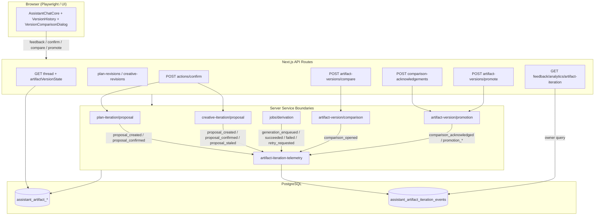

# Phase 207: Iterative Copilot Integration and UAT - Research

**Researched:** 2026-06-28
**Domain:** Safe operator telemetry + Nyquist test closure + authenticated Playwright UAT for plan/creative iteration loop
**Confidence:** HIGH

## Summary

Phase 207 is an integration-and-verification phase: it does not add new product semantics from Phases 203–206. It wires **observable, safe telemetry** at existing server boundaries and closes **automated test gaps** so the plan→creative iteration loop is provable end-to-end in CI.

The codebase already has a mature reference implementation for safe telemetry in `guided-flow-telemetry.ts` + `assistant_guided_flow_events` (Phase 190) and a read-only owner funnel at `GET /api/feedback/analytics/guided-flow-funnel`. CONTEXT locks D-01: create a **separate artifact-iteration event stream** (new table + emitter + repository), not overload guided-flow events. Emit points belong at service boundaries already owning mutations: plan/creative proposal confirm, derivation callbacks, compare/acknowledge/promote routes — never UI-only hooks.

Nyquist validation docs for Phases 204–206 still list Wave 0 gaps (`❌ W0`), but **most target test files now exist** in the repo (comparison, promotion, route, component, hook tests). Phase 207 should (a) reconcile stale VALIDATION.md claims against reality, (b) extend existing files for integration scenarios called out in CONTEXT (reload after promotion, stale card after concurrent head change, cross-thread isolation at service glue), and (c) add **new Playwright specs** — there is currently **zero** E2E coverage for artifact iteration (`grep` over `app/tests/e2e` finds no iteration/compare/promote specs).

Release closure reuses the v13.8 gate pattern (`run-v13-8-release-gate.mjs`, evidence JSON, milestone audit with claim boundaries). **No v13.9 gate script exists yet** — planner must add `run-v13-9-release-gate.mjs` + evidence template extending automated steps to Phases 203–207 test files and guided/iteration Playwright.

**Primary recommendation:** Mirror Phase 190 telemetry architecture for artifact iteration (table → sanitizer → repository → fire-and-forget emitter → owner read route), extend existing Vitest files for Nyquist gaps, and add one desktop + one mobile Playwright spec via `playwright.guided.config.ts` patterns with `guided-auth` + route mocks.

## Architectural Responsibility Map

| Capability | Primary Tier | Secondary Tier | Rationale |
|------------|-------------|----------------|-----------|
| Artifact-iteration event emission | API / Backend (service boundaries) | — | D-04: emit after successful mutations in proposal/confirm/derivation/promotion services and routes; never client-only |
| Telemetry payload sanitization | API / Backend | — | Positive allowlist + `containsDeniedPersistenceKeys` before insert |
| Telemetry persistence | Database / Storage | — | Append-only `assistant_artifact_iteration_events` table with scope denormalization |
| Operator telemetry query | API / Backend | — | Read-only owner route/script; `requirePlatformOwner` + workspace/time filters |
| Repository/API/component/contract tests | API / Backend + jsdom component | — | Vitest co-located tests; extend existing files per D-06 |
| Authenticated iteration-loop Playwright | Browser / Client (E2E) | API mocks in test | Desktop/mobile viewports; mocked LLM/credits/Inngest per D-08 |
| Milestone audit + release gate | Build / CI scripts | — | `run-v13-9-release-gate.mjs` orchestrates Vitest + build + evidence JSON |
| a11y landmarks (comparison dialog, version history) | Browser / Client (component + E2E) | — | Assert `role="dialog"`, `aria-labelledby` patterns already in components |

<user_constraints>
## User Constraints (from CONTEXT.md)

### Locked Decisions

#### Telemetry (QA-01)
- **D-01:** Extend the existing `assistant_guided_flow_events` pattern with a dedicated artifact-iteration event stream (table + emitter) rather than overloading guided-flow events.
- **D-02:** Event keys cover: `proposal_created`, `proposal_confirmed`, `generation_enqueued`, `generation_succeeded`, `generation_failed`, `comparison_opened`, `comparison_acknowledged`, `promotion_requested`, `promotion_succeeded`, `promotion_conflict`, `retry_requested`, `proposal_staled`.
- **D-03:** Payloads are positive allowlists only: scope dimensions, artifact type, lineage id, version numbers, proposal/action ids, operation id, stale/conflict reason codes. No prompts, signed URLs, snapshots, or provider payloads.
- **D-04:** Emit from existing service boundaries (plan/creative proposal confirm, derivation callbacks, comparison/promote routes) — no UI-only telemetry.
- **D-05:** Provide a read-only operator query route or script using workspace scope filters consistent with guided-flow funnel tooling.

#### Automated tests (QA-02)
- **D-06:** Close Nyquist gaps called out in 203–206 VALIDATION docs: cross-thread isolation, reload projection, idempotent replay mismatch, first-approval null head, compound promotion rollback — prefer extending existing test files over new harnesses.
- **D-07:** Add component/integration tests only where Phase 206 left human-needed items (reload after promotion, stale card after head change).
- **D-08:** Playwright uses the established `guided-auth` API sign-in pattern with route mocks for LLM/credits/Inngest; no live provider spend.
- **D-09:** One desktop and one mobile viewport spec file for the iteration loop: plan revision → confirm → creative revision → compare → approve/promote → reload verifies state → stale card after concurrent head change (mocked).
- **D-10:** Playwright asserts accessibility landmarks on comparison dialog and version history (existing a11y gate patterns).

#### Milestone closure
- **D-11:** Reuse v13.8/v13.9 release-gate scripts; milestone audit must cite explicit claim boundaries (what is proven in CI vs staging vs human).
- **D-12:** Production build + full unit suite remain hard gates before `complete-milestone`.

#### Inherited constraints
- **D-13:** Portuguese user-facing copy in UI tests; English identifiers in code/tests.
- **D-14:** Do not weaken SAFE-* invariants from Phases 203/205 for test convenience.

### Claude's Discretion

*(None listed in CONTEXT.md — research recommends mirroring Phase 190 discretion: metadata key allowlist shape, index naming, `occurred_at` override, test file organization.)*

### Deferred Ideas (OUT OF SCOPE)

- New revision semantics, new comparison/promotion rules, billing changes, or cross-thread memory (phase boundary).
</user_constraints>

<phase_requirements>
## Phase Requirements

| ID | Description | Research Support |
|----|-------------|------------------|
| QA-01 | Operator can query safe telemetry for proposal, confirmation, generation, comparison, approval, promotion, failure, and retry events | New `assistant_artifact_iteration_events` table + emitter mirroring `guided-flow-telemetry.ts`; 12 locked event keys (D-02); owner read route mirroring `guided-flow-funnel/route.ts` with `parseOwnerAnalyticsQuery` filters |
| QA-02 | Repository, API, component, contract, and authenticated Playwright tests cover plan and creative iteration, reload, conflict, failure, retry, comparison, approval, and promotion | Extend existing Vitest files (203–206); add component tests for reload/stale card (D-07); new Playwright spec(s) with `guided-auth` + mocks (D-08–D-10); v13.9 release gate bundles automated proof (D-11–D-12) |
</phase_requirements>

## Standard Stack

### Core

| Library | Version | Purpose | Why Standard |
|---------|---------|---------|--------------|
| Vitest | ^4.1.5 | Unit/integration/component tests | Project default; `app/config/vitest.config.ts` [VERIFIED: `app/package.json`] |
| @testing-library/react | ^16.3.2 | Component tests | Existing assistant component test pattern [VERIFIED: `app/package.json`] |
| @playwright/test | ^1.60.0 | Authenticated E2E | Phase 201 guided journey matrix [VERIFIED: `app/package.json`] |
| zod | 4.4.3 (registry) | Telemetry metadata strict objects | Same as guided-flow telemetry [VERIFIED: npm registry] |
| drizzle-orm | (project pin) | Migration + repository | All artifact tables use Drizzle [VERIFIED: `app/drizzle/0064_assistant_artifact_versions.sql`] |

### Supporting

| Library | Version | Purpose | When to Use |
|---------|---------|---------|-------------|
| `containsDeniedPersistenceKeys` | — | Denylist enforcement | All telemetry metadata before insert [VERIFIED: `guided-flow-telemetry.ts`] |
| `parseOwnerAnalyticsQuery` | — | Owner filter parsing | Operator query route [VERIFIED: `beta-analytics/query.ts`] |
| `requirePlatformOwner` | — | Owner-only analytics | Funnel route auth [VERIFIED: `guided-flow-funnel/route.ts`] |
| TanStack Query hooks | — | Client reload state | Thread `artifactVersionState` projection [VERIFIED: `use-assistant-threads.test.tsx`] |

### Alternatives Considered

| Instead of | Could Use | Tradeoff |
|------------|-----------|----------|
| New artifact-iteration table (D-01) | Overload `assistant_guided_flow_events` | Rejected — different domain, event keys, and query semantics |
| Live Inngest/LLM in Playwright | Route mocks (D-08) | Live paths cost money and flake; v13.8 accepted same debt pattern |

**Installation:** No new packages required — reuse existing test and schema stack.

## Architecture Patterns

### System Architecture Diagram



### Recommended Project Structure

```
app/
├── drizzle/
│   └── 0068_assistant_artifact_iteration_events.sql   # next migration after 0067
├── src/server/assistant/
│   ├── artifact-iteration-telemetry.ts                # sanitizer + emit (mirror guided-flow-telemetry.ts)
│   ├── artifact-iteration-telemetry.test.ts
│   └── artifact-iteration-funnel.ts                   # optional summary builder for owner route
├── src/server/repositories/
│   └── artifact-iteration-telemetry.ts                # insert + list + owner list
├── src/app/api/feedback/analytics/
│   └── artifact-iteration/route.ts                    # owner read (mirror guided-flow-funnel)
├── tests/e2e/
│   ├── iterative-copilot-loop.desktop.spec.ts         # D-09 desktop
│   └── iterative-copilot-loop.mobile.spec.ts          # D-09 mobile (or single file + projects)
└── scripts/
    ├── run-v13-9-release-gate.mjs                     # D-11 (create from v13-8 template)
    └── run-iterative-copilot-e2e.mjs                  # optional runner mirroring run-guided-e2e.mjs
```

### Pattern 1: Fire-and-forget safe telemetry (mirror Phase 190)

**What:** Validate event key + metadata allowlist, insert append-only row, swallow errors with structured warn log.

**When to use:** Every D-02 event at service boundary after successful mutation (or on expected failure paths like `generation_failed`, `promotion_conflict`).

**Example:**

```typescript
// Source: app/src/server/assistant/guided-flow-telemetry.ts (pattern)
export function emitArtifactIterationTelemetry(
  input: RecordArtifactIterationTelemetryInput
): void {
  void recordArtifactIterationTelemetryEvent(input);
}
```

### Pattern 2: Service-boundary emit map (D-04)

| Event key | Emit location | Trigger |
|-----------|---------------|---------|
| `proposal_created` | `plan-iteration/proposal.ts` → `proposePlanRevision` | After `createArtifactProposal` succeeds |
| `proposal_created` | `creative-iteration/proposal.ts` → `proposeCreativeRevision` | After `createArtifactProposal` succeeds |
| `proposal_confirmed` | `plan-iteration/proposal.ts` → `confirmPlanRevision` | After confirm transaction (include `idempotent` flag in metadata) |
| `proposal_confirmed` | `creative-iteration/proposal.ts` → `confirmCreativeRevision` | After proposal transition to confirmed |
| `generation_enqueued` | `action-execution/handlers/revise-creative.ts` | After `inngest.send` succeeds |
| `generation_succeeded` | `jobs/derivation.ts` | After `createArtifactVersion` for `creative_revision` |
| `generation_failed` | `jobs/derivation.ts` → `onFailure` | When `generationMode === "creative_revision"` |
| `retry_requested` | `revise-creative.ts` | When retry idempotency key path used (`creative_revision:retry:N`) |
| `comparison_opened` | `artifact-version/comparison.ts` → `compareArtifactVersions` | After successful compare DTO built |
| `comparison_acknowledged` | `artifact-version/promotion.ts` → `acknowledgeLinkedPlanComparison` | After acknowledgement persisted |
| `promotion_requested` | `artifact-version/promotion.ts` → `promoteThreadArtifactVersion` | Entry before transaction |
| `promotion_succeeded` | Same | After transaction commits (`replayed: false`) |
| `promotion_conflict` | `promote/route.ts` or promotion service | On `ArtifactHeadConflictError` / 409 conflict DTO |
| `proposal_staled` | `repositories/artifact-version.ts` → `staleSiblingProposals`; `creative-iteration/service.ts` → `markCreativeProposalsStaleOnPlanChange` | After stale transitions |

[VERIFIED: file paths from codebase grep and semantic search]

### Pattern 3: Owner read-only query (D-05)

**What:** `GET /api/feedback/analytics/artifact-iteration` with `requirePlatformOwner`, `parseOwnerAnalyticsQuery`, repository `listArtifactIterationEventsForOwner`, optional funnel summary.

**When to use:** Operator debugging — never expose to workspace members.

[VERIFIED: `guided-flow-funnel/route.ts`, `guided-flow-telemetry.ts` repository owner list]

### Pattern 4: Playwright iteration UAT (D-08–D-10)

**What:** `loginGuidedJourney` + `mockClientProfiles` from `tests/e2e/support/guided-auth.ts`; `page.route` mocks for thread, plan-revisions, creative-revisions, compare, promote, confirm, credits; Portuguese copy assertions; `getByRole("dialog")` and version history `aria-labelledby`.

**When to use:** End-to-end loop proof without provider spend.

[VERIFIED: `guided-assistant-journeys.spec.ts`, `playwright.guided.config.ts`, `VersionComparisonDialog.tsx`, `VersionHistory.tsx`]

### Anti-Patterns to Avoid

- **UI-only telemetry:** Violates D-04; hooks re-render and can double-fire.
- **Overloading guided-flow events:** Violates D-01; mixes journey funnel with artifact iteration.
- **New test harnesses:** Violates D-06; repo already has co-located Vitest files per layer.
- **Weakening SAFE invariants for mocks:** Violates D-14; use scoped fixtures, not bypass scope checks.

## Don't Hand-Roll

| Problem | Don't Build | Use Instead | Why |
|---------|-------------|-------------|-----|
| Telemetry sanitization | Custom string scrubber | `containsDeniedPersistenceKeys` + zod strict metadata object | Shared denylist with persistence layer [VERIFIED: Phase 190] |
| Owner analytics auth/filters | New query parser | `requirePlatformOwner` + `parseOwnerAnalyticsQuery` | Consistent owner tooling [VERIFIED: guided-flow-funnel] |
| E2E authentication | UI login flows | `loginGuidedJourney` API sign-in | Proven resilient pattern [VERIFIED: Phase 201] |
| Release gate orchestration | Ad-hoc CI script | Extend `run-v13-8-release-gate.mjs` → v13.9 | Evidence JSON + claim boundaries [VERIFIED: v13.8 audit] |
| Comparison/promotion semantics | New diff/promotion logic | Existing `comparison.ts` / `promotion.ts` | Out of phase scope |

**Key insight:** Phase 207 is glue and proof — the iteration semantics are already implemented; hand-rolling parallel telemetry or test infrastructure would drift from established Phase 190/201 patterns.

## Nyquist Gap Inventory (Phases 203–206)

> VALIDATION.md frontmatter for 204–206 still shows `wave_0_complete: false` and `❌ W0` file flags, but **filesystem audit on 2026-06-28 shows most files now exist**. Phase 207 should update VALIDATION sign-off and add **integration/E2E** coverage where unit tests stop.

| Gap (CONTEXT D-06) | Prior VALIDATION claim | Current repo status | Phase 207 action |
|--------------------|------------------------|---------------------|------------------|
| Cross-thread isolation | 204 W0 service scope test; 203 repo tests | `artifact-version.test.ts` rejects cross-thread; `draft.test.ts` (plan + creative) [VERIFIED] | Extend `plan-iteration/service.test.ts` + `creative-iteration/service.test.ts` with confirm-scope rejection; E2E negative path optional |
| Reload projection | 203 route/service | `service.test.ts` "approved and working versions independently on reload"; `use-assistant-threads.test.tsx` parses `artifactVersionState` [VERIFIED] | Component test: UI reflects post-promotion reload (D-07); Playwright reload step (D-09) |
| Idempotent replay mismatch | 206 promotion | `artifact-version.test.ts` "rejects replay when operation id belongs to a different command" [VERIFIED] | Assert telemetry emits no duplicate `promotion_succeeded` on replay (QA-01) |
| First-approval null head | 206 APPR | `artifact-version.test.ts` "approves the first official version when the head has no current official" [VERIFIED] | Wire test to emit `promotion_succeeded` with `expectedOfficialVersionId: null` metadata |
| Compound promotion rollback | 206-02 | `artifact-version.test.ts` rollback tests for canonical failure + creative CAS conflict [VERIFIED] | Extend `promotion.test.ts` service-level test if route layer untested; telemetry `promotion_conflict` on rollback path |
| Reload after promotion (human) | 206 manual deferral | No component test for post-promote reload | **New** `AssistantChatCore` or `VersionHistory` test (D-07) |
| Stale card after head change | 206 manual deferral | `markCreativeProposalsStaleOnPlanChange` unit tests exist; no UI stale card test | **New** component + Playwright mocked concurrent head change (D-07, D-09) |
| Authenticated browser matrix | 206 explicit deferral to 207 | No iteration E2E specs | **New** Playwright desktop + mobile (D-09) |

### Existing test files to extend (do not replace)

| Layer | Files |
|-------|-------|
| Contract | `src/lib/assistant/artifact-version.test.ts` |
| Repository | `src/server/repositories/artifact-version.test.ts` |
| Plan iteration | `src/server/assistant/plan-iteration/*.test.ts` |
| Creative iteration | `src/server/assistant/creative-iteration/*.test.ts` |
| Handlers | `revise-creative-plan.test.ts`, `revise-creative.test.ts` |
| Derivation | `src/server/jobs/derivation.test.ts` |
| Comparison/promotion service | `comparison.test.ts`, `promotion.test.ts`, `service.test.ts` |
| Routes | `artifact-versions/compare/route.test.ts`, `promote/route.test.ts`, `comparison-acknowledgements/route.test.ts`, `plan-revisions/route.test.ts`, `creative-revisions/route.test.ts` |
| Hooks | `use-assistant-artifact-versions.test.tsx`, `use-assistant-threads.test.tsx` |
| Components | `VersionHistory.test.tsx`, `VersionComparisonDialog.test.tsx`, `AssistantActionCard.test.tsx`, `AssistantChatCore.test.tsx` |
| Telemetry (new) | Co-locate with `artifact-iteration-telemetry.ts` + repository + owner route |
| E2E (new) | `tests/e2e/iterative-copilot-loop.*.spec.ts` |
| Release | `tests/unit/release/v13-9-release-evidence.test.ts` (create from v13-8 template) |

## Common Pitfalls

### Pitfall 1: Stale VALIDATION.md blocks planning

**What goes wrong:** Planner creates duplicate Wave 0 files that already exist.

**Why it happens:** 204–206 VALIDATION frontmatter not updated after execution.

**How to avoid:** First 207 task wave: grep filesystem vs VALIDATION tables; mark existing files ✅ before writing new tests.

**Warning signs:** Plan lists `comparison.test.ts` as `❌ W0` when file is present.

### Pitfall 2: Telemetry payload leakage

**What goes wrong:** Operator table stores prompts, signed URLs, or snapshots.

**Why it happens:** Reusing version DTOs or proposal payloads directly as metadata.

**How to avoid:** D-03 positive allowlist only; run `containsDeniedPersistenceKeys` on every metadata object; unit test rejected keys.

**Warning signs:** Metadata keys like `snapshot`, `previewUrl`, `feedback` (full text), `prompt`.

### Pitfall 3: Double emit on idempotent replay

**What goes wrong:** Duplicate funnel counts for `promotion_succeeded` / `proposal_confirmed`.

**Why it happens:** Emitting before idempotency check.

**How to avoid:** Emit after service returns; include `idempotent` / `replayed` boolean in metadata; skip second success emit when `replayed: true` [ASSUMED: confirm with product — metadata flag is safest].

### Pitfall 4: Playwright live provider spend

**What goes wrong:** Flaky tests, credit charges, CI cost.

**Why it happens:** Not mocking Inngest/LLM/credits routes.

**How to avoid:** D-08 route mocks; follow `guided-assistant-journeys.spec.ts` pattern; never call live `derivation.generate`.

### Pitfall 5: v13.9 gate without claim boundaries

**What goes wrong:** Milestone audit over-claims live Inngest/staging proof.

**Why it happens:** Copying v13.8 verdict without inherited debt section.

**How to avoid:** D-11 explicit CI vs staging vs human matrix; inherit `liveInngestLifecycle: unverified` from STATE.md until separately proven.

## Code Examples

### Telemetry sanitizer (mirror guided-flow)

```typescript
// Source: app/src/server/assistant/guided-flow-telemetry.ts
export const ARTIFACT_ITERATION_EVENT_KEYS = [
  "proposal_created",
  "proposal_confirmed",
  // ... D-02 keys
] as const;

export function sanitizeArtifactIterationMetadata(input: unknown) {
  if (containsDeniedPersistenceKeys(input)) {
    throw new ArtifactIterationTelemetrySanitizationError(
      "metadata contains denied persistence keys"
    );
  }
  return metadataSchema.parse(input); // zod strictObject on allowlisted scalars
}
```

### Owner analytics route

```typescript
// Source: app/src/app/api/feedback/analytics/guided-flow-funnel/route.ts (pattern)
export async function GET(request: Request) {
  await requirePlatformOwner(request);
  const filters = parseOwnerAnalyticsQuery(new URL(request.url).searchParams);
  const events = await listArtifactIterationEventsForOwner(filters);
  return NextResponse.json({ filters, events });
}
```

### Playwright auth + mock entry

```typescript
// Source: app/tests/e2e/guided-assistant-journeys.spec.ts
test.beforeEach(async ({ page }) => {
  await mockClientProfiles(page);
  await loginGuidedJourney(page);
});
```

### a11y assertions (comparison + history)

```typescript
// Source: VersionComparisonDialog.test.tsx + VersionHistory.tsx
await expect(page.getByRole("dialog")).toBeVisible();
await expect(page.getByTestId("version-history")).toBeVisible();
// VersionHistory uses aria-labelledby="version-history-title"
```

## State of the Art

| Old Approach | Current Approach | When Changed | Impact |
|--------------|------------------|--------------|--------|
| Guided-flow events for all assistant telemetry | Separate artifact-iteration stream (D-01) | Phase 207 | Cleaner operator queries per domain |
| Manual-only compare/approve | Automated component tests (206) | 2026-06-28 | Browser E2E still missing — Phase 207 |
| v13.8 release gate only | v13.9 gate for iteration phases | Phase 207 | New `run-v13-9-release-gate.mjs` needed |

**Deprecated/outdated:**
- 204–206 VALIDATION `❌ W0` rows for files that now exist — treat as documentation debt, not implementation debt.

## Assumptions Log

| # | Claim | Section | Risk if Wrong |
|---|-------|---------|---------------|
| A1 | Skip second `promotion_succeeded` / `proposal_confirmed` telemetry when `replayed: true` | Pattern 1 | Operator funnel under-counts legitimate retries |
| A2 | Next Drizzle migration is `0068` (after `0067_assistant_artifact_approvals`) | Project structure | Migration numbering collision |
| A3 | v13.9 inherits v13.8 accepted debt for live Inngest/staging until explicitly re-verified | Milestone closure | Over-claiming production readiness |
| A4 | Two Playwright spec files (desktop + mobile) preferred over one file with projects | D-09 | Planner may choose single file + `playwright.guided.config.ts` projects — both satisfy intent |

## Open Questions

1. **Telemetry table name**
   - What we know: Guided flow uses `assistant_guided_flow_events`; artifact tables use `assistant_artifact_*` prefix.
   - What's unclear: Exact table name not locked in CONTEXT.
   - Recommendation: `assistant_artifact_iteration_events` for consistency [ASSUMED A2].

2. **Funnel summary vs raw event list for operator route**
   - What we know: Guided flow has `buildGuidedFlowFunnelSummary`.
   - What's unclear: Whether iteration needs aggregated funnel or raw list is enough.
   - Recommendation: Ship raw filtered list first (D-05); optional summary helper if planner wants parity with Phase 191.

3. **Single vs dual Playwright spec files**
   - What we know: D-09 says one desktop and one mobile viewport spec file; `playwright.guided.config.ts` already defines desktop/mobile projects.
   - Recommendation: One spec file matched by guided config projects is acceptable if test names distinguish viewports; two files also fine.

## Environment Availability

| Dependency | Required By | Available | Version | Fallback |
|------------|------------|-----------|---------|----------|
| Node.js | Vitest, Playwright, gate scripts | ✓ | v25.9.0 | — |
| npm / npx | test runners | ✓ | — | — |
| PostgreSQL (TEST_DATABASE_URL) | Repository integration tests | ✓ (when env set) | — | `npm run test:db:setup` per 206 VALIDATION |
| Dev server :3000 | Playwright E2E | ✓ (reuse or spawn) | — | `run-guided-e2e.mjs` / `E2E_SKIP_WEBSERVER` |
| Live Inngest / OpenAI | — | Not required | — | Route mocks (D-08) |

**Missing dependencies with no fallback:** None for Phase 207 scope.

**Missing dependencies with fallback:** Live provider paths — mocked E2E only.

## Validation Architecture

### Test Framework

| Property | Value |
|----------|-------|
| Framework | Vitest ^4.1.5 (node + jsdom) + Playwright ^1.60.0 |
| Config file | `app/config/vitest.config.ts`, `app/playwright.guided.config.ts` |
| Quick run command | `cd app && npm test -- --run src/server/assistant/artifact-iteration-telemetry.test.ts src/server/repositories/artifact-version.test.ts` |
| Full suite command | `cd app && npm test && npx tsc --noEmit --pretty false && npm run build` |
| Playwright iteration | `cd app && npx playwright test --config playwright.guided.config.ts tests/e2e/iterative-copilot-loop*.spec.ts` |

### Phase Requirements → Test Map

| Req ID | Behavior | Test Type | Automated Command | File Exists? |
|--------|----------|-----------|-------------------|-------------|
| QA-01 | Event keys + metadata allowlist | unit | `npm test -- --run src/server/assistant/artifact-iteration-telemetry.test.ts` | ❌ Wave 0 |
| QA-01 | Repository scope isolation on insert | unit | `npm test -- --run src/server/repositories/artifact-iteration-telemetry.test.ts` | ❌ Wave 0 |
| QA-01 | Owner query route auth + filters | route | `npm test -- --run src/app/api/feedback/analytics/artifact-iteration/route.test.ts` | ❌ Wave 0 |
| QA-01 | Emit on proposal_created | integration | `npm test -- --run src/server/assistant/plan-iteration/proposal.test.ts -t telemetry` | ❌ Wave 0 (extend) |
| QA-01 | Emit on promotion_succeeded / promotion_conflict | integration | `npm test -- --run src/server/assistant/artifact-version/promotion.test.ts -t telemetry` | ❌ Wave 0 (extend) |
| QA-02 | Cross-thread isolation | repository + service | `npm test -- --run src/server/repositories/artifact-version.test.ts src/server/assistant/plan-iteration/service.test.ts` | partial ✅ |
| QA-02 | Reload projection | service + hook | `npm test -- --run src/server/assistant/artifact-version/service.test.ts src/lib/hooks/use-assistant-threads.test.tsx` | ✅ |
| QA-02 | Idempotent replay mismatch | repository | `npm test -- --run src/server/repositories/artifact-version.test.ts -t "rejects replay"` | ✅ |
| QA-02 | First-approval null head | repository | `npm test -- --run src/server/repositories/artifact-version.test.ts -t "first official"` | ✅ |
| QA-02 | Compound promotion rollback | repository | `npm test -- --run src/server/repositories/artifact-version.test.ts -t "rolls back"` | ✅ |
| QA-02 | Reload after promotion (UI) | component | `npm test -- --run src/components/assistant/VersionHistory.test.tsx -t "reload"` | ❌ Wave 0 (extend) |
| QA-02 | Stale card after head change | component | `npm test -- --run src/components/assistant/AssistantActionCard.test.tsx -t "stale"` | ❌ Wave 0 (extend) |
| QA-02 | Full iteration loop desktop | e2e | `npx playwright test --config playwright.guided.config.ts --project=desktop iterative-copilot-loop` | ❌ Wave 0 |
| QA-02 | Full iteration loop mobile | e2e | `npx playwright test --config playwright.guided.config.ts --project=mobile iterative-copilot-loop` | ❌ Wave 0 |
| QA-02 | a11y landmarks on compare + history | e2e + component | Playwright `getByRole("dialog")` + existing component tests | partial ✅ |
| QA-02 | v13.9 release gate | unit | `npm test -- --run tests/unit/release/v13-9-release-evidence.test.ts` | ❌ Wave 0 |

### Sampling Rate

- **Per task commit:** Requirement-specific Vitest file(s) from map above (<30s).
- **Per wave merge:** All artifact-version + plan/creative iteration + telemetry tests.
- **Phase gate:** Full Vitest + `tsc` + `npm run build` + Playwright iteration specs green before `/gsd-verify-work`.

### Wave 0 Gaps

- [ ] `artifact-iteration-telemetry.ts` + `.test.ts` — sanitizer, event keys, fire-and-forget
- [ ] `repositories/artifact-iteration-telemetry.ts` + `.test.ts` — insert, scoped list, owner list
- [ ] Drizzle migration `0068_assistant_artifact_iteration_events.sql`
- [ ] `api/feedback/analytics/artifact-iteration/route.ts` + `.test.ts`
- [ ] Telemetry emit assertions in proposal/promotion/derivation tests (extend existing)
- [ ] Component extensions: reload after promotion, stale card (D-07)
- [ ] `tests/e2e/iterative-copilot-loop.desktop.spec.ts` (+ mobile variant)
- [ ] `scripts/run-v13-9-release-gate.mjs` + `tests/unit/release/v13-9-release-evidence.test.ts`
- [ ] Update `playwright.guided.config.ts` `testMatch` to include iteration specs (or dedicated config)

## Security Domain

### Applicable ASVS Categories

| ASVS Category | Applies | Standard Control |
|---------------|---------|------------------|
| V2 Authentication | yes (E2E + owner route) | `requirePlatformOwner` for telemetry query; workspace auth on mutation routes |
| V3 Session Management | yes (Playwright) | API sign-in via `guided-auth`; no credential storage in tests |
| V4 Access Control | yes | Four-dimensional scope on all artifact + telemetry rows; cross-thread rejection |
| V5 Input Validation | yes | zod strict schemas on telemetry metadata, compare/promote commands |
| V6 Cryptography | no new crypto | N/A — no new secrets |

### Known Threat Patterns

| Pattern | STRIDE | Standard Mitigation |
|---------|--------|---------------------|
| Cross-thread telemetry or mutation | Elevation of privilege | Scope assert in repository before insert [VERIFIED: `guided-flow-telemetry.ts` repository] |
| Prompt/URL leakage in operator telemetry | Information disclosure | D-03 allowlist + `containsDeniedPersistenceKeys` |
| Operator route exposed to tenants | Information disclosure | `requirePlatformOwner` only [VERIFIED: guided-flow-funnel] |
| Idempotent replay abuse | Tampering | Operation ID + command digest match [VERIFIED: `artifact-version.ts`] |

## Project Constraints (from .cursor/rules/)

No `.cursor/rules/` directory exists in the workspace root. `app/AGENTS.md` notes Next.js breaking changes — read `node_modules/next/dist/docs/` when touching Next.js APIs during route implementation.

## Sources

### Primary (HIGH confidence)

- `app/src/server/assistant/guided-flow-telemetry.ts` — telemetry emitter/sanitizer pattern
- `app/drizzle/0059_assistant_guided_flow_events.sql` — table shape reference
- `app/src/app/api/feedback/analytics/guided-flow-funnel/route.ts` — owner query pattern
- `app/tests/e2e/guided-assistant-journeys.spec.ts` + `support/guided-auth.ts` — Playwright auth/mocks
- `app/scripts/run-v13-8-release-gate.mjs` — release gate orchestration
- `.planning/phases/207-iterative-copilot-integration-and-uat/207-CONTEXT.md` — locked decisions
- Filesystem audit of `app/src/server/assistant/{plan-iteration,creative-iteration,artifact-version}/**/*.test.ts` — Nyquist gap reconciliation

### Secondary (MEDIUM confidence)

- `.planning/phases/203-206/*-VALIDATION.md` — gap inventory (stale W0 flags noted)
- `.planning/milestones/v13.8-MILESTONE-AUDIT.md` — claim boundary template for D-11
- `docs/TESTING.md` — framework versions and commands

### Tertiary (LOW confidence)

- None requiring validation — all critical claims verified in repo or CONTEXT.

## Metadata

**Confidence breakdown:**
- Standard stack: HIGH — verified package.json and existing patterns
- Architecture: HIGH — emit points traced to concrete service files
- Pitfalls: HIGH — grounded in Phase 190/201/206 experience and CONTEXT locks

**Research date:** 2026-06-28
**Valid until:** 2026-07-28 (stable patterns; Playwright spec structure may vary per planner)
