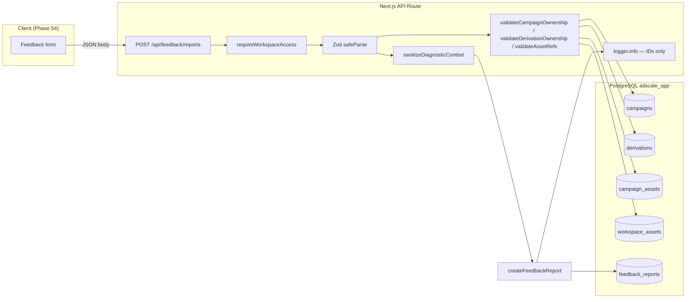

# Phase 53: Feedback Data Model and Secure API - Research

**Researched:** 2026-06-05
**Domain:** PostgreSQL (Drizzle) data model + Next.js App Router secure API for beta feedback
**Confidence:** HIGH (codebase-verified patterns); MEDIUM (API route design — not yet implemented)

## Summary

Phase 53 delivers the server-side foundation for beta feedback: a `feedback_reports` table, workspace-scoped persistence, diagnostic sanitization, entity reference validation, and a single authenticated `POST /api/feedback/reports` endpoint. UI, Sentry client correlation, and owner triage are explicitly deferred to phases 54–55.

**Critical repo state:** Substantial groundwork already exists as **untracked / uncommitted** work under `app/`. The planner should treat phase execution as **finish and wire**, not greenfield:

| Artifact | Path | Status |
|----------|------|--------|
| Drizzle table | `app/src/server/db/schema.ts` (`feedbackReports`) | Present (modified) |
| SQL migration | `app/drizzle/0026_feedback_reports.sql` | Present (not in `drizzle/meta/_journal.json`) |
| Sanitization | `app/src/server/feedback/sanitize.ts` | Present |
| Ref validation | `app/src/server/feedback/validate-refs.ts` | Present |
| Repository | `app/src/server/repositories/feedback.ts` | Present |
| API route | `app/src/app/api/feedback/reports/route.ts` | **Missing** |
| Tests | `sanitize`, `validate-refs`, repository, route | **Missing** |

Migration journal ends at `0024_wealthy_silver_sable`; `0025_beta_entitlements.sql` and `0026_feedback_reports.sql` exist on disk but are **not registered** in `drizzle/meta/_journal.json`. Planner must reconcile via `npm run db:generate` (if schema drift) or register/apply migrations consistently before deploy.

**Primary recommendation:** Commit and journal the existing schema/migration/helpers/repository, implement `POST /api/feedback/reports` using the established `requireWorkspaceAccess` + Zod + `handleApiError` pattern, call `sanitizeDiagnosticContext` / `validateAssetRefs` before insert, and add Vitest coverage for sanitization, cross-workspace rejection, and non-sensitive structured logs.

<user_constraints>
## User Constraints (from CONTEXT.md)

### Locked Decisions

#### Data model
- Single `feedback_reports` table in `adscale_app` schema with status, type, severity, category, message, followUpAllowed, route, contextKind, workspaceId, userId, campaignId, derivationId (nullable FKs), diagnosticContext (jsonb), sentryCorrelation (jsonb), contextCompleteness (jsonb), timestamps.
- Status values: `new`, `reviewing`, `resolved`, `archived`.
- Type values: `bug`, `suggestion`, `question`, `other`.
- Severity values: `low`, `medium`, `high`, `critical`.
- Asset references stored as normalized jsonb array on the report (`assetRefs`) with `{ kind, id, key? }` — no duplicate file storage.
- Internal owner notes and resolution summary columns exist on the table but are only writable via owner APIs in phase 55.

#### API surface (this phase)
- `POST /api/feedback/reports` — create only in this phase.
- `PATCH /api/feedback/reports/[id]` — status/notes reserved for phase 55; do not expose to beta users in this phase.
- Use `requireWorkspaceAccess` for auth; reject if session/workspace missing.
- Server validates optional `campaignId`, `derivationId`, and each `assetRefs[]` entry belongs to the active workspace before insert.

#### Diagnostic sanitization
- Max message length 4000 chars; max diagnostic JSON 32 KB after normalization.
- Strip keys matching `/token|password|secret|authorization|cookie|prompt/i` and truncate long string values (>500 chars).
- Exclude raw request bodies, full prompts, auth headers, and unrelated workspace entity IDs.
- Breadcrumb array capped at 20 entries, each entry capped at 1 KB serialized.

#### Observability (server)
- Log report creation and validation failures with `reportId`, `workspaceId`, `userId`, `requestId` only — no message or diagnostic body in logs.
- Reuse existing structured logger patterns from the app.

### Claude's Discretion

- Exact Zod schema field names and category enum list (suggest: `ui`, `generation`, `billing`, `performance`, `other`).
- Repository file layout (`server/repositories/feedback.ts`).
- Migration numbering under `app/drizzle/`.
- Unit vs integration test split.

### Deferred Ideas (OUT OF SCOPE)

- Feedback modal UI — Phase 54.
- Sentry client correlation tags — Phase 54.
- Owner triage list/detail — Phase 55.
- Browser smoke and privacy audit doc — Phase 56.
- Email notifications on new reports — backlog (FBK-FUT-02).
</user_constraints>

<phase_requirements>
## Phase Requirements

| ID | Description | Research Support |
|----|-------------|------------------|
| FBK-02 | Beta user can submit structured feedback with type, severity, category, message, and optional follow-up permission. | `POST` body Zod enums + `createFeedbackReport`; message max 4000; `followUpAllowed` boolean. Client UI in phase 54 calls this API. |
| OBS-03 | Server-side feedback handling logs report creation and validation failures with non-sensitive IDs matchable to the report. | `logger.info`/`logger.warn` with `reportId`, `workspaceId`, `userId`, `requestId` only; pattern from `campaigns/[id]/derivations/route.ts`. |
| SEC-01 | Feedback create APIs enforce authenticated workspace membership before accepting report data. | `requireWorkspaceAccess(request)` → 401/403 via `handleApiError`; inserts always use `workspace.id` + `user.id` from session. |
| SEC-02 | Server validates every submitted campaign, derivation, campaign asset, workspace asset, and output reference against active workspace. | `validateCampaignOwnership`, `validateDerivationOwnership`, `validateAssetRefs` in `server/feedback/validate-refs.ts`; mirror `assets/link/route.ts` ownership checks. |
| SEC-03 | Diagnostic context excludes secrets, tokens, raw bodies, full prompts, unrelated workspace data. | `sanitizeDiagnosticContext` + `sanitizeBreadcrumbs` in `server/feedback/sanitize.ts`; align with `sanitizeBrandMemoryPayload` precedent. |
</phase_requirements>

## Architectural Responsibility Map

| Capability | Primary Tier | Secondary Tier | Rationale |
|------------|-------------|----------------|-----------|
| AuthN / workspace gate | API / Backend | — | Session + workspace resolved server-side; never trust client workspace IDs. |
| Input validation (shape, enums, sizes) | API / Backend | — | Zod at route boundary; reject before DB. |
| Entity ownership checks | API / Backend | Database | Queries scoped by `workspaceId` on campaigns, derivations, assets. |
| Diagnostic sanitization | API / Backend | — | Normalize/strip before persist; client sends raw-ish JSON in phase 54. |
| Persistence | Database | API / Backend | Drizzle insert into `adscale_app.feedback_reports`. |
| Structured logging | API / Backend | — | IDs only at create/validation failure. |
| Sentry correlation storage | Database | Browser (phase 54) | `sentryCorrelation` jsonb stored now; populated client-side later. |
| Owner triage / PATCH | — (phase 55) | API / Backend | Repository `updateFeedbackReportStatus` exists but must not be exposed this phase. |

## Standard Stack

### Core

| Library | Version | Purpose | Why Standard |
|---------|---------|---------|--------------|
| drizzle-orm | 0.45.2 `[VERIFIED: npm registry]` | Schema, inserts, workspace-scoped selects | Already used for all `adscale_app` tables |
| drizzle-kit | 0.31.10 `[VERIFIED: npm registry]` | Migrations | `npm run db:migrate` / `db:generate` in `app/package.json` |
| zod | 4.4.3 `[VERIFIED: npm registry]` | Request body validation | Used on all API routes (e.g. `campaigns/route.ts`) |
| better-auth (session) | ^1.6.9 `[VERIFIED: package.json]` | Authentication | `requireWorkspaceAccess` → `getSessionFromHeaders` |
| Next.js App Router | 16.2.6 | `route.ts` handlers | Existing API layout under `app/src/app/api/` |

### Supporting

| Library | Version | Purpose | When to Use |
|---------|---------|---------|-------------|
| `@/lib/logger` | (in-repo) | Structured console logs | Create + validation failure events |
| `@/lib/api-response` | (in-repo) | `apiError`, `handleApiError`, `apiSuccess` | Consistent error shapes + i18n codes |
| Vitest | ^4.1.5 | Unit + route tests | `npm test` from `app/` |

### Alternatives Considered

| Instead of | Could Use | Tradeoff |
|------------|-----------|----------|
| In-app `sanitizeDiagnosticContext` | Only client-side redaction | Fails SEC-03; server must enforce |
| Separate feedback microservice | — | Rejected in REQUIREMENTS.md (Out of Scope) |

**Installation:** No new packages required for phase 53.

## Architecture Patterns

### System Architecture Diagram



### Recommended Project Structure

```
app/src/
├── app/api/feedback/reports/route.ts     # NEW — POST only
├── server/
│   ├── db/schema.ts                    # feedbackReports (exists)
│   ├── repositories/feedback.ts        # create + get + update (exists)
│   └── feedback/
│       ├── sanitize.ts                 # exists
│       └── validate-refs.ts            # exists
├── tests/unit/feedback-sanitize.test.ts    # NEW
├── tests/unit/feedback-validate-refs.test.ts # NEW (mock db or integration)
└── app/api/feedback/reports/route.test.ts  # NEW — colocated pattern optional
app/drizzle/0026_feedback_reports.sql   # exists — fix journal
```

### Pattern 1: Authenticated workspace-scoped API route

**What:** Resolve session + workspace once; never accept `workspaceId` from client body for authorization.

**When to use:** All feedback endpoints.

**Example:**

```typescript
// Pattern from app/src/app/api/campaigns/route.ts + assets/link/route.ts
export async function POST(request: Request) {
  try {
    const { user, workspace } = await requireWorkspaceAccess(request);
    const body = await request.json();
    const parsed = createFeedbackReportSchema.safeParse(body);
    if (!parsed.success) {
      return apiError("invalidInput", 400, parsed.error.flatten());
    }
    // validate refs, sanitize, createFeedbackReport({ workspaceId: workspace.id, userId: user.id, ... })
    return apiSuccess({ report }, 201);
  } catch (error) {
    return handleApiError(error, "feedback.reports.POST");
  }
}
```

`requireWorkspaceAccess` implementation `[VERIFIED: app/src/server/auth/workspace.ts]` throws `WorkspaceAuthError` for missing session or workspace; `handleApiError` maps to 401/403.

### Pattern 2: Entity ownership before insert

**What:** For each optional FK / asset ref, query with `workspaceId` constraint; 404/400 on mismatch.

**When to use:** `campaignId`, `derivationId`, `assetRefs[]`.

**Precedent:** `app/src/app/api/campaigns/[id]/assets/link/route.ts` uses `getCampaignById(campaignId, workspace.id)` and `getWorkspaceAssetById(id, workspace.id)`.

**Existing helpers:** `validate-refs.ts` already implements batch `inArray` checks for campaign assets, workspace assets, and derivation outputs `[VERIFIED: codebase]`.

### Pattern 3: Diagnostic sanitization before persist

**What:** Run `sanitizeDiagnosticContext` on client-provided diagnostic blob; optionally merge sanitized breadcrumbs.

**Precedent:** `sanitizeBrandMemoryPayload` in `app/src/server/memory/brand-memory-events.ts` strips secret-like keys `[VERIFIED: brand-memory-events.test.ts]`.

**Phase-specific rules** in `sanitize.ts` match CONTEXT (32 KB cap, 500-char strings, sensitive key regex, breadcrumb limits) `[VERIFIED: app/src/server/feedback/sanitize.ts]`.

### Pattern 4: Non-sensitive structured logging

**What:** On success and validation failure, log correlation IDs only.

**Example:**

```typescript
const requestId = request.headers.get("x-request-id") ?? crypto.randomUUID();
logger.info("[feedback.reports.POST] created", {
  reportId: report.id,
  workspaceId: workspace.id,
  userId: user.id,
  requestId,
});
```

`requestId` is not used elsewhere in the repo today `[VERIFIED: grep]`; generating per-request UUID (optional header override) satisfies OBS-03.

### Anti-Patterns to Avoid

- **Accepting `workspaceId` from JSON body for auth:** Bypasses SEC-01.
- **Logging `message` or `diagnosticContext`:** Violates OBS-03 and privacy goals.
- **Exposing `updateFeedbackReportStatus` via PATCH in phase 53:** Reserved for phase 55; beta users must not set `internalNotes` / status.
- **Storing duplicate asset binaries:** Use `assetRefs` references only (locked).
- **Skipping migration journal update:** Deploy will not apply `0026` if journal out of sync.

## Don't Hand-Roll

| Problem | Don't Build | Use Instead | Why |
|---------|-------------|-------------|-----|
| JSON secret stripping | Ad-hoc regex per route | `sanitizeDiagnosticContext` (+ extend if needed) | Centralized limits; testable |
| Workspace membership check | Custom session parsing | `requireWorkspaceAccess` | Consistent 401/403 |
| Campaign/derivation exists | Trust client UUIDs | `validateCampaignOwnership` / `getCampaignById` pattern | SEC-02 |
| Error responses | Custom JSON shapes | `apiError` / `handleApiError` | i18n + Sentry on 500 |
| ORM migrations | Raw SQL only | drizzle-kit + `adscale_app` schema filter | Matches `drizzle.config.ts` |

**Key insight:** The repo already extracted feedback-specific sanitization and validation — the planner should wire them, not duplicate.

## Common Pitfalls

### Pitfall 1: Migration not applied in CI/production

**What goes wrong:** Table missing at runtime; 500 on create.

**Why it happens:** `0026_feedback_reports.sql` not in `_journal.json`; `0025` also absent from journal.

**How to avoid:** Run `npm run db:migrate` after journal fix; verify in Render/staging.

**Warning signs:** `relation "adscale_app.feedback_reports" does not exist`.

### Pitfall 2: Cross-workspace entity references

**What goes wrong:** User submits another workspace's `campaignId`.

**Why it happens:** FK columns nullable; Postgres won't block wrong workspace if ID exists elsewhere.

**How to avoid:** Always call validators with `workspace.id` from session before insert.

**Warning signs:** Integration test with two workspaces fails without 400.

### Pitfall 3: campaignId + derivationId inconsistency

**What goes wrong:** Derivation belongs to a different campaign than submitted `campaignId`.

**Why it happens:** CONTEXT does not lock consistency rule; validators check workspace only.

**How to avoid:** When both IDs present, load derivation and assert `derivation.campaignId === campaignId` `[ASSUMED: recommended — confirm in plan]`.

### Pitfall 4: Leaking diagnostics via logs or 400 `details`

**What goes wrong:** `parsed.error.flatten()` or logged Zod input includes message body.

**How to avoid:** Log only IDs; return generic `invalidInput` without echoing diagnostic fields.

### Pitfall 5: Repository update exposed too early

**What goes wrong:** Beta user PATCHes status or `internalNotes`.

**How to avoid:** No `PATCH` route in phase 53; owner-only routes in phase 55 with `requireRole` / platform-owner gate.

## Code Examples

### Create feedback report (repository — exists)

```typescript
// app/src/server/repositories/feedback.ts [VERIFIED: codebase]
export async function createFeedbackReport(input: CreateFeedbackReportInput) {
  const [report] = await db.insert(feedbackReports).values({
    workspaceId: input.workspaceId,
    userId: input.userId,
    status: "new",
  type: input.type,
    // ...
  }).returning();
  return report;
}
```

### Suggested Zod schema (discretion — align with repository types)

```typescript
// Source: pattern from app/src/app/api/campaigns/route.ts [VERIFIED]
const assetRefSchema = z.object({
  kind: z.enum(["campaign_asset", "workspace_asset", "derivation_output"]),
  id: z.string().uuid(),
  key: z.string().max(512).optional(),
});

export const createFeedbackReportSchema = z.object({
  type: z.enum(["bug", "suggestion", "question", "other"]),
  severity: z.enum(["low", "medium", "high", "critical"]),
  category: z.enum(["ui", "generation", "billing", "performance", "other"]),
  message: z.string().trim().min(1).max(4000),
  followUpAllowed: z.boolean().optional().default(false),
  route: z.string().max(2048).optional(),
  contextKind: z.enum(["global", "campaign", "derivation"]).optional(),
  campaignId: z.string().uuid().optional(),
  derivationId: z.string().uuid().optional(),
  assetRefs: z.array(assetRefSchema).max(20).optional().default([]),
  diagnosticContext: z.record(z.unknown()).optional(),
  sentryCorrelation: z.record(z.unknown()).optional(),
  contextCompleteness: z.record(z.unknown()).optional(),
});
```

Map `FeedbackValidationError` to `apiError("invalidInput", 400, { code: error.code })` without entity IDs from other workspaces in message text.

### Handle validation errors without leaking payload

```typescript
// In route.ts after validators
} catch (error) {
  if (error instanceof FeedbackValidationError) {
    logger.warn("[feedback.reports.POST] validation failed", {
      workspaceId: workspace.id,
      userId: user.id,
      requestId,
      code: error.code,
    });
    return apiError("invalidInput", 400, { code: error.code });
  }
  return handleApiError(error, "feedback.reports.POST");
}
```

## State of the Art

| Old Approach | Current Approach | When Changed | Impact |
|--------------|------------------|--------------|--------|
| No beta feedback table | `feedback_reports` + migration 0026 | 2026 (in progress) | Enables phases 54–56 |
| Brand-memory-only sanitization | Dedicated `server/feedback/sanitize.ts` | In-repo WIP | Stricter breadcrumb/size rules for feedback |

**Deprecated/outdated:**
- None for this phase; do not reuse derivation `feedback` text column for beta reports (different feature).

## Assumptions Log

| # | Claim | Section | Risk if Wrong |
|---|-------|---------|---------------|
| A1 | When both `campaignId` and `derivationId` are sent, derivation must belong to that campaign | Pitfall 3 | Orphan or misleading triage links |
| A2 | `requestId` = `x-request-id` header or new UUID per request | Pattern 4 | OBS-03 correlation harder if ops expects different header |
| A3 | `sentryCorrelation` / `contextCompleteness` accepted as opaque jsonb on create (sanitized lightly or trusted as small objects) | Zod example | Oversized Sentry metadata — cap in Zod if needed |
| A4 | `updateFeedbackReportStatus` in repository is for phase 55 only — no public route in 53 | Anti-patterns | Scope creep |

## Open Questions

1. **Migration journal reconciliation**
   - What we know: `0025` and `0026` SQL files exist; journal stops at `0024`.
   - What's unclear: Whether `0025` was applied manually to Neon.
   - Recommendation: Planner task — run `drizzle-kit` status/migrate in staging; regenerate journal if needed.

2. **Derivation–campaign consistency**
   - Recommendation: Add validator in route when both IDs present; document in PLAN verification steps.

## Environment Availability

| Dependency | Required By | Available | Version | Fallback |
|------------|------------|-----------|---------|----------|
| Node.js | Vitest, Next build | ✓ | v24.3.0 | — |
| npm / app deps | drizzle, zod | ✓ | lockfile | — |
| DATABASE_URL | migrate + integration tests | ✓/✗ per env | — | Unit tests mock DB; integration needs `TEST_DATABASE_URL` |
| psql CLI | optional local debug | ✗ | — | Use `db:studio` or hosted console |
| drizzle-kit migrate | deploy | ✓ | 0.31.10 | — |

**Missing dependencies with no fallback:**
- `DATABASE_URL` for applying `0026` in target environment (blocking deploy, not blocking unit tests with mocks).

## Validation Architecture

### Test Framework

| Property | Value |
|----------|-------|
| Framework | Vitest ^4.1.5 `[VERIFIED: app/package.json]` |
| Config file | `app/config/vitest.config.ts` |
| Quick run command | `cd app && npm test` |
| Full suite command | `cd app && npm test` (same; e2e via `npm run test:e2e` — out of scope phase 53) |

### Phase Requirements → Test Map

| Req ID | Behavior | Test Type | Automated Command | File Exists? |
|--------|----------|-----------|-------------------|-------------|
| FBK-02 | Valid create payload accepted | unit/route | `cd app && npx vitest run src/app/api/feedback/reports/route.test.ts -x` | ❌ Wave 0 |
| FBK-02 | Message > 4000 rejected | unit | `cd app && npx vitest run tests/unit/feedback-sanitize.test.ts -x` | ❌ Wave 0 |
| SEC-01 | No session → 401 | route | `cd app && npx vitest run src/app/api/feedback/reports/route.test.ts -x` | ❌ Wave 0 |
| SEC-02 | Wrong workspace campaignId → 400 | route | same | ❌ Wave 0 |
| SEC-03 | Strips `password`, `authorization`, `prompt` keys | unit | `cd app && npx vitest run tests/unit/feedback-sanitize.test.ts -x` | ❌ Wave 0 |
| SEC-03 | Diagnostic JSON > 32 KB bounded | unit | same | ❌ Wave 0 |
| OBS-03 | Logger called with IDs, not message | unit | `cd app && npx vitest run src/app/api/feedback/reports/route.test.ts -x` (spy logger) | ❌ Wave 0 |

### Sampling Rate

- **Per task commit:** `cd app && npx vitest run tests/unit/feedback-sanitize.test.ts src/app/api/feedback/reports/route.test.ts -x`
- **Per wave merge:** `cd app && npm test`
- **Phase gate:** Full vitest green; migration applied on staging DB

### Wave 0 Gaps

- [ ] `app/src/app/api/feedback/reports/route.ts` — POST handler
- [ ] `app/src/app/api/feedback/reports/route.test.ts` — auth, validation, success 201
- [ ] `app/tests/unit/feedback-sanitize.test.ts` — limits, sensitive keys, breadcrumb cap
- [ ] `app/tests/unit/feedback-validate-refs.test.ts` — optional if route tests mock validators
- [ ] `app/drizzle/meta/_journal.json` — register `0025`/`0026` if not already
- [ ] Commit WIP: schema, migration, `server/feedback/*`, `repositories/feedback.ts`

## Security Domain

### Applicable ASVS Categories

| ASVS Category | Applies | Standard Control |
|---------------|---------|------------------|
| V2 Authentication | yes | `requireWorkspaceAccess` + Better Auth session |
| V3 Session Management | yes | Server-side session; no feedback without session |
| V4 Access Control | yes | Workspace-scoped queries; phase 55 adds owner role |
| V5 Input Validation | yes | Zod + sanitization + size caps |
| V6 Cryptography | no | No new crypto; do not store tokens in diagnostic jsonb |

### Known Threat Patterns for Next.js + Postgres

| Pattern | STRIDE | Standard Mitigation |
|---------|--------|---------------------|
| IDOR on campaign/derivation/asset refs | Elevation | `validate*` with session `workspace.id` |
| Sensitive data in diagnostic JSON | Information disclosure | `sanitizeDiagnosticContext` |
| Log injection / PII in logs | Information disclosure | Log IDs only (OBS-03) |
| Unauthenticated report spam | DoS | Auth required; optional rate limit later (not phase 53) |

## Project Constraints (from .cursor/rules/)

No `.cursor/rules/` directory in ADScale_2 workspace root `[VERIFIED: glob]`. Follow `app/AGENTS.md` Next.js 16 conventions and existing API/repository patterns.

## Sources

### Primary (HIGH confidence)

- `app/src/server/db/schema.ts` — `feedbackReports` table definition
- `app/drizzle/0026_feedback_reports.sql` — migration DDL
- `app/src/server/feedback/sanitize.ts`, `validate-refs.ts`
- `app/src/server/repositories/feedback.ts`
- `app/src/server/auth/workspace.ts`, `app/src/lib/api-response.ts`
- `app/src/app/api/campaigns/route.ts`, `campaigns/[id]/assets/link/route.ts`
- `.planning/phases/53-feedback-data-model-and-secure-api/53-CONTEXT.md`
- `.planning/REQUIREMENTS.md` — FBK-02, OBS-03, SEC-01–03

### Secondary (MEDIUM confidence)

- npm registry — zod 4.4.3, drizzle-orm 0.45.2, drizzle-kit 0.31.10

### Tertiary (LOW confidence)

- None asserted as fact without codebase verification

## Metadata

**Confidence breakdown:**
- Standard stack: HIGH — pinned in `app/package.json` and verified via `npm view`
- Architecture: HIGH — matches existing routes; gap analysis from live WIP files
- Pitfalls: HIGH — migration journal mismatch verified in `_journal.json`

**Research date:** 2026-06-05
**Valid until:** 2026-07-05 (stable stack); re-check if drizzle journal or WIP lands on main before execute
