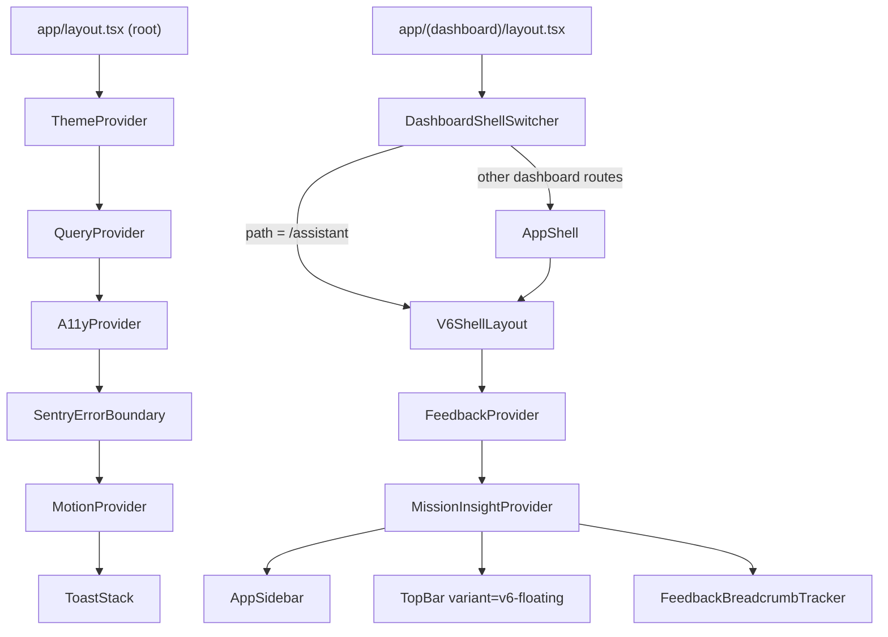
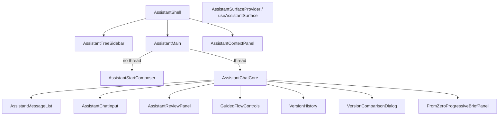

<!-- generated-by: gsd-doc-writer -->

# ADScale Frontend Components

The `app/src/components/` tree holds every React component in the ADScale web client — a Next.js (App Router) + React 19 application styled with Tailwind CSS and a CSS-variable design-token system. Components are organized into **21 feature-oriented subdirectories** that map closely to product surfaces: the conversational **Assistant**, **campaigns** management, the creative **workspace**, the home **creative-work** composer, **brand-training**, **quick-tools**, the **dashboard**, **settings**/**billing**, an owner-facing **feedback**/quality cockpit, an **admin** calibration console, plus cross-cutting **layout**, **providers**, **ui** primitives, and **animations**. There is no top-level barrel `index.ts`; each module exports its own components (mostly `export default` per file) and is imported via deep `@/components/<module>/<file>` paths. Two parallel UI generations coexist: the current production shell (`AppShell`/`AppSidebar`/`TopBar`) and an in-progress **v6** redesign living in `auth/v6`, `campaigns/v6`, `dashboard/v6`, `library/v6`, and `settings/v6` alongside their `*-v6-types.ts`/`map-*-v6.ts` view-model adapters.

---

## Directory map

| Directory | Components (excl. tests) | Purpose |
|-----------|------------------------:|---------|
| `admin/` | 5 | Platform-owner brand calibration console: taste profiles, calibration rules, evidence, voice inspect, owner panel |
| `animations/` | 3 | Reusable motion primitives (loader, fade, stagger) built on Framer Motion |
| `assistant/` | 31 | Conversational AI surface: shell, chat core, message list, tree sidebar, guided-flow panels, artifact versioning |
| `auth/` | 7 | Sign-in / sign-up cards, password input with strength meter, social auth, plus `auth/v6` redesign |
| `billing/` | 1 | `ConversionCta` — the conversion-gate call-to-action rendered on HTTP 402 spend blocks |
| `campaigns/` | Campaign UI | Campaign list/grid/board views, cards, filter toolbar, kanban, and output learning |
| `creative-work/` | 6 | Home composer, tool cards, inspirations rail, source chips, result cards |
| `brand-training/` | 3 | Brand training upload and status surfaces |
| `quick-tools/` | 1 | Quick-tool entry points (e.g. create-post proposal grid) |
| `cookie-consent/` | 1 | GDPR-style cookie consent banner with localStorage-persisted preferences |
| `dashboard/` | 13 | Home shell (`DashboardHomeActions`), credit panel/charts, masonry grid, activity feed, onboarding tour, plus `dashboard/v6` |
| `feedback/` | 13 | Contextual feedback modal/provider plus owner-facing quality cockpit (corpus, learning proposals, analytics, beta sessions) |
| `layout/` | 16 | Application shells, sidebar, top bar, page primitives (frame, header, section, panel, toolbar), runtime guards |
| `library/` | 1 | Asset library (`library/v6/LibraryV6View` — production page at `/library`) |
| `mission-insights/` | 2 | Context provider + prompt that captures mission-completion sentiment signals |
| `providers/` | 6 | App-wide React context providers (Query, Theme, Motion, A11y, Sentry boundary, Toast) |
| `restyling/` | 2 | Creative restyling upload + form |
| `settings/` | 11 | Settings tab components (profile, workspace, team, billing, brand kit, plans, credit history, integrations, privacy), plus `settings/v6` |
| `templates/` | 2 | Creative template card + save-modal |
| `ui/` | 18 | Shared design-system primitives (Base UI / shadcn-style): button, dialog, sheet, select, table, badge, plus higher-level `ConfirmDialog`, `EmptyState`, `StatusBadge`, `ThemeToggle`, `LanguageSwitcher` |
| `workspace/` | 18 | Single-campaign workspace: briefing steps, derivation grid/cards/review, delivery package, pilot upload, strategy recipes |

Totals across the tree: **199 component `.tsx` files** (excluding tests), **86 co-located `.test.tsx`** specs, and **27+ `.ts`** support modules (types, mappers, label builders, pricing model, hooks).

---

## Shell & provider architecture

Components are mounted inside Next.js App Router route segments. Two shell variants are switched by path via `DashboardShellSwitcher`:

- **Root providers** (`app/layout.tsx`) compose `ThemeProvider` (next-themes, dark-forced) → `QueryProvider` (TanStack Query) → `A11yProvider` → `SentryErrorBoundary` → `MotionProvider`, with `ToastStack` rendered last.
- **`V6ShellLayout`** (`layout/V6ShellLayout.tsx`) wraps the dashboard body in `FeedbackProvider` → `MissionInsightProvider`, renders `AppSidebar` + `TopBar` (floating variant) and a `FeedbackBreadcrumbTracker`, and accepts a `sidebarVariant: "production" | "preview"`.
- **`AppShell`** (`layout/AppShell.tsx`) renders `V6ShellLayout` around its children plus a `<main>` and a mobile bottom nav. It is the default for all dashboard routes except `/assistant`, which gets a bare `V6ShellLayout`.
- **`DashboardShellSwitcher`** keys off `usePathname().startsWith("/assistant")` to pick the bare-v6 path vs the full `AppShell`.
- The preview redesign lives under `app/(preview)/v6/` and reuses `V6ShellLayout` with `sidebarVariant="preview"`.

---

## Per-module detail

### `admin/` — owner brand-calibration console

Read-only platform-owner panels (mounted under `app/(dashboard)/admin/quality/brands/[clientProfileId]/`) that surface brand-memory and calibration state. Every panel fetches via TanStack Query against `@/lib/api-client`.

| Component | Key props / exports | Role |
|----------|---------------------|------|
| `OwnerCalibrationPanel` | `(clientProfileId?)` | Top container with tabbed sub-panels; queries brand list + profile gate |
| `BrandTasteProfilePanel` | `(clientProfileId)`; exports `BrandProfileResponse`, `fetchBrandTasteProfile`, `SOURCE_LABELS` | Taste profile patterns (color, typography, composition) by source |
| `BrandCalibrationRulesPanel` | `(clientProfileId)`; inner `RulesTable` | Active calibration rules table |
| `BrandEvidencePanel` | `(clientProfileId)`; exports `fetchBrandEvidence` | Olhar release evidence / claims list |
| `BrandVoiceInspectPanel` | `(clientProfileId)` | Brand voice config sections |
| `calibration-status-copy.ts` | `getCalibrationStatusDisplay()`, `EVIDENCE_LEVEL_LABELS`, `formatHumanQualitySourceLabel()` | Pure helpers mapping status enums to display copy |

**Relationships:** consumes `@/server/brand-taste` and `@/server/olhar-calibration` types via `@/lib/api-client`; no shared component deps beyond `ui/`.

### `animations/` — motion primitives

Built on Framer Motion, re-exported through `animations/index.ts`.

| Export | Props | Role |
|--------|-------|------|
| `FadeIn` | `animation: "fadeIn" \| "fadeInUp" \| "fadeInDown" \| "scaleIn" \| "slideInLeft" \| "slideInRight"`, plus `HTMLMotionProps<"div">` | Generic enter-animation wrapper; consumed by `ui/EmptyState` |
| `StaggerContainer` / `StaggerItem` | container `StaggerContainerProps` | Sequenced child reveal |
| `AdscaleLoader` | `size`, `label?` | Branded spinner; `AdscaleLoaderStage` variant for full-stage loading |

### `assistant/` — conversational AI surface

The largest module (31 components). Implements a three-pane chat application: tree sidebar (threads), main chat, and a context panel. Streaming, tool-calling, and guided flows are driven by hooks in `@/lib/hooks/use-assistant-*`; the server orchestrator lives in `@/server/assistant/`.

Key components and their public API:

- **`AssistantShell`** — layout primitive taking `sidebar`, `main`, `contextPanel` ReactNode slots; persists context-panel open state to `sessionStorage` and provides a mobile tab switcher (`AssistantMobileTab = "tree" | "chat" | "context"`).
- **`AssistantMain({ threadId? })`** — selects between `AssistantStartComposer` (no thread) and `AssistantChatCore` (active thread); reads `useAssistantSurface()` for `pendingFirstMessage` and `openCreateClient`.
- **`AssistantChatCore`** — `AssistantChatCoreProps { threadId: string | null; variant?: "full" | "drawer"; onClose?; pendingFirstMessage?; onPendingFirstMessageConsumed? }`. Uses `useAssistantChat` (streaming) + `useAssistantThread` (history) and merges live + server messages; composes the message list, input, guided-flow panels, version history, and comparison dialog.
- **`AssistantMessageList`** — exports `AssistantDisplayMessage` interface and renders `MessageBubble`, `ActionCardMessage`, `QuickActionCard`, `MessageAttachments`.
- **`AssistantContextPanel`** — `AssistantContextPanelProps`; shows thread/campaign context.
- **`AssistantSurfaceContext`** — context provider exposing `useAssistantSurface()` plus `VersionComparisonRequest` type; coordinates cross-component actions (create client/campaign/thread, version compare).
- **`CampaignAssistantDrawer`** — `CampaignAssistantDrawerProps`; embeds the assistant in a campaign page drawer (also exports inner `CampaignAssistantPanel`).
- **Guided-flow panels** — `FromZeroProgressiveBriefPanel`, `FromZeroReferencesPanel`, `ExistingCreativeSelectPanel`, `CreativeDiagnosisPanel`, `GuidedFlowControls`, `GuidedFlowResumeBanner` implement the from-zero and existing-creative iteration journeys.
- **Artifact versioning** — `VersionHistory` (`VersionHistoryProps`, lineage over `ArtifactVersionPresentation`) and `VersionComparisonDialog` (creative image + plan diff views, `VersionHeader`, `PlanComparison`, `CreativeComparison` with pan/zoom).
- **`markdown-lite.tsx`** — pure utilities `escapeMarkdownText`, `parseInlineMarkdown`, `renderInlineMarkdown`, `renderMarkdownLite` for safe assistant-message rendering.
- **`CreditConfirmModal`** — `CreditConfirmModalProps`; confirms metered spends mid-flow.
- **Create dialogs** — `AssistantCreateCampaignDialog`, `AssistantCreateClientDialog`, `AssistantCreateThreadDialog`.
- **`AssistantJourneyCards` / `AssistantActionCard` / `ActionCard`** — structured action-card message rendering.

**Relationships:** depends heavily on `@/lib/hooks/use-assistant-chat|threads|actions|artifact-versions`, `@/lib/assistant/chat-attachments`, `@/lib/hooks/use-plan-feedback-draft`, plus `ui/`, `animations/`, and `billing/ConversionCta`.

### `auth/` — authentication surfaces

Sign-in / sign-up UI built for Better Auth.

| Component | Exports / props | Role |
|----------|-----------------|------|
| `AuthPageShell` | `(children, showBranding?)` | Full-page auth frame |
| `AuthCard` | `(children, className?)` | Centered card container |
| `PasswordInput` | `PasswordInputProps` | Password field with show/hide and live strength meter |
| `SocialAuthButtons` | `(mode: "sign-in" \| "sign-up", callbackURL?)`; inline `GoogleIcon`/`GitHubIcon` | OAuth provider buttons |
| `password-utils.ts` | `PasswordRequirement`, `PasswordStrength`, `validatePassword()`, `getPasswordStrength()` | Password policy + scoring (shared with `PasswordInput`) |

**`auth/v6/`** redesign: `AuthV6Header`, `AuthV6BrandingPanel`, `AuthV6ErrorAlert`, `AuthV6SuccessAlert`, driven by `auth-v6-types.ts` + `build-auth-v6-labels.ts`.

### `billing/` — conversion-gate CTA

- **`ConversionCta`** — `ConversionCtaProps { payload: ConversionErrorPayload; size?: "sm" \| "default"; className? }`. Renders when a metered API call returns HTTP 402; reads `payload.recommendedAction` (`checkout` | `portal` | path) and `payload.suggestedPlan`, then drives `useStartCheckout()` / `useBillingPortal()` hooks or routes to `/settings?tab=billing`. The single bridge between the conversion-gate contract (`@/lib/billing/conversion-contract`) and the UI.

### `campaigns/` — campaign management

Campaign list/grid/board views, cards, filters, skeletons, and the active output-learning recommendation.

**Views & cards** (props centered on a `Campaign` from `@/lib/mock-data`):

| Component | Props / notes |
|----------|---------------|
| `CampaignsHeader` | `{ count, isLoading?, onNewCampaign }` |
| `CampaignsFilterToolbar` | `CampaignsFilterToolbarProps` with `ActiveFilter` type; status/platform/sort/search controls |
| `CampaignsBulkActionsBar` | `CampaignsBulkActionsBarProps` |
| `CampaignsGridView` / `CampaignsListView` | `{ campaigns }` / `CampaignsListViewProps` |
| `CampaignsPagination` | `CampaignsPaginationProps` |
| `CampaignCard` / `CampaignListCard` / `CampaignTableRow` | memoized (`React.memo`); `CampaignCardProps`, `CampaignListCardProps`, `CampaignTableRowProps` |
| `KanbanBoard` / `KanbanColumn` / `KanbanCard` | board view; `KanbanBoardProps`, `KanbanColumnProps`, `KanbanCardProps` (memoized) |
| `PlatformsDrawer` | `PlatformsDrawerProps` |
| `CampaignClientSubtitle` | `CampaignClientSubtitleProps`; `ClientProfileLinkControl` links to client profiles |
| `CampaignErrorState` / `CampaignNotFoundState` / `CampaignSkeleton` / `GridSkeleton` / `TableSkeleton` | loading & error states; `CampaignErrorStateProps { kind?, onRetry? }` |

**State & types:**

- **`types.ts`** — `ViewMode = "list" | "grid" | "board"`, `SortOption`, `StatusFilter = "all" | "draft" | "active" | "generating" | "completed" | "failed"`, `PlatformFilter = "all" | "Meta" | "TikTok" | "Google"`.
- **`useCampaignsPage(searchParams)`** — the page-level controller hook: holds local UI state (view mode, filters, sort, selection, pagination, debounced search), wires update/delete/duplicate mutations, syncs `?q=` to the URL, and routes legacy `?new=1` plus the list CTA to the operational composer at `/`.
- **`useCreativeAnalysis(campaignId)`** — `useMutation` wrapper for creative analysis.
- **`filter-labels.ts`** — `getStatusFilterLabel()`, `getPlatformFilterLabel()`, `getSortFilterLabel()` with a `TranslateFn` abstraction (testable without next-intl).

**Learning:** `OutputLearningRecommendationCard` is the mounted recommendation adapter.

### `cookie-consent/` — GDPR banner

- **`CookieBanner`** — renders a fixed bottom `<dialog>` only when no consent is stored. Exports `ConsentPreferences = { necessary; analytics; marketing }` (persisted to `localStorage` under `adscale_cookie_consent`) and an inner `CookieConsentProvider`. Uses `useSyncExternalStore` for SSR-safe mount detection. Accept-all / necessary-only / granular-update actions.

### `creative-work/` — home composer & inspirations

Primary standalone creative surface mounted on `/` via `DashboardHomeActions`. Orchestrated by `useCreativeComposer` against `/api/creative-work/*`.

| Component | Key API | Role |
|----------|---------|------|
| `CreativeComposer` | `CreativeComposerProps` | Request input, format selection, source attachments, proposal grid |
| `useCreativeComposer` | hook | Draft lifecycle: autosave, source analysis polling, generate/select/revise |
| `CreativeToolCards` | intent cards | Entry intents: variations, single, format_adaptation, restyle |
| `BrandInspirations` | `useCreativeInspirations` | Curated/template/approved-work inspiration rail on home |
| `CreativeSourceChip` | chip props | Attached source preview with remove/retry |
| `CreativeSourceAnalysisEditor` | editor props | Edit analyzed source brief before generation |
| `CreativeResultCard` | output props | Output card with select, revise, and download actions |

Also uses `quick-tools/create-post/CreativeProposalGrid` for the proposal comparison grid.

**Relationships:** hooks in `@/lib/hooks/use-creative-work.ts`, `@/lib/hooks/use-canonical-works.ts`, `@/lib/hooks/use-creative-inspirations.ts`; server contracts in `@/server/creative-work/contracts.ts`.

### `dashboard/` — home dashboard

Production home (`app/(dashboard)/page.tsx` → `DashboardHomeActions`) is **composer-first**:

1. `CreativeToolCards` + active brand switcher
2. `CreativeComposer` (primary creation surface)
3. “Continue where you left off” via `useCanonicalWorks`
4. `BrandInspirations`

Search params: `workId`, `intent`, `compose=1`, `templateId` (`dashboard-search-params.ts`).

Legacy dashboard widgets below remain in the tree for campaigns list and settings contexts; `MissionPathCard` is not mounted on the home route today.

| Component | Key API | Role |
|----------|---------|------|
| `DashboardHomeActions` | — | Home layout composing creative-work modules |
| `MissionPathCard` | exports `MissionKey` type | Mission progression card (legacy; not on home) |
| `LaboratoryProgressPanel` | — | Lab/mission progress; `ActiveStep`, `MissionListItem`, `MissionKeyIcon` |
| `AdsScientistProgressCard` | — | Compact progress summary |
| `MissionCreditBanner` | `MissionCreditBannerProps` | Credit-estimate banner |
| `CreditPanel` | `CreditPanelProps { remaining, total, planKey, renewalDate }` | Credit balance summary |
| `CreditChart` / `CreditChartBars` | `CreditChartProps { data, range, onRangeChange, isFetching }`; `DataPoint` | Credit-spend chart with range toggle |
| `CampaignMasonryGrid` | exports `campaignMasonryGridClassName`, `campaignMasonryItemClassName`; `CampaignMasonryGridItem` | Pinterest-style responsive grid |
| `VisualCampaignCard` | `VisualCampaignCardProps extends DashboardCampaignItem` | Image-led campaign card |
| `DashboardCampaignListView` | `DashboardCampaignListViewProps`; `ListThumbnail` | Compact list of recent campaigns |
| `ActivityFeed` | `ActivityFeedProps { activities }`; `Activity` | Recent activity timeline |
| `OnboardingTour` | `OnboardingTourProps { steps, onComplete, onSkip }`; `TourStep` | Spotlight onboarding walkthrough |
| `campaign-status-config.ts` | `statusConfig`, `DashboardCampaignItem` | Status → token class map |

### `feedback/` — feedback modal + owner quality cockpit

Split between **user-facing feedback capture** and **platform-owner quality operations** (the latter queries `@/lib/api-client` against `api/feedback/*` and `api/admin/quality/*`).

**Capture (context + UI):**

- **`FeedbackProvider`** — React context; `useFeedback()` returns `{ openFeedback(options?), closeFeedback() }`. Composed inside `V6ShellLayout`. Submits via `useSubmitFeedback()` (TanStack mutation) and surfaces toasts through `useAppStore`.
- **`FeedbackModal`** / `FeedbackForm` — `FeedbackModalProps`; collects `FeedbackContextPayload` + free text.
- `ContextualFeedbackButton` / `FeedbackTriggerButton` — buttons that call `openFeedback`.
- `FeedbackBreadcrumbTracker` — auto-captures route breadcrumbs into feedback context.
- `GuidedFlowFeedbackPanel` — feedback surfaced inside assistant guided flows.

**Owner cockpit (all TanStack Query + Mutation):**

| Component | Queries / mutations | Role |
|----------|---------------------|------|
| `HumanQualityCorpusPanel` | corpus queue, status counts, impact & frequency reports | Score / review corpus items; largest sub-panel |
| `LearningProposalsTab` | proposals query, `generate` / `accept` mutations | Aggregate-and-accept learning proposals |
| `OwnerAnalyticsPanel` | funnel, credit-surprise, readiness-override queries | Cockpit analytics tables (`MissionFunnelRow`, `CreditSurpriseRow`, `RecipeFunnelRow`, …) |
| `BetaSessionsPanel` | active/stored session queries, `start` mutation | Beta session lifecycle; `CopyIdButton` |
| `TesterProfilesPanel` | tester query, `grant` / `revoke` mutations | Beta tester entitlement management |
| `FactualAlertsPanel` | `fetchFactualAlerts()`, alerts query | Factual alert feed |
| `CorpusIngestionBanner` | status query, backfill mutation | Corpus ingestion status / backfill trigger |
| `analytics-labels.ts` | `formatFallbackKey()`, `useAnalyticsLabels()` | Label resolution hook |

### `layout/` — application shell & page primitives

| Component | API | Role |
|----------|-----|------|
| `DashboardShellSwitcher` | `{ children }` | Picks `AppShell` vs bare `V6ShellLayout` by path |
| `V6ShellLayout` | `{ children, sidebarVariant? }` | Wraps body in `FeedbackProvider`→`MissionInsightProvider`, renders sidebar + floating `TopBar` |
| `AppShell` | `AppShellProps { children }` | `V6ShellLayout` + `<main>` + mobile bottom nav (`MobileNavItem`) |
| `AppSidebar` | `{ variant?: "production" \| "preview" }` | Primary nav; reads `useAppStore` for user/billing, next-intl for labels |
| `TopBar` | `deriveRouteTitle()` helper + default component; reads notifications from `@/lib/hooks` | Top bar with route title, notifications, account menu |
| `PageFrame` | `PageFrameWidth` type + `{ children, width?, className? }` | Content width container |
| `PageHeader` / `PageSection` / `Panel` / `Toolbar` | presentational wrappers | Page composition primitives |
| `Footer` | — | App footer |
| `ResponsiveTabs` | `ResponsiveTabItem` type + props | Tabs that collapse to a dropdown on mobile |
| `AccountStatusBadge` | `{ variant: "demo" \| "tester" }` | Demo/tester account indicator |
| `DeploymentVersionGuard` / `ChunkLoadRecovery` / `ClientRuntimeGuards` | — | Runtime safety: version mismatch banner, chunk-load error recovery, client guard checks |

### `library/` — asset library

Production page `app/(dashboard)/library/page.tsx` renders **`LibraryV6View`** with workspace asset hooks:

- `useWorkspaceAssets({ excludeSources: ["curated_inspiration", "curated_inspiration_copy"] })` — user uploads only; curated inspirations stay on the home rail
- XHR upload to `POST /api/workspace/assets` (50 MB max)
- Search debounce, pagination (`PAGE_SIZE=24`, `MAX_LIMIT=200`), delete confirm

Supporting v6 adapters: `map-library-v6.ts`, `library-v6-types.ts`, `build-library-v6-labels.ts`, `LibraryV6View` (`LibraryV6Asset` / `LibraryV6Labels`).

### `mission-insights/` — mission sentiment capture

- **`MissionInsightProvider`** — context; `useMissionInsight()` (throws if missing) and `useMissionInsightOptional()`. Exposes `maybePromptMissionInsight(context)` and `recordMissionSignal(context, action, extras?)`. Backed by `useSubmitMissionInsight()` and `@/lib/mission-insights/storage` (prompt dedupe) + `@/lib/mission-insights/types` (`MissionInsightAction`, `MissionInsightSentiment`, `MissionInsightReason`, `MissionInsightPromptContext`). Composed inside `V6ShellLayout`.
- **`MissionInsightPrompt`** — `MissionInsightPromptProps`; the modal UI.

### `providers/` — app-wide context providers

| Provider | Implementation | Role |
|----------|----------------|------|
| `QueryProvider` | `QueryClientProvider` with a `useState`-created `QueryClient` | TanStack Query client host |
| `ThemeProvider` | wraps `next-themes` `NextThemesProvider` | Theme (dark-forced at root) |
| `MotionProvider` | Framer Motion `MotionConfig` | Reduced-motion / global motion config |
| `A11yProvider` | `useEffect` side-effects | Accessibility runtime adjustments |
| `SentryErrorBoundary` | `useEffect` + Sentry | Captures render errors |
| `ToastStack` | reads `useAppStore().toasts` + `removeToast`; `ToastItem` with exit animation | Renders the global toast queue |

### `restyling/` — creative restyling

- **`RestylingUpload`** — `RestylingUploadProps`; upload dropzone for a source creative.
- **`RestylingForm`** — `RestylingFormProps`; restyling parameters form.

### `settings/` — settings tabs

Each tab is a self-contained page section composed under `/settings?tab=<id>`. Most read/write through TanStack Query hooks and `useAppStore`.

| Component | Notes |
|----------|-------|
| `ProfileTab` | `ProfileFormState`; avatar + profile fields (`ProfileAvatarSection`, `ProfileFieldsSection`) |
| `WorkspaceTab` | `WorkspaceFormState`; workspace settings |
| `TeamTab` | `TeamMember` interface; member management |
| `BillingTab` | `useQueryClient`; embeds forecast model; `ForecastRow`, `NumberField`, `Spec`, `Line` helpers |
| `PlansTab` | plan comparison (`CompareRow`); links to Stripe checkout |
| `BrandKitTab` | `BrandKitState`; `TagInput`; brand colors/fonts/voice |
| `CreditHistoryTab` | credit transaction history + `SummaryInline` |
| `IntegrationsTab` | `Integration`/`IntegrationStatus`; connected integrations list |
| `PrivacyTab` | data/privacy preferences |
| `SettingsTabSkeleton` | loading placeholder |
| `pricing-model.ts` | `pricingAssumptions`, `planTiers`, `USD_BRL_PLANNING_RATE`, `brlCurrency`/`usdCurrency` formatters, `calculateForecast(input?)` |

**`settings/v6/`** redesign: `SettingsV6View` (`SettingsV6Card` / `SettingsV6Labels`), `map-settings-v6.ts`, `settings-v6-types.ts`, `build-settings-v6-labels.ts`.

### `templates/` — creative templates

- **`TemplateCard`** — `TemplateCardProps`; gallery card for a reusable template.
- **`SaveTemplateModal`** — `SaveTemplateModalProps`; saves the current creative as a template.

### `workspace/` — single-campaign creative workspace

The end-to-end creative production surface for one campaign: briefing → pilot upload → derivation generation → review → delivery. Composed in `app/(dashboard)/campaigns/[id]/`.

| Component | Key API | Role |
|----------|---------|------|
| `WorkspaceStageStrip` | `WorkspaceStageState = "setup" \| "trabalho"`; `StagePill` | Top stage indicator |
| `WorkspaceActionBar` | `ReadinessBlockingSummary`; `WorkspaceActionBarProps` | Sticky action bar (generate/approve) |
| `BriefingStep` | `BriefingFormData`; `BriefingStepProps { campaign, onContinue, onSaveDraft }` | Manual briefing form |
| `AutoBriefingSheet` | `AutoBriefingSheetProps`; `AutoBriefingState` | AI-generated briefing sheet |
| `GuidedBriefingPanel` | `FullBriefingForm`; `GuidedBriefingPanelProps`; `FullFieldsDisclosure` | Guided full-briefing form |
| `BriefingRestoreBanner` | `BriefingRestoreBannerProps { tBriefing, onRestore, onDiscard }` | Autosave restore prompt |
| `PilotSidebar` | `PilotSidebarProps`; `BriefingRow` | Side summary of briefing/pilot |
| `PilotUploadPanel` | `PilotUploadPanelProps`; `UploadState`/`UploadUiState`/`UploadUiAction` reducer; `PilotUploadDropzone` | Source-creative upload + analysis |
| `StrategyRecipePanel` | `StrategyRecipePanelProps`; `FormatSelectionFields` | Strategy recipe + format selection |
| `DerivationGrid` | `DerivationGridProps`; `AddNewCard` | Grid of generated variants |
| `DerivationCard` | `DerivationCardProps`; `DerivationDisplayStatus`; `StatusOverlay`, `Spinner`, `DerivationActionTooltip` | Single variant card with retry |
| `DerivationReviewSheet` | `DerivationReviewSheetProps`; `useMutation` (add-to-corpus); `AssetThumb`, `BulletList` | Variant review + send-to-corpus |
| `DerivationPreviewGateFooter` | `DerivationPreviewGateFooterProps` | Preview-gate CTA footer |
| `DerivationAutoRetryBadge` | `DerivationAutoRetryBadgeProps` | Auto-retry indicator |
| `DerivationLoadErrorBanner` | `DerivationLoadErrorBannerProps { kind, onRetry }` | Error banner |
| `CreativeReadinessPanel` | `CreativeReadinessPanelProps`; `ReadinessIssueList` | Pre-generation readiness checks |
| `ClientApprovalPackagePanel` | `ClientApprovalPackagePanelProps`; reads `useAppStore` | Approval package assembly |
| `DeliveryPackageModal` | `DeliveryPackageModalProps`; `DeliveryFormat = "1:1" \| "4:5" \| "9:16" \| "1.91:1" \| "16:9"` | Multi-format export modal |

---

## Shared UI primitives (`ui/`)

The `ui/` directory is the project's design-system library. Lower-level primitives follow a **shadcn/ui-style pattern** built on **Base UI** (`@base-ui/react/*`) primitives with `class-variance-authority` (CVA) for variants and a local `cn()` className merger (`@/lib/utils`). They are styled almost entirely through CSS custom properties (`var(--...)`) rather than hardcoded Tailwind palette classes, so theming is token-driven.

### Primitive components (CVA variants)

| File | Exports | Variants / notes |
|------|---------|------------------|
| `button.tsx` | `Button` | `variant`: default, outline, secondary, ghost, destructive, link; `size`: default, xs, sm, lg, icon, icon-xs, icon-sm, icon-lg. Built on `@base-ui/react/button`. |
| `badge.tsx` | `Badge` | `badgeVariants({ variant })` |
| `dialog.tsx` | `Dialog`, `DialogTrigger`, `DialogContent`, `DialogHeader`, `DialogBody`, `DialogFooter`, `DialogTitle`, `DialogDescription` | `DialogContent` size variants; Base UI Dialog primitive |
| `sheet.tsx` | `Sheet`, `SheetTrigger`, `SheetContent`, `SheetHeader`, `SheetBody`, `SheetFooter`, `SheetTitle`, `SheetDescription` | `sheetContentVariants({ side, size })` |
| `select.tsx` | `Select`, `SelectTrigger`, `SelectContent`, `SelectItem`, `SelectItemText`, `SelectGroup`, `SelectValue`, `SelectLabel`, `SelectSeparator` | Base UI Select |
| `dropdown-menu.tsx` | `DropdownMenu`, `DropdownMenuTrigger`, `DropdownMenuContent`, `DropdownMenuItem`, `DropdownMenuCheckboxItem`, `DropdownMenuRadioItem`, `DropdownMenuLabel`, `DropdownMenuSeparator`, `DropdownMenuGroup`, `DropdownMenuSub`, `DropdownMenuSubContent`, `DropdownMenuRadioGroup` | Full menu primitives |
| `tooltip.tsx` | `Tooltip`, `TooltipTrigger`, `TooltipContent`, `TooltipProvider` | Base UI Tooltip |
| `table.tsx` | `Table`, `TableHeader`, `TableBody`, `TableFooter`, `TableRow`, `TableHead`, `TableCell`, `TableCaption` | Semantic table wrappers |
| `input.tsx` / `textarea.tsx` / `label.tsx` | `Input`, `Textarea`, `Label` | Thin styled wrappers over native elements |
| `skeleton.tsx` | `Skeleton` | `shimmer` prop; gradient shimmer animation |
| `sonner.tsx` | `Toaster` | Sonner toaster themed via CSS vars (success/info/warning/error/loading icons) |

### Higher-level components

| File | Export | Purpose |
|------|--------|---------|
| `ConfirmDialog.tsx` | default `ConfirmDialog` (`ConfirmDialogProps`) | Confirmation modal over `Dialog` |
| `EmptyState.tsx` | default `EmptyState` (`EmptyStateProps`, `EmptyStateAction`) | Illustrated empty state with optional steps; uses `animations/FadeIn` |
| `StatusBadge.tsx` | default `StatusBadge`; `ProductStatus` type | Status pill for the 9 product statuses (`draft` … `failed`), token-mapped + optional pulsing dot; next-intl labels |
| `ThemeToggle.tsx` | default `ThemeToggle` | Theme switch (next-themes) |
| `LanguageSwitcher.tsx` | default `LanguageSwitcher` | Locale dropdown (next-intl) |

**Conventions:** components are forward-ref-free function components taking `React.ComponentProps<...>` (or Base UI primitive props) spread after `className`; CVA variant props (`variant`, `size`, `side`) are typed via `VariantProps<typeof variants>`; design tokens are referenced as `var(--radius-control)`, `var(--surface-base)`, `var(--status-*-bg)`, etc. `visual-foundations.test.tsx` and `visual-overlays.test.tsx` guard the token system.

---

## State & data-fetching patterns

### TanStack Query (`@tanstack/react-query`)

`QueryProvider` (`providers/QueryProvider.tsx`) hosts a single app-wide `QueryClient`. Components and hooks follow two conventions:

1. **Hooks-first data access.** Components rarely call `useQuery`/`useMutation` directly; instead they import purpose-built hooks from `app/src/lib/hooks/` (e.g. `useCampaigns`, `useDerivations`, `useAssistantChat`, `useSubmitFeedback`, `useStartCheckout`, `useBillingPortal`, `useSubmitMissionInsight`). These hooks wrap `useQuery`/`useMutation` around `@/lib/api-client` calls and own cache keys. The one page-level orchestrator, `campaigns/useCampaignsPage`, composes several such hooks and adds local UI state.
2. **Direct `useQuery`/`useMutation` in owner panels.** The `admin/`, `feedback/`, and some `settings/` panels query owner-only endpoints directly (e.g. `BrandTasteProfilePanel`, `HumanQualityCorpusPanel`, `LearningProposalsTab`, `BetaSessionsPanel`, `TesterProfilesPanel`, `CorpusIngestionBanner`, `FactualAlertsPanel`, `OwnerAnalyticsPanel`, `workspace/DerivationReviewSheet`). They use `useQueryClient()` to invalidate after mutations and surface toasts via the Zustand store.

| Pattern | Where | Example |
|---------|-------|---------|
| Hook-wrapped query/mutation | most feature components | `campaigns/useCampaignsPage.ts` → `useCreateCampaign()` |
| Direct query + invalidation | owner cockpit | `feedback/LearningProposalsTab.tsx` (`generate`/`accept` mutations invalidate proposals query) |
| Mutation with toast feedback | forms / actions | `feedback/FeedbackProvider` → `addToast("success"\|"error")` |

### Zustand (`@/lib/store` → `useAppStore`)

A single global store created with `create<AppState>()` in `app/src/lib/store.ts`. Components select slices with the `useAppStore((s) => s.<field>)` selector pattern.

| Slice | Shape | Consumers |
|-------|-------|-----------|
| `toasts` | `Toast[]` (`{ id, type: "success"\|"error"\|"warning"\|"info", message }`) | `providers/ToastStack`, any component calling `addToast` |
| `user` | `UserState` (name, email, …) | `layout/AppSidebar`, `layout/TopBar`, `settings/*` |
| `billing` | `BillingState` (plan, `billingCycle`, …) | `layout/AppSidebar`, `layout/TopBar` |
| Actions | `addToast(type, message)`, `removeToast(id)` | toasts lifecycle |

Mutation actions `addToast` / `removeToast` append/filter the `toasts` array immutably. The store is the **only** toast channel — `ToastStack` renders the queue and is mounted once in the root layout. Several workspace/settings components (e.g. `DerivationReviewSheet`, `BrandKitTab`, `ClientApprovalPackagePanel`, `ClientProfileLinkControl`) read workspace/user state from the store rather than re-fetching.

### Local UI state & persistence

- **`useState` + reducer-style actions** for multi-step flows (`workspace/PilotUploadPanel` defines `UploadState`, `UploadUiState`, `UploadUiAction`).
- **`sessionStorage`** for transient layout prefs (`AssistantShell` context-panel open state under `adscale:assistant-context-open`).
- **`localStorage`** for consent/dedupe (`cookie-consent` under `adscale_cookie_consent`; `@/lib/mission-insights/storage` for prompt dedupe).

### Internationalization

All user-facing components use `useTranslations` from **next-intl** (namespaces like `navigation`, `campaign`, `billing.conversion`, `feedback`). The v6 redesign isolates label-building into `build-*-v6-labels.ts` modules so views receive pre-built `*V6Labels` objects, keeping the view components pure. `ui/StatusBadge` and `campaigns/filter-labels.ts` abstract the translate function (`TranslateFn`) to stay testable without the next-intl provider.
