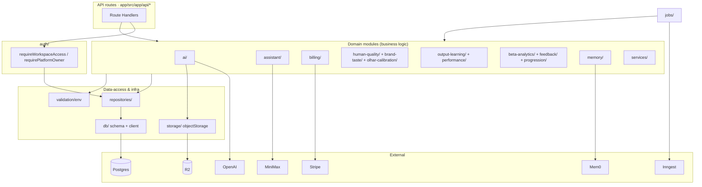
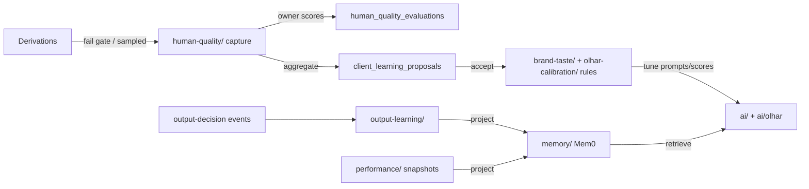

<!-- generated-by: gsd-doc-writer -->

# Server Modules (`app/src/server/`)

Reference for the server-side business-logic modules that back ADScale's API routes. Covers the 22 module directories plus the central `config.ts`.

Cognitive organ names (Cortex, Hands, Gaze, …) and how modules wire as a body: [`COGNITIVE-ATLAS.md`](./COGNITIVE-ATLAS.md).

---

## Overview

The server is organized as a layered Next.js backend. Every HTTP request and background job flows through the same four layers:

```
Next.js Route Handler (app/src/app/api/*)
        │  resolves auth + workspace
        ▼
services/  ·  ai/  ·  assistant/  ·  billing/  ·  …  (business logic / use cases)
        │  orchestrates domain rules, calls AI providers, enforces spend
        ▼
repositories/  (data-access layer — Drizzle queries, no business rules)
        │
        ▼
db/  (Drizzle client + Postgres schema)   storage/  (R2 object storage)
```

- **Routes** are thin: they authenticate, parse input, delegate to a service, and shape the HTTP response.
- **Services and domain modules** (`ai/`, `assistant/`, `billing/`, `human-quality/`, `performance/`, `output-learning/`, …) hold the business rules and call external providers (OpenAI, MiniMax, Stripe, Mem0).
- **`repositories/`** is the pure data-access layer: 57 Drizzle-backed files exposing ~315 query/mutation functions. Repositories never import from `services/`, `billing/`, `jobs/`, or `ai/` — they only depend on `db/` and `db/schema`.
- **`db/`** owns the Drizzle client (`db` = `pg`-pool-backed, for Inngest jobs; `dbHttp` = Neon serverless HTTP driver, for serverless route handlers) and the single source-of-truth schema (`adscale_app` Postgres schema, 70+ tables).
- **`jobs/`** registers Inngest functions for async work (derivation generation, brand-memory ingestion, learning aggregation, trial notifications, workspace-asset analysis).
- A closed **quality/learning loop** spans `human-quality/` → `brand-taste/` → `olhar-calibration/` → `output-learning/` → `performance/`, projecting approved learnings back into `memory/` (Mem0).

---

## Module map

| Module | Layer | Purpose | Key exports |
|--------|-------|---------|-------------|
| `ai/` | Domain | OpenAI creative-generation pipeline: prompts, quality gates, scoring, Olhar art-direction verdicts | `buildDerivationPrompt`, `executeGenerationStep`, `classifyCreativeQualityGate`, `analyzeCreativeQa`, `buildCreativeReadiness` |
| `assistant/` | Domain | Conversational AI layer (MiniMax): orchestration, tool-calling, guided flows, artifact versioning | `runAssistantTurn`, `MiniMaxModelAdapter`, `TOOL_REGISTRY`, `evaluateToolCall`, `applyGuidedConversationCommand` |
| `auth/` | Cross-cutting | Better Auth config + workspace/role/platform-owner access guards | `requireWorkspaceAccess`, `requireRole`, `requirePlatformOwner`, `auth`, `AUTH_ERROR_CODES` |
| `beta-analytics/` | Domain | Cockpit event ingest, sanitization, aggregation, owner analytics + CSV export | `recordBetaAnalyticsEvent`, `parseOwnerAnalyticsQuery`, `summarizeOwnerCreditSignals`, `BETA_EVENT_KEYS` |
| `beta-sessions/` | Domain | Zod schemas for beta runbook/operator-session shapes | `BETA_RUNBOOK_STAGES`, `startBetaSessionSchema`, `endBetaSessionSchema`, `mergeStageNotesSchema` |
| `billing/` | Domain | Stripe subscriptions, credit grants/FIFO spend, entitlements, conversion gates | `spendOrApiError`, `getWorkspaceBillingAccess`, `recordUsage`, `createCheckoutSession`, `redeemBetaAccess` |
| `brand-taste/` | Domain | Per-brand calibration: evidence reports, rule extraction, taste prompt injection | `buildCalibrationEvidenceReport`, `persistRuleCandidate`, `recordCalibrationSignal`, `buildBrandTastePromptSection` |
| `db/` | Infrastructure | Drizzle client(s) + `adscale_app` Postgres schema | `db`, `dbHttp`, `adscaleSchema`, `*` (table definitions) |
| `feedback/` | Domain | Owner feedback reports: sanitization, ownership validation, mission credit signals | `validateAssetRefs`, `sanitizeDiagnosticContext`, `summarizeMissionCreditSignals` |
| `human-quality/` | Domain | Quality corpus queue, owner evaluations, calibration/impact/trend reports, learning proposals | `HumanQualityServiceError`, `runGlobalCorpusEvidence`, `runScoreCalibration`, `generateAndPersistClientLearningProposals` |
| `jobs/` | Async | Inngest function definitions + realtime channels + Sentry middleware | `derivationJob`, `brandMemoryIngestJob`, `learningProposalAggregatorJob`, `trialNotificationJob`, `workspaceAssetAnalyzeJob` |
| `memory/` | Domain | Mem0 brand/campaign memory: events, ingestion, retrieval, learning projections | `getBrandMemoryContext`, `ingestBrandMemoryEvent`, `getMem0Client`, `projectPerformanceLearning` |
| `mission-insights/` | Domain | Owner mission-insight recording with input sanitization | `recordMissionInsight`, `sanitizeMissionInsightInput` |
| `olhar-calibration/` | Domain | Cenbrap-style human calibration + Olhar release-evidence tracking | `runCenbrapCalibration`, `OLHAR_RELEASE_MILESTONE`, Olhar release metrics |
| `output-learning/` | Domain | Output-decision events → client output learnings → Mem0 projection | `recomputeClientOutputLearnings`, `recordOutputDecisionEvidence`, `getOutputLearningRecommendation` |
| `performance/` | Domain | Creative performance snapshots, CSV import, hypothesis comparison, learnings | `recordPerformanceSnapshot`, `previewCsvImport`, `runHypothesisComparison`, `recomputeClientLearnings` |
| `progression/` | Domain | Workspace progression levels + ordered cockpit missions | `getWorkspaceProgression`, `getWorkspaceMissions`, `calculateLevel`, `MISSION_DEFINITIONS` |
| `repositories/` | Data-access | Drizzle query/mutation functions per entity (no business logic) | ~315 functions across 57 files (e.g. `createCampaign`, `getDerivationById`, `getAvailableCreditGrants`) |
| `services/` | Domain | Email/notifications, export packaging, landing-page rendering, Resend contacts | `sendEmail`, `exportAllApproved`, `renderLandingPageHtml`, `sendLowCreditsEmail` |
| `storage/` | Infrastructure | S3-compatible object storage abstraction over R2 | `objectStorage`, `ObjectStorage` interface, `R2ObjectStorage` |
| `validation/` | Cross-cutting | Zod env-schema gate + AI-deduced-field schemas | `env`, `envSchema`, `aiDeducedFieldsSchema` |
| `waitlist/` | Domain | Pre-launch waitlist normalization + signup schema | `waitlistSignupSchema`, `normalizeEmail`, `normalizeWhatsapp` |
| `config.ts` | Cross-cutting | Central constants | `INVITE_EXPIRATION_DAYS = 7` |

---

## Layering & dependency rules

The codebase enforces a strict one-way dependency graph. The data-access layer (`repositories/`) is a leaf: it imports only `db/` and `db/schema`. Domain modules may import repositories and each other, but repositories never import domain/services/billing/jobs/ai.



Rules:

1. **Routes** call `requireWorkspaceAccess()`/`requirePlatformOwner()`, then a domain function.
2. **`repositories/`** never imports `services/`, `billing/`, `jobs/`, or `ai/` (verified — zero cross-imports). It only depends on `db` and `db/schema`.
3. **Drizzle client selection** — the `pg`-pool-backed `db` is used by `repositories/` and `jobs/` (sustained connections); `dbHttp` (Neon HTTP driver) is reserved for serverless fan-out in route handlers.
4. **`jobs/`** functions orchestrate cross-layer async work: they read/write via `repositories/`, call `ai/` generators, push to `storage/`, and emit `beta-analytics/` events.
5. **Server-only** boundary — `db/index.ts` and `ai/utils.ts` carry `import "server-only"` to prevent leaking DB/keys into client bundles.

---

## Cross-cutting modules

### `config.ts`

Minimal central constants file.

- `INVITE_EXPIRATION_DAYS = 7` — workspace-invite link TTL, consumed by `repositories/invitation`.

### `validation/`

**`env.ts`** — runtime environment gate. A `z.object` schema (`envSchema`) validates every `process.env` key at module load and throws on missing/invalid values (or returns `undefined` under `NODE_ENV=test`). Notable constraints:

- `OPENAI_IMAGE_MODEL` defaults to `gpt-image-2-2026-04-21`; `OPENAI_TEXT_MODEL` defaults to `gpt-5-mini`.
- `MINIMAX_MODEL` defaults to `MiniMax-M3`.
- `STRIPE_SECRET_KEY` must start with `sk_`/`rk_`; `STRIPE_WEBHOOK_SECRET` with `whsec_`; three `STRIPE_*_PRICE_ID` keys with `price_`.
- `INNGEST_SIGNING_KEY` refuses the dev default `"local"` in production.
- Mem0 keys are optional (feature-flagged via `MEM0_ENABLED`).

The validated object is exported as `env` and imported by `db/`, `auth/`, `billing/stripe.ts`, `jobs/client.ts`, `memory/mem0-client.ts`, and `ai/utils.ts`.

**`ai-deduction.ts`** — Zod schemas for AI-suggested campaign fields: `aiDeducedFieldsSchema`, `AiSuggestion`, `AiDeducedFields`, `confidenceLevelSchema`.

### `db/` schema overview

`db/schema.ts` defines the `adscale_app` Postgres schema (via `pgSchema("adscale_app")`) containing 70+ tables. Groupings:

- **Identity / Better Auth** — `user`, `session`, `account`, `verification`, `workspaces`, `workspaceMembers`, `workspaceInvites`.
- **Billing & entitlements** — `billingCustomers`, `subscriptions`, `creditGrants`, `creditTransactions`, `workspaceEntitlements`, `betaAccessRedemptions`, `processedStripeEvents`.
- **Clients & campaigns** — `clientProfiles`, `competitorAnalyses`, `clientReferences`, `campaigns`, `campaignTemplates`, `campaignAssets`, `pendingUploads`, `workspaceAssets`, `creativePlans`, `landingPages`, `shareLinks`.
- **Derivations & copy** — `derivations`, `derivationCopyVariants`.
- **Performance** — `creativePerformanceSnapshots`, `performanceImportBatches`, `performanceImportRows`, `creativeHypotheses`, `hypothesisVariants`, `variantComparisons`, `clientPerformanceLearnings`, `clientOutputLearnings`.
- **Usage / activity / exports** — `usageEvents`, `activityEvents`, `exports`, `personaSimulations`, `notifications`.
- **Beta & feedback** — `feedbackReports`, `betaSessions`, `betaAnalyticsEvents`.
- **Learning / calibration** — `outputDecisionEvents`, `calibrationSignals`, `calibrationRules`, `humanQualityCorpusItems`, `humanQualityCorpusCandidates`, `humanQualityEvaluations`, `humanQualityFeedbackArtifacts`, `rubricCalibrationAdjustments`, `clientLearningProposals`, `clientProfileOlharConfig`.
- **Progression & waitlist** — `workspaceProgression`, `waitlistSignups`.
- **Assistant** — `assistantThreads`, `assistantMessages`, `assistantActionRecords`, `assistantGuidedFlows`, `assistantGuidedFlowTransitions`, `assistantArtifactLineages`, `assistantArtifactVersions`, `assistantArtifactLineageHeads`, `assistantArtifactApprovalEvents`, `assistantArtifactComparisonAcknowledgements`, `assistantPlanFeedbackDrafts`, `assistantCreativeFeedbackDrafts`, `assistantArtifactProposals`, `assistantGuidedFlowEvents`, `assistantArtifactIterationEvents`, `assistantGuidedFlowStagingEvidence`, `assistantGuidedFlowFeedback`.

A second data-access file, `db/repositories/brand-kit.ts`, resolves brand-kit profiles per workspace (with `BrandKitAmbiguityError` / `BrandKitProfileNotFoundError` guards).

---

## Per-module detail

### `ai/` — Creative generation pipeline

OpenAI-backed pipeline that turns campaign briefs into image derivations, scores them, and enforces art-direction rules.

**Substructure:** two subdirectories plus ~40 top-level files.
- `ai/olhar/` — "Olhar" (Portuguese for "gaze/look") art-direction system: `base-reading.ts`, `generation-direction.ts`, `art-direction-verdict.ts`, `dual-verdict.ts`, `olhar-qa.ts`, plus `constitution.ts` (`OLHAR_AXES`, `OLHAR_VERDICTS`, `OLHAR_ADSCALE_PRINCIPLES`) and `vocabulary.ts`.
- `ai/voices/` — per-client voice profiles: `cenbrap.ts` (`CENBRAP_VOICE`), `client-voice.ts`, `voice-config-resolver.ts`, `voice-prompt-section.ts`, `voice-review-gate.ts`.

**Public API (highlights):**

| Export | Kind | Role |
|--------|------|------|
| `getOpenAI()` (`utils.ts`) | fn | Lazily builds the singleton `OpenAI` client (60s timeout) |
| `buildDerivationPrompt(config)` (`prompt-builder.ts`) | async fn | Builds the full generation prompt from campaign + plan + asset |
| `executeGenerationStep(ctx)` (`derivation-pipeline.ts`) | async fn | Runs one OpenAI image-generation step and normalizes the result |
| `resolveCanonicalCreative(input)` (`canonical-creative-contract.ts`) | fn | Resolves invariant identity + content tiers into a `CanonicalCreative` |
| `classifyCreativeQualityGate(input)` (`creative-quality-gate.ts`) | fn | Returns `invalid`/`improvable`/`acceptable` verdict + polish suggestions |
| `analyzeCreativeQa(input)` (`creative-qa.ts`) | async fn | LLM-powered QA checklist over `CreativeQaCriterion` set |
| `buildCreativeReadiness(input)` (`creative-readiness.ts`) | fn | Builds `CreativeReadinessResult` with blocking/attention dimensions |
| `analyzeDerivationCreative(input)` (`creative-score.ts`) | async fn | Heuristic + LLM scoring → `ScoreResult` |
| `generateCopyVariants(ctx)` (`copy-generator.ts`) | async fn | Ad-copy variant generation |
| `getStrategyRecipeCatalog()` (`strategy-recipes.ts`) | fn | Catalog of `StrategyRecipeDefinition` + ranking helpers |
| `analyzeCompetitorCreative(...)` / `generateDifferentiationStrategy(...)` (`competitor-analyzer.ts`) | async fn | Competitor analysis + Zod-validated differentiation strategy |
| `generateLandingPageStructure(...)` (`landing-page.ts`) | async fn | Landing-page section structure |
| `extractBrandKitFromImage(...)` (`brand-kit-extractor.ts`) | async fn | Derives a `BrandKit` from a reference image |
| `analyzeCampaignCreative(imageUrl)` (`campaign-deduction.ts`) | async fn | AI-suggested campaign fields |
| `runDerivationAutoRetry(input)` (`derivation-auto-retry.ts`) | async fn | Policy-driven automatic retry of failed derivations |
| `validateExportReadiness(input)` (`export-validation.ts`) | fn | CTA/export readiness validation |

**Key types:** `CreativeContract`, `CanonicalCreative`, `InvariantIdentity`, `ContentTiers`, `GenerationMode`, `CreativeQualityVerdict`, `CreativeReadinessResult`, `ScoreResult`, `CreativeQaChecklist`, `StrategyRecipeDefinition`, `ArtDirectionVerdict`, `BaseCreativeReading`, `ClientVoice`.

**Dependencies:** OpenAI SDK, `storage/` (writes generated images to R2), `repositories/derivation` (status updates), `validation/env`. The pipeline is invoked primarily from `jobs/derivation.ts` (async) and from `assistant/tools`.

### `assistant/` — Conversational AI layer

Threaded, tool-calling assistant backed by MiniMax (via an OpenAI-compatible adapter), streaming over SSE.

**Substructure:**
- `assistant/model/` — `MiniMaxModelAdapter`, reasoning-delta sanitizers (`stripThinkBlocks`, `assertNoReasoningInText`), `AssistantModelClient` interface, `getMiniMaxClient()`.
- `assistant/tools/` — `TOOL_REGISTRY`, `registerTool()`, `getToolDefinition()`, `listToolsForProvider()`, `evaluateToolCall()` (policy gate), `executeApprovedToolCall()`.
- `assistant/stream/` — SSE encoding: `ASSISTANT_SSE_EVENTS` (`text_delta`, `tool_summary`, `action_card`, `done`, `error`), `encodeAssistantSseEvent()`.
- `assistant/context/` — context assembly + allow-listed field projection (`CONTEXT_CATEGORIES`, `pickAllowedFields`, `sanitizeContextValue`, `buildSystemPrompt`, `toAssistantModelRequest`).
- `assistant/action-contracts/` — intent classification (`classifyUserIntent`, `classifyGuidedPath`), prompt augments, `ACTION_CONTRACT_REGISTRY`, confirmation policies.
- `assistant/action-execution/` — `executeConfirmedAssistantAction()`, `ActionExecutionContext`.
- `assistant/artifact-version/` — plan/creative artifact versioning, lineage, comparison, promotion (`createArtifactVersion`, `compareArtifactVersions`, `promoteThreadArtifactVersion`, `parseArtifactSnapshot`).
- `assistant/guided-conversation/` — state machine for guided briefing journeys (`transitionJourney`, `journeyStateFromRow`, `presentJourneyState`, `isBriefingComplete`).
- `assistant/guided-paths/` — from-zero & existing-creative paths (`materializeExistingCreativeCampaign`, `buildFromZeroPromptAugment`).
- `assistant/creative-iteration/` & `assistant/plan-iteration/` — revision flows (propose/confirm/cancel, feedback drafts, intent classification).

**Public API:**

| Export | Kind | Role |
|--------|------|------|
| `runAssistantTurn(input)` (`orchestrator.ts`) | async generator | The core turn loop; yields `AssistantTurnEvent`s |
| `AssistantTurnInput` / `AssistantTurnEvent` | types | Turn contract (workspace, thread, message, attachments) |
| `AssistantChatAttachment` | type | Attachment shape |
| `evaluateToolCall(...)` | async fn | Policy gate before tool execution |
| `executeConfirmedAssistantAction(ctx)` | async fn | Runs a confirmed (user-approved) action |
| `applyGuidedConversationCommand(...)` | async fn | Drives guided-flow state transitions |

**Key types:** `AssistantModelClient`, `AssistantModelRequest`, `AssistantModelTool`, `AssistantStreamEvent`, `RegisteredTool`, `ToolHandler`, `ActionContract`, `JourneyState`, `BriefingSnapshot`.

**Dependencies:** MiniMax adapter, `repositories/assistant-*`, `repositories/guided-flow*`, `ai/` (prompt building, creative generation tools), `billing/credits` (assistant confirm flows pre-flight spend via `checkSpend`).

### `auth/`

Better Auth wiring plus multi-tenancy and platform-owner guards.

| Export | Kind | Role |
|--------|------|------|
| `auth` (`index.ts`) | Better Auth instance | Email/password (with verification + reset), Google/GitHub social, magic-link plugin; auto-creates workspace + owner membership on user create |
| `requireWorkspaceAccess(request?)` (`workspace.ts`) | async fn | Resolves session + workspace; throws `WorkspaceAuthError` otherwise |
| `requireRole(workspaceId, userId, allowedRoles)` | async fn | Role gate (`owner`/`admin`/`member`) |
| `requirePlatformOwner(request?)` (`platform-owner.ts`) | async fn | Guards owner-only routes via `PLATFORM_OWNER_EMAILS` env |
| `AUTH_ERROR_CODES`, `WorkspaceAuthError`, `isWorkspaceAuthError` (`errors.ts`) | const/class/fn | Error vocabulary |

Supporting files: `session.ts` (`getSession`, `getSessionFromHeaders`), `team.ts`, `calibration-access.ts`, `dev-admin.ts` (dev-only auto-verified admin emails), `config.ts` (`buildTrustedOrigins`), `e2e-reset-store.ts`.

**Dependencies:** `better-auth`, `better-auth/adapters/drizzle`, `repositories/user`, `repositories/workspace`, `services/email`, `validation/env`.

### `beta-analytics/`

Closed-loop cockpit analytics: allowlisted event ingest, sanitization, owner aggregation, CSV export.

| Export | Kind | Role |
|--------|------|------|
| `recordBetaAnalyticsEvent(input)` (`record.ts`) | async fn | Persists a sanitized workspace-scoped cockpit event |
| `sanitizeBetaEventProperties(value)` (`sanitize.ts`) | fn | Enforces `MAX_PROPERTIES_BYTES` (32 KB) + allowlisted keys |
| `parseOwnerAnalyticsQuery(params)` (`query.ts`) | fn | Parses owner dashboard query filters |
| `summarizeOwnerCreditSignals(...)` (`credit-signals.ts`) | async fn | Owner-wide credit surprise summary |
| `getBetaSessionIdFromRequest(...)` (`session.ts`) | fn | Resolves beta session id from request |
| `recordShareLinkOpened(...)` (`share-analytics.ts`) | async fn | Share-link telemetry |
| `emitDerivationAutoRetryTriggered/Outcome(...)` (`derivation-auto-retry-telemetry.ts`) | fn | Auto-retry telemetry emitters |
| `BETA_EVENT_KEYS`, `ALLOWED_PROPERTY_KEYS` (`types.ts`) | const | Allowlists (`PHASE_76`/`PHASE_107`/`PHASE_121` event sets) |

**Key types:** `MissionFunnelRow`, `CockpitStageFunnelRow`, `CreditSurpriseRow`, `RecipeFunnelRow`, `OwnerAnalyticsQuery`, `EventCreditSignals`, `BetaEventSource`.

**Dependencies:** `repositories/beta-analytics`, `repositories/beta-sessions`. Emitters are called from `billing/credits.ts`, `jobs/derivation.ts`, and route handlers.

### `beta-sessions/`

Zod schemas for beta operator-session capture (no runtime logic).

| Export | Kind | Role |
|--------|------|------|
| `BETA_RUNBOOK_STAGES`, `BetaRunbookStage` (`types.ts`) | const/type | Ordered cockpit runbook stages |
| `assistanceLevelSchema` (`hands_on`/`observe_only`) | schema | Operator involvement level |
| `startBetaSessionSchema`, `endBetaSessionSchema`, `mergeStageNotesSchema` | schemas | Session lifecycle inputs |

### `billing/`

Stripe subscriptions, credit grants with FIFO spend, beta/tester entitlements, and conversion gates returning structured 402 payloads.

| Export | Kind | Role |
|--------|------|------|
| `CREDIT_COSTS` (`credits.ts`) | const | Per-action credit costs (e.g. `image_derivation: 5`, `landing_page: 10`) |
| `canSpend(workspaceId, action)` | async fn | Pre-flight `SpendCheck` (respects unlimited/tester bypass) |
| `recordUsage(input)` | async fn | Idempotent FIFO debit across `credit_grants` + low-credit email + analytics |
| `refundCredits(input)` | async fn | Idempotent credit refund |
| `spendOrApiError(params)` (`paywall.ts`) | async fn | HTTP adapter: returns `null` or a 402 `NextResponse` with `ConversionErrorPayload` |
| `spend(params)` / `checkSpend` (`paywall.ts`) | async fn | Canonical spend decision; `checkSpend = canSpend` |
| `getWorkspaceBillingAccess(workspaceId)` (`access.ts`) | async fn | Resolves `WorkspaceBillingAccess` (`paid`/`beta`/`tester`/`none`) |
| `createCheckoutSession(input)` / `createPortalSession(input)` (`sessions.ts`) | async fn | Stripe Checkout / Customer Portal |
| `processStripeEvent(event)` (`events.ts`) | async fn | Webhook handler (sync status, grant monthly credits on `invoice.paid`, mark `past_due`) |
| `redeemBetaAccess(input)` (`beta.ts`) | async fn | One-time code redemption → `beta_tester` entitlement + 50-credit grant |
| `billingPlanKeys` / `planCreditGrants` / `getStripePriceId(planKey)` (`plans.ts`) | const/fn | `starter`/`growth`/`scale` → 30/120/360 monthly credits |
| `stripe` (`stripe.ts`) | Stripe client | Configured Stripe SDK instance |
| `creditsToRemainingAds(balance)` (`entitlements.ts`) | fn | Maps credits → ad allowance (`BETA_AD_ALLOWANCE = 10`) |
| `workspaceHasUnlimitedBillingAccess(workspaceId)` (`unlimited-access.ts`) | async fn | Dev-admin / tester unlimited bypass |
| `resolveCreditOperationKey(action, metadata)` (`credit-operation-key.ts`) | fn | Idempotency/operation key resolution |

**Key types:** `CreditAction`, `SpendCheck`, `WorkspaceBillingAccess`, `WorkspaceAccessKind`, `SubscriptionStatus`, `SpendResult`, `BillingAccess`, `BetaRedeemError`, `ConversionErrorPayload` (from `@/lib/billing/conversion-contract`).

**Dependencies:** Stripe SDK, `repositories/billing`, `repositories/usage`, `repositories/entitlements`, `repositories/credit-transactions`, `services/notifications`, `beta-analytics/record`, `auth/dev-admin`. Webhook handler is wired in `api/billing/webhook`.

### `brand-taste/`

Per-brand calibration engine that converts calibration signals into approved rule constraints and prompt sections.

| Export | Kind | Role |
|--------|------|------|
| `recordCalibrationSignal(input)` (`calibration-signal-recorder.ts`) | async fn | Persists a `calibration_signal` (idempotent) |
| `recordCalibrationSignalFromOutputDecisionEvent(...)` | async fn | Bridge from `output-learning/` decision events |
| `buildCalibrationEvidenceReport(input)` (`calibration-evidence.ts`) | fn | Computes agreement rates + mismatch trends per brand |
| `extractRuleCandidatesFromSignals(input)` (`rule-extraction.ts`) | fn | Promotes signals into `CalibrationRuleCandidate`s |
| `persistRuleCandidate` / `approveCalibrationRule` / `rejectCalibrationRule` / `deprecateCalibrationRule` (`calibration-rules.ts`) | async fn | Rule lifecycle |
| `getApprovedRuleConstraints(input)` | async fn | Loads approved constraints for prompt injection |
| `buildBrandTastePromptSection(...)` (`taste-application.ts`) | fn | Builds the brand-taste prompt block |
| `buildBrandTasteProfile(input)` (`taste-profile.ts`) | fn | Composes evidence level + source composition |
| `classifyJudgmentUncertainty(...)` / `buildReviewQueue(...)` (`uncertainty-queue.ts`) | fn | Routes low-confidence verdicts to human review |
| `loadPromptCalibrationContext(input)` (`prompt-calibration-loader.ts`) | async fn | Assembles calibration context for prompts |

`index.ts` re-exports public types (incl. `PerBrandEvidenceReport`).

**Key types:** `HumanCalibrationVerdict`, `CalibrationSourceLabel`, `CalibrationMismatchBucket`, `EvidenceLevel`, `CalibrationRuleCandidate`, `CalibrationEvidenceReport`, `JudgmentUncertainty`, `ReviewQueueItem`.

**Dependencies:** `repositories/calibration-rule`, `repositories/calibration-signal`, `repositories/output-decision-event`, `output-learning/` (decision events), `olhar-calibration/` (shared verdict vocabulary).

### `db/`

Drizzle clients + schema (see "Cross-cutting modules" above for the schema map).

| Export | Kind | Role |
|--------|------|------|
| `db` (`index.ts`) | Drizzle (`pg` pool) | Pool-backed client (`max: 10`, 10s connect timeout); used by repositories + Inngest jobs |
| `dbHttp` (`http.ts`) | Drizzle (Neon HTTP) | Serverless-friendly client for route-handler fan-out |
| `adscaleSchema` (`schema.ts`) | `pgSchema("adscale_app")` | The single Postgres schema, ~70 tables |
| table consts (`schema.ts`) | `adscaleSchema.table(...)` | One per entity (e.g. `campaigns`, `derivations`, `creditGrants`, `assistantThreads`) |

`db/repositories/brand-kit.ts` provides workspace-scoped brand-kit resolution (`resolveBrandKitProfileId`, `getBrandKitByWorkspace`, `upsertBrandKit`, `deleteBrandKit`).

### `feedback/`

Owner feedback-report helpers: sanitization, asset ownership validation, mission credit signals.

| Export | Kind | Role |
|--------|------|------|
| `sanitizeDiagnosticContext(input)` / `sanitizeBreadcrumbs(input)` (`sanitize.ts`) | fn | Caps `FEEDBACK_MESSAGE_MAX_LENGTH` (4000) and scrubs context |
| `validateAssetRefs(...)` / `validateCampaignOwnership(...)` / `validateDerivationOwnership(...)` (`validate-refs.ts`) | async fn | Ownership checks (`FeedbackValidationError`) |
| `summarizeMissionCreditSignals()` (`mission-credit-signals.ts`) | async fn | Aggregates mission credit-signal summaries |
| `classifyMissionInsightSignal(report)` | fn | Classifies insight signals |

**Dependencies:** `repositories/feedback`, `repositories/campaign`, `repositories/derivation`, `repositories/asset`.

### `human-quality/`

The quality corpus loop: capture derivations → owner evaluation → calibration/impact/trend analysis → learning proposals. The largest domain module by file count.

**Substructure (subdirectories):**
- `calibration/` — `runScoreCalibration`, `persistProposedAdjustments`, `buildCalibrationReport`, `buildCalibrationComparisons`, divergence detection.
- `impact/` — `runLearningImpact`, `buildImpactRows`, A/B arm metrics, cohort movement, slice comparisons.
- `improvement/` — `runQualityImprovement`, `acceptProposedAdjustment`, `buildApplyPlan`, fixture baseline pass-rates.
- `ingestion/` — `runCorpusBackfillBatch`, `getCorpusIngestionStatus`.
- `learning/` — `generateAndPersistClientLearningProposals`, `detectAndPersistCrossClientGlobalProposals`, `enforceCorpusQualityRuleCap`, factual-issue alerts.
- `sampling/` — sample-coverage thresholds (`MIN_ARM_SAMPLE`, `MIN_GLOBAL_*`, `SAMPLE_*`).
- `trend/` — `runQualityTrend`, regression detection, ISO-week bucketing.

**Top-level highlights:**

| Export | Kind | Role |
|--------|------|------|
| `HumanQualityServiceError` (`service.ts`) | class | Domain error for the corpus service |
| `MAX_CORPUS_BATCH_SIZE = 25` | const | Owner batch-selection cap |
| `captureCorpusCandidateFromDerivation(...)` (`candidate-capture.ts`) | async fn | Enqueues a derivation as a corpus candidate |
| `promoteCorpusCandidateToQueue(...)` (`candidate-promotion.ts`) | async fn | Promotes a candidate to the evaluation queue |
| `autoPromoteCandidate(...)` / `captureAndAutoPromote(...)` (`auto-promote.ts`) | async fn | Sampling-rule auto-promotion |
| `runGlobalCorpusEvidence(...)` (`global-evidence-service.ts`) | async fn | Cross-client evidence aggregation |
| `recordHumanDecisionCalibrationEvidence(...)` (`human-decision-calibration.ts`) | async fn | Bridges owner decisions to calibration signals |
| `selectLiveCorpusTarget(...)` (`live-corpus-target.ts`) | fn | Picks live vs fixture-seed profiles for evidence |
| `parseCorpusQueueFilters(...)` (`queue-filters.ts`) | fn | Parses owner queue search params |
| `buildHumanQualityFeedbackArtifactPayload(input)` (`feedback-artifact.ts`) | fn | Builds versioned feedback artifact payload |
| `parseOutputLearningApplication(...)` (`application-schema.ts`) | fn | Zod-validated output-learning application snapshot |

**Key types:** `HumanQualityCorpusCohort`, `HumanQualityCorpusStatus`, `HumanQualitySourceLabel`, `HumanQualityIntent`, `GlobalCorpusEvidenceReport`, `CenbrapCalibrationStatus`, `CorpusQueueFilters`, `RecordHumanDecisionCalibrationInput`, `OutputLearningApplicationSnapshot`.

**Dependencies:** `repositories/human-quality-*`, `repositories/calibration-*`, `repositories/client-learning-proposal`, `repositories/output-decision-event`, `brand-taste/` (calibration-signal bridge), `olhar-calibration/`. Aggregation is scheduled by `jobs/learning-proposal-aggregator.ts`.

### `jobs/`

Inngest function definitions, realtime channels, and middleware.

| Export | File | Role |
|--------|------|------|
| `inngest` | `client.ts` | Inngest client (`id: "adscale"`, Sentry middleware, production `INNGEST_DEV` guard) |
| `derivationJob` | `derivation.ts` | Async derivation generation + `scoreCompletedDerivation()` |
| `brandMemoryIngestJob` | `brand-memory.ts` | Ingests brand-memory events into Mem0 |
| `learningProposalAggregatorJob` | `learning-proposal-aggregator.ts` | Nightly human-quality learning aggregation |
| `trialNotificationJob` | `trial-notifications.ts` | Trial-expiry email notifications |
| `workspaceAssetAnalyzeJob` | `workspace-asset.ts` | Async workspace-asset analysis |
| `derivationChannel` | `channels.ts` | Inngest realtime channel for derivation status (`queued`→`completed`/`failed`) |
| `SentryMiddleware` | `sentry-middleware.ts` | Sentry error-capture middleware |
| `sanitizeDerivationFailureError(error)` | `derivation-error-sanitizer.ts` | Returns `DERIVATION_USER_SAFE_ERROR` |

**Dependencies:** `inngest`, `validation/env`, `ai/`, `repositories/`, `services/notifications`, `storage/`, `memory/`, `human-quality/`. All functions are registered in `app/src/app/api/inngest/route.ts`.

### `memory/`

Mem0-backed brand & campaign memory: event ingestion, retrieval, and projection of approved learnings.

| Export | Kind | Role |
|--------|------|------|
| `getMem0Client()` (`mem0-client.ts`) | fn | Mem0 client factory (feature-flagged by `MEM0_ENABLED`) |
| `isBrandMemoryEnabled()` | fn | Feature flag |
| `getBrandMemoryUserId(workspaceId, clientProfileId?)` | fn | Mem0 user-id scoping |
| `getBrandMemoryContext(input)` (`brand-memory-context.ts`) | async fn | Retrieves `BrandMemoryContext` + `buildBrandMemoryPromptBlock(items)` |
| `recordBrandMemoryEvent(event)` (`brand-memory-dispatch.ts`) | async fn | Dispatches a brand-memory event |
| `prepareBrandMemoryEvent(...)` / `sanitizeBrandMemoryPayload(...)` (`brand-memory-events.ts`) | fn | Event prep + deep sanitize |
| `ingestBrandMemoryEvent(event)` (`brand-memory-ingest.ts`) | async fn | Writes to Mem0 |
| `getCampaignMemory(...)` / `recordCampaignMemoryEntry(...)` (`campaign-memory*.ts`) | async fn | Campaign-scoped memory |
| `projectPerformanceLearning(...)` / `projectPerformanceLearnings(...)` (`performance-learning-projection.ts`) | async fn | Projects performance learnings to Mem0 |
| `projectOutputLearning(...)` / `projectOutputLearnings(...)` (`output-learning-projection.ts`) | async fn | Projects output learnings to Mem0 |
| `searchPerformanceLearnings(input)` (`performance-learning-retrieval.ts`) | async fn | Retrieves performance learnings |

**Key types:** `BrandMemoryItem`, `BrandMemoryContext`, `BrandMemoryEvent`, `BrandMemoryEventType`, `CampaignMemoryEntry`, `CampaignMemoryRecord`, `PERFORMANCE_LEARNING_MEMORY_TYPE`, `OUTPUT_LEARNING_MEMORY_TYPE`.

**Dependencies:** Mem0 SDK, `validation/env`, `repositories/output-decision-event`. Ingestion runs via `jobs/brand-memory.ts`.

### `mission-insights/`

Owner mission-insight recording with input sanitization.

| Export | Kind | Role |
|--------|------|------|
| `recordMissionInsight(input)` (`service.ts`) | async fn | Persists an owner mission insight |
| `sanitizeMissionInsightInput(input)` (`sanitize.ts`) | fn | Sanitizes text + builds diagnostic context |
| `sanitizeOptionalText(value)` | fn | Trims/sanitizes optional text |

### `olhar-calibration/`

Human (Cenbrap-style) calibration plus Olhar release-evidence tracking — the calibration half of the quality loop.

| Export | Kind | Role |
|--------|------|------|
| `runCenbrapCalibration(input)` (`service.ts`) | async fn | Runs the Cenbrap calibration pass |
| `CENBRAP_CALIBRATION_SCHEMA_VERSION` (`cenbrap-calibration.ts`) | const | Schema version |
| `CENBRAP_MISMATCH_BUCKETS`, `CenbrapMismatchBucket` | const/type | Mismatch taxonomy |
| `HumanCalibrationDecision` (`entra`/`quase`/`nao_entra`) | type | Human verdict vocabulary |
| `AgreementClassification`, `HumanDecisionSource`, `CenbrapCalibrationStatus` | types | Classification vocabulary |
| `OLHAR_RELEASE_MILESTONE = "v12.7"` (`olhar-release-evidence.ts`) | const | Current Olhar release milestone |
| `OLHAR_RELEASE_EVIDENCE_SCHEMA_VERSION` | const | Release-evidence schema version |
| `ArtDirectionMetrics` / `FactualExportMetrics` / `OlharReleaseRequirementResult` / `OlharReleaseEvidence` | types | Release-evidence report shapes |

### `output-learning/`

Converts owner output-decision events into client output learnings, with confidence scoring, recommendation, and safety guards before Mem0 projection.

**Substructure:** `recommendation/` (`getOutputLearningRecommendation`, `mapOutputLearningToPrefill`), `safety/` (`guardOutputLearningPrefill`, `filterApprovedPostgresLearnings`, `isApprovedPostgresLearning`, `buildAppliedLearningTrace`).

| Export | Kind | Role |
|--------|------|------|
| `recomputeClientOutputLearnings(input)` (`service.ts`) | async fn | Recomputes learnings for a client profile |
| `recomputeOutputLearningsForCampaign(input)` | async fn | Campaign-scoped recompute |
| `recordOutputDecisionEvidence(input)` (`output-decision-recorder.ts`) | async fn | Records an output-decision event |
| `aggregateOutputLearningsFromEvents(...)` (`aggregate.ts`) | fn | Aggregates events → learnings |
| `computeOutputLearningConfidence(...)` (`confidence.ts`) | fn | Confidence scoring (`shouldApproveOutputLearning`, `shouldSupersedeOutputLearning`) |
| `dispatchOutputLearningRecomputeForCampaign(...)` (`dispatch.ts`) | async fn | Dispatches recompute (best-effort variant) |
| `OUTPUT_DECISION_ACTIONS` / `OUTPUT_DECISION_DIRECTIONS` / `OUTPUT_DECISION_STRENGTHS` (`output-decision-events.ts`) | const | Decision vocabulary |
| `normalizeOutputVariableKey(...)` / `extractVariablesFromEvent(...)` / `buildOutputLearningStatement(...)` (`variable-value.ts`) | fn | Variable normalization |
| `OUTPUT_LEARNING_ALGORITHM_VERSION = "1.0.0"` (`types.ts`) | const | Algorithm version |
| `OUTPUT_SUPPORTED_VARIABLE_KEYS` / `OutputLearningStatus` / `OutputLearningConfidenceLevel` | const/type | Supported keys + status vocab |

**Key types:** `OutputLearningRecommendation`, `OutputGenerationPrefill`, `OutputEvidencePolarity`, `AppliedLearningTrace`, `GuardPrefillResult`, `OutputDecisionReason`.

**Dependencies:** `repositories/client-output-learning`, `repositories/output-decision-event`, `memory/output-learning-projection`, `human-quality/application-schema`. Recompute dispatch emits via `dispatch.ts`.

### `performance/`

Creative performance snapshots, CSV/manual import, hypothesis comparison, and learning extraction.

**Substructure:** `hypothesis/` (`runHypothesisComparison`, `runObservationalComparison`, `listCampaignComparisons`, `COMPARISON_VERDICTS`), `import/` (`previewCsvImport`, `previewManualImport`, `confirmImport`, `REQUIRED_CSV_COLUMNS`, `CSV_MAX_ROWS`), `learning/` (`recomputeClientLearnings`, `recomputeLearningsForCampaign`, `aggregateLearningsFromComparisons`, `SUPPORTED_VARIABLE_KEYS`), `recommendation/` (`getNextExperimentRecommendation`, `mapLearningToPrefill`).

| Export | Kind | Role |
|--------|------|------|
| `recordPerformanceSnapshot(input)` (`service.ts`) | async fn | Records a creative performance snapshot |
| `getCampaignPerformanceSnapshots(input)` | async fn | Lists snapshots for a campaign |
| `derivePerformanceMetrics(...)` (`metrics.ts`) | fn | Derives CTR/CPC/etc. from raw metrics |
| `normalizePlacement(...)` (`placement.ts`) | fn | Normalizes ad placement |
| `buildPerformanceSourceKey(identity)` (`source-key.ts`) | fn | Deterministic source key |
| `canonicalPerformanceSnapshotInputSchema` (`validation.ts`) | zod schema | Canonical snapshot validation |
| `PERFORMANCE_PLATFORMS` (`meta`/`google`/`tiktok`/`other`), `PERFORMANCE_PLACEMENTS`, `PERFORMANCE_SOURCE_TYPES` (`types.ts`) | const | Enumerations |

**Key types:** `PerformanceSnapshotView`, `PerformancePlatform`, `PerformancePlacement`, `PerformanceScope`, `RawPerformanceMetrics`, `NormalizedPlacement`, `NextExperimentRecommendation`, `ComparisonVerdict`.

**Dependencies:** `repositories/performance*`, `repositories/hypothesis`, `repositories/performance-import`, `repositories/client-learning`, `memory/performance-learning-projection`.

### `progression/`

Workspace progression levels + ordered cockpit missions with evidence inference.

**Substructure:** `missions/` (`MISSION_DEFINITIONS`, `MISSION_ORDER`, `getWorkspaceMissions`, `inferMissionCompletions`, `getMissionCreditEstimate`, `buildMissionStatuses`).

| Export | Kind | Role |
|--------|------|------|
| `getWorkspaceProgression(workspaceId)` (`service.ts`) | async fn | Resolves level + evidence + missions |
| `getCachedWorkspaceProgression(...)` | async fn | Cached variant |
| `inferWorkspaceEvidence(ctx)` (`evidence.ts`) | async fn | Infers evidence from workspace activity |
| `calculateLevel(...)` / `calculateProgressPercent(...)` / `getLevelDefinition(key)` (`levels.ts`) | fn | Level math + `LEVEL_DEFINITIONS` / `EVIDENCE_DEFINITIONS` |
| `EVIDENCE_ORDER` | const | Ordered evidence keys |

### `repositories/`

The data-access layer. **57 non-test files** exposing ~315 Drizzle query/mutation functions. Pure data access — no business rules, no provider calls, no imports from `services/`/`billing/`/`jobs/`/`ai/`.

**Coverage by entity (representative functions):**

| Area | Files & representative functions |
|------|----------------------------------|
| Identity / workspace | `user.ts`, `workspace.ts`, `invitation.ts` (`addMember`, `createWorkspace`, `createInvitation`) |
| Assistant | `assistant-thread.ts`, `assistant-message.ts`, `assistant-action.ts`, `assistant-job-sync.ts`, `artifact-version.ts`, `artifact-iteration-telemetry.ts`, `guided-flow.ts`, `guided-flow-feedback.ts`, `guided-flow-telemetry.ts`, `guided-flow-staging-evidence.ts`, `guided-flow-transition.ts` |
| Billing | `billing.ts` (`getActiveSubscriptionByWorkspace`, `getAvailableCreditGrants`, `updateCreditGrantRemaining`), `credit-transactions.ts`, `usage.ts` (`trackUsage`, `getUsageByIdempotencyKey`), `plan.ts` |
| Entitlements | `entitlements.ts` (`getActiveBetaEntitlementByWorkspace`, `grantTesterEntitlement`, `createBetaEntitlement`, `recordBetaRedemption`) |
| Campaigns & assets | `campaign.ts`, `asset.ts`, `plan.ts`, `template.ts`, `workspace-asset.ts`, `pendingUploads` via `export.ts` |
| Derivations & copy | `derivation.ts`, `copy-variant.ts`, `persona-simulation.ts` |
| Performance | `performance.ts`, `performance-import.ts`, `hypothesis.ts`, `client-learning.ts` |
| Learning & calibration | `client-learning-proposal.ts`, `client-output-learning.ts`, `output-decision-event.ts`, `calibration-rule.ts`, `calibration-signal.ts`, `calibration-adjustment-errors.ts`, `rubric-calibration-adjustments.ts` |
| Human quality | `human-quality-corpus.ts`, `human-quality-candidate.ts`, `human-quality-feedback-artifact.ts`, `human-quality-ingestion.ts` |
| Beta & feedback | `beta-analytics.ts`, `beta-sessions.ts` (+ fixture), `feedback.ts`, `guided-flow-feedback.ts` |
| Misc | `export.ts`, `landing-page.ts`, `share-link.ts`, `notification.ts`, `dashboard.ts`, `progression.ts`, `waitlist.ts`, `client-reference.ts`, `competitor-analysis.ts`, `client-profile-olhar-config.ts`, `assistant-types.ts` |

**Conventions:**
- All accept an optional transaction client (`tx?: DbOrTx`) where atomic writes matter (see `entitlements.ts`).
- Idempotency keys are used for metered writes (`getUsageByIdempotencyKey`).
- `assistant-types.ts` exposes `containsDeniedPersistenceKeys()` to prevent persistence-key injection.

### `services/`

Business-logic services that don't belong to a single domain: email, notifications, export packaging, landing-page rendering.

| Export | Kind | Role |
|--------|------|------|
| `sendEmail(input)` (`email.ts`) | async fn | Generic transactional email send (Resend) |
| `sendVerificationEmail` / `sendPasswordResetEmail` / `sendMagicLinkEmail` / `sendWaitlistConfirmationEmail` / `sendInviteEmail` | async fn | Transactional variants |
| `renderTransactionalEmail(layout)` (`email-template.ts`) | fn | HTML email layout renderer (`escapeHtml`) |
| `resolveEmailLocale(locale)` / `getTransactionalEmailTranslations(locale)` (`email-i18n.ts`) | fn | Locale resolution + i18n strings |
| `exportIndividual(...)` / `exportAllApproved(...)` (`export.ts`) | async fn | Delivery-package export |
| `renderLandingPageHtml(input)` (`landing-page-renderer.ts`) | fn | Renders landing-page HTML |
| `sendDerivationCompleteEmail` / `sendPlanReadyEmail` / `sendLowCreditsEmail` / `sendTrialExpiringEmail` (`notifications.ts`) | async fn | Notification emails |
| `getWorkspaceNotificationRecipients(...)` / `shouldSendToUser(...)` | async fn | Recipient resolution + preference gate |
| `syncWaitlistContact(input)` (`resend-contacts.ts`) | async fn | Syncs a waitlist contact to Resend |

**Dependencies:** Resend HTTP API (called directly via `fetch("https://api.resend.com/emails")` with `RESEND_API_KEY` — no `resend` npm package/SDK), `repositories/user`, `repositories/notification`, `repositories/usage`, `validation/env`. Called by `auth/`, `billing/credits.ts`, `jobs/`.

### `storage/`

S3-compatible object-storage abstraction over Cloudflare R2.

| Export | Kind | Role |
|--------|------|------|
| `objectStorage` (`index.ts`) | `R2ObjectStorage` | Singleton instance |
| `ObjectStorage` (`object-storage.ts`) | interface | `put`, `get`, `getStream?`, `delete`, `head`, `signedUploadUrl`, `signedDownloadUrl`, `publicUrl` |
| `StorageMetadata` | type | `{ contentType?, contentLength? }` |
| `R2ObjectStorage` (`r2-object-storage.ts`) | class | R2-backed implementation |
| `InMemoryObjectStorage` (`in-memory-object-storage.ts`) | class | Test/fake implementation |
| `storage-helpers.ts` | helpers | Key/path utilities |

**Dependencies:** AWS S3 SDK (configured for R2), `validation/env` (`R2_*` keys). Used by `ai/derivation-pipeline.ts`, `jobs/derivation.ts`, `services/export.ts`.

### `waitlist/`

Pre-launch waitlist capture.

| Export | Kind | Role |
|--------|------|------|
| `waitlistSignupSchema` / `WaitlistSignupInput` (`schema.ts`) | zod schema/type | Validates waitlist signup |
| `WAITLIST_SECTORS` / `WaitlistSector` | const/type | Sector enum |
| `WAITLIST_CONSENT_VERSION = "2026-06-08"` | const | Consent version |
| `normalizeEmail(email)` / `normalizeWhatsapp(raw)` / `isValidWhatsappLength(digits)` (`normalize.ts`) | fn | Input normalization |

**Dependencies:** `repositories/waitlist`, `services/resend-contacts`.

---

## Quality & learning loop

Five modules form a closed feedback loop that improves generation quality over time. Data flows capture → evaluate → propose → calibrate → project back into memory:



- **`human-quality/`** owns the corpus queue, evaluation capture, and the calibration/impact/trend/improvement report generators. Aggregation is scheduled by `jobs/learning-proposal-aggregator.ts`.
- **`brand-taste/`** turns calibration signals into per-brand rule constraints and prompt sections.
- **`olhar-calibration/`** performs Cenbrap-style human calibration and tracks Olhar release-evidence milestones.
- **`output-learning/`** converts approve/reject/regenerate decisions into learnings with confidence + safety guards.
- **`performance/`** imports real ad performance, runs hypothesis comparisons, and extracts learnings.
- Both learning streams project into **`memory/`** (Mem0) for retrieval at generation time.
