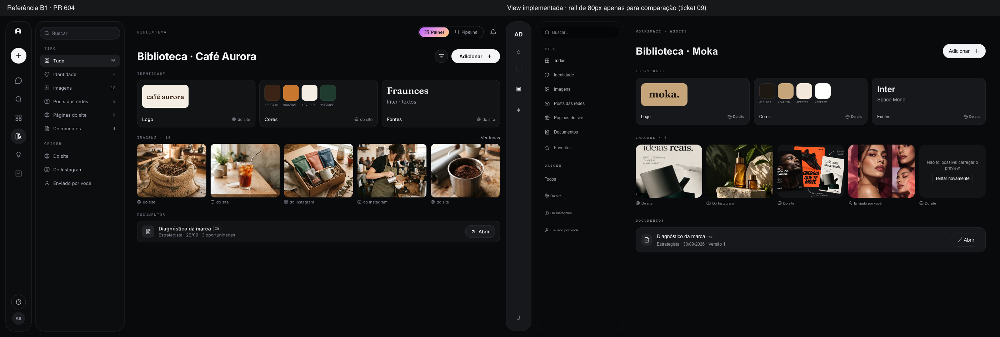
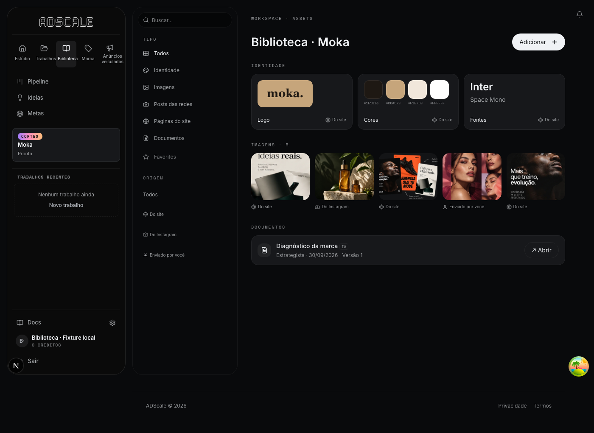
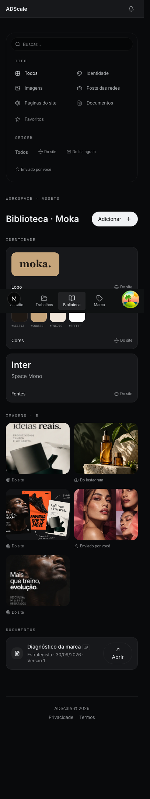
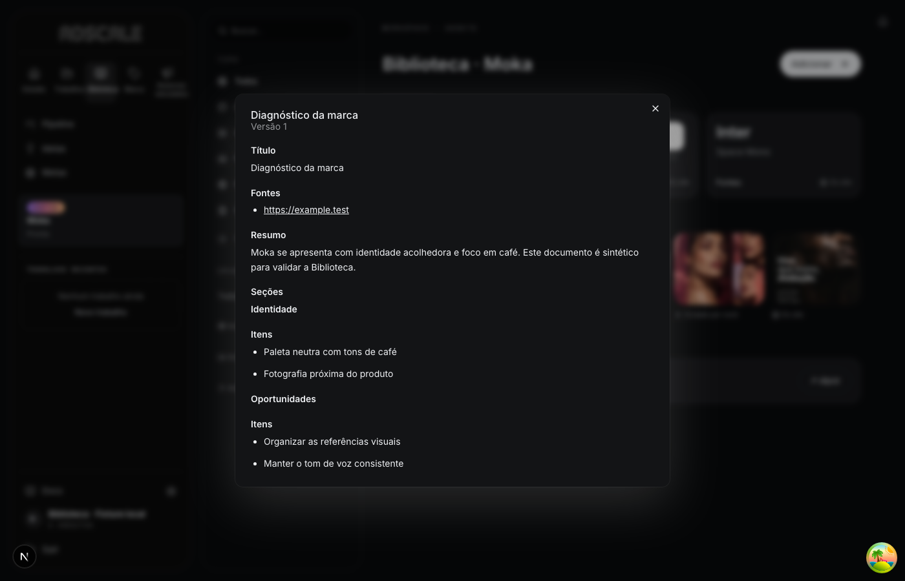

# Biblioteca por marca · ticket 07

Capturas de 30/09/2026, Chromium, tema escuro, movimento reduzido. Marca, conta, diagnóstico e login são fixtures locais. Imagens reutilizam fixtures públicas do repositório. Nenhuma chamada paga, leitura externa ou escrita em produção.

| Evidência | Ambiente e limite |
| --- | --- |
| [B1 lado a lado](b1-comparison.png) | 1400×900 por painel: PNG aprovado do PR 604 à esquerda; componente de produção `LibraryV6View` à direita, com dados sintéticos e um rail de 80px apenas para comparação. **O rail pertence ao ticket 09 e não foi implementado aqui.** |
| [Página completa desktop](library-full-desktop.png) | `/library` real, viewport 1400×900, shell atual com sidebar de 280px, autenticação local e APIs reais sobre PostgreSQL exclusivo `fluxo0_ticket07_test`. |
| [Página completa mobile](library-full-mobile.png) | Mesma página, viewport 390×844. `documentElement.scrollWidth === innerWidth === 390`; shell mobile atual preservado. |
| [Documento legível](document-readable-desktop.png) | Diálogo aberto pelo botão da página real; título, seções, itens e fontes como links. Conteúdo sintético; não comprova a geração do diagnóstico pelo ticket 08. |

O smoke local confirmou carregamento de identidade/assets/documento, abertura e fechamento do diálogo e combinação `Imagens` + `Do Instagram` retornando apenas o asset da origem escolhida. A comparação isolada verifica a view no espaço B1; a página completa mostra sua integração no shell existente. Prints não representam aprovação visual humana, deploy ou comportamento de provedores reais.

