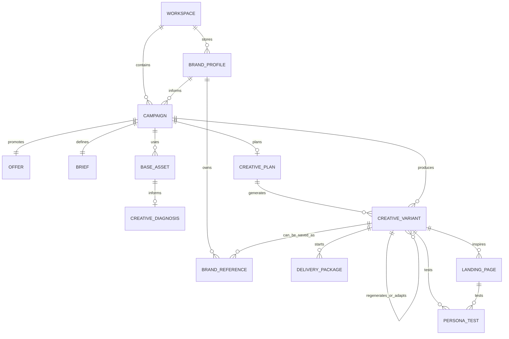
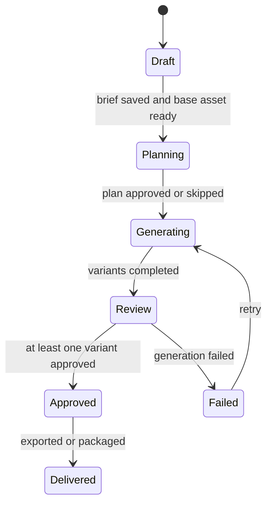
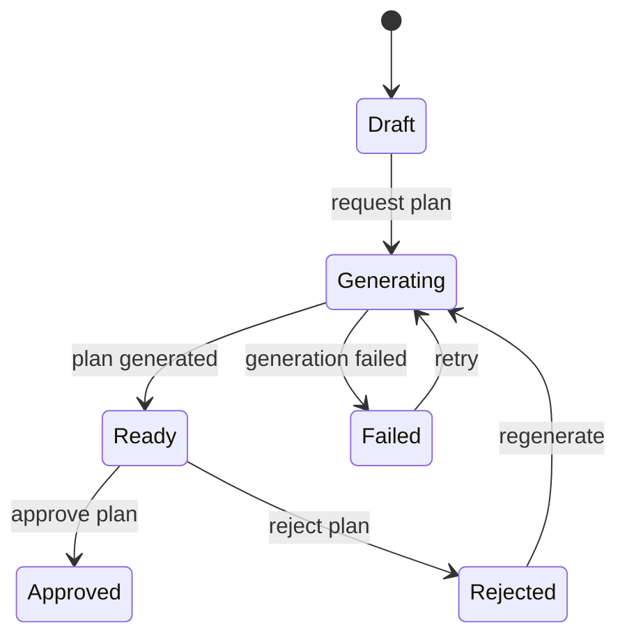
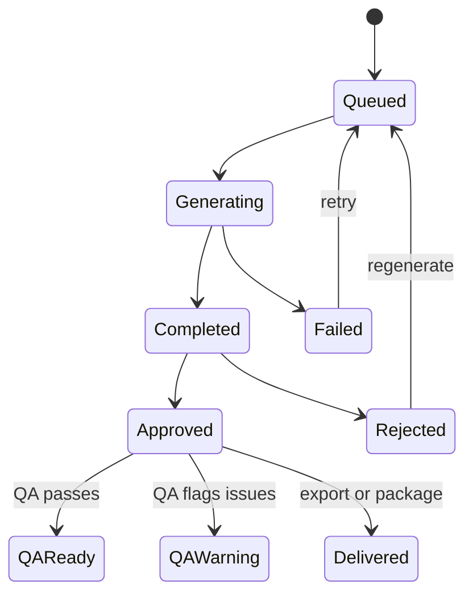
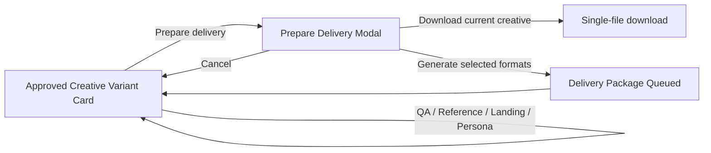

# Layers Design Session — 2026-05-24

## Framework

Using the Layers of Product Design framework:

1. Observed behaviour
2. Domain
3. User needs
4. Product & service strategy
5. Conceptual model
6. Interaction structure and flow
7. Surface

Lower layers are foundations for upper layers. Before resolving an upper-layer decision, check whether the relevant lower-layer decisions are stable.

## Project Notes

- Separate true new product features from incremental flow improvements.
- When touching translated surfaces, verify the whole surface rather than only the first missing key.

## Session Focus

Orient ADScale geral as an existing product with a problematic flow.

## Layer Audit

| Layer | State | Notes |
| --- | --- | --- |
| Observed behaviour | Weak | The repo contains many product/design plans and implementation proofs, but little evidence of direct user observation, interviews, analytics-derived behaviour, or real agency workflow traces. Pain points are plausible, but mostly product/team inferred. |
| The domain | Partial | The product domain is recognizable: campaigns, creatives, formats, briefings, references, derivations, QA, landing pages, personas, credits, workspaces. However, the real-world agency/client handoff model is not yet explicit enough to explain which artefacts belong to campaign work vs client memory vs final delivery. |
| User needs | Assumed | Several needs are stated in feature docs, such as reducing manual briefing, choosing winners faster, preserving references, and producing delivery packages. These are useful but not yet organized as underlying jobs with evidence and priority. |
| Product & service strategy | Partial | The product direction is clear enough for an AI ad-creative SaaS with billing, credits, campaign generation, review, export, and reference workflows. The strongest strategic question is still which primary workflow should define the product: campaign creation, creative improvement, client asset memory, or delivery packaging. |
| Conceptual model | Partial / Risky | The data model is rich, but the user-facing model is carrying many objects: workspace, campaign, template, client profile, reference, asset, pending upload, plan, derivation, preview, QA, landing page, persona simulation, delivery package, export, credit. Some relationships are implicit or feature-local, which can make flows feel bolted together. |
| Interaction structure | Partial | There is a concrete wizard flow: Briefing -> Upload -> Plan -> Gallery, plus review/export-style actions from derivation cards. The interaction path exists, but post-generation actions compete for meaning: QA, approve/reject, save reference, landing page, persona simulation, package, export, regenerate. |
| Surface | Strong | The project has an approved flat/dense dashboard direction, component conventions, i18n, and many implemented surfaces. Surface quality is not the root bottleneck for the reported "problematic flow." |

## Bottleneck

The bottleneck is **Observed behaviour**.

The product has accumulated many plausible capabilities, but the foundation underneath them is thin: we do not yet have a clear record of what a real user actually does before, during, and after using ADScale. That makes upper-layer decisions riskier because every feature can argue that it helps "make ads," while the product lacks a shared behavioural spine for deciding which flow matters most.

The immediate design risk is that the product keeps improving individual surfaces while the main workflow remains conceptually crowded. A user may ask: am I creating a campaign, improving one creative, building a reusable client library, preparing a delivery package, or simulating market response? The app supports all of those, but the observed behaviour layer does not yet tell us which one should dominate the experience.

## Assumed Layers

- **User needs** are treated as known, but most are feature-local rather than evidence-backed jobs.
- **Conceptual model** is implemented in schema and APIs, but not yet cleanly articulated as a shared user-facing model.
- **Interaction structure** exists in code, but the meaning of secondary actions after generation is not yet clearly prioritized.

## Recommendation

Run `/layers-observed-behaviour` next.

Reason: before changing the wizard, dashboard, or object model, identify the actual behavioural sequence the product is trying to serve. The useful output should be a compact behavioural map: what the marketer/agency person starts with, what they are trying to transform it into, what decisions they make, what they hand off, and where ADScale currently interrupts or accelerates that sequence.

If we must move faster because the product needs a near-term release decision, the pragmatic alternative is `/layers-conceptual-model`: define the object model explicitly so the existing feature set stops feeling like a pile of adjacent tools. But that would still be design under behavioural uncertainty.

## Observed Behaviour Plan

Mode: **Plan from scratch**.

No user research, analytics review, interviews, support-ticket analysis, or session recordings were available in the repo during this session. Current observations are therefore **product-inferred**, not user-observed.

### Learning Goal

Understand the real workflow a marketer, designer, founder, or agency operator follows when turning existing campaign inputs into final paid-social creative assets, so ADScale can decide which flow should be primary and which capabilities should remain supporting actions.

Specific research questions:

1. When someone needs new paid-social creatives, what triggers the work and what starting materials do they actually have?
2. How do they decide whether a creative is "good enough" to ship, revise, adapt into more formats, or save as future reference?
3. Where does the workflow currently break down: briefing quality, visual consistency, client feedback, format adaptation, handoff/export, or confidence before spending media budget?

### Participants

Recommended first round: 6-8 qualitative participants.

Recruit across three behaviour types:

| Participant type | Why |
| --- | --- |
| Small agency operators / performance marketers | Likely to handle repeated client campaigns, references, approvals, and delivery packages. |
| In-house growth/marketing generalists | Likely to feel the pain of generating many variants without a full design team. |
| Founder/operator running ads personally | Likely to reveal low-setup, speed-driven behaviour and vocabulary. |

Prioritize people who created or requested ad creatives in the last 30 days. Avoid asking only hypothetical future users; this study needs real past behaviour.

### Study Method

Primary method: **JTBD interviews** about a recent real campaign.

Add-on if possible: **artifact walkthrough**. Ask the participant to show the brief, reference assets, generated/exported creatives, client comments, Slack/WhatsApp/Figma links, or final ad manager upload screen from one real campaign.

Why this method:

- JTBD interviews reveal triggers, anxieties, tradeoffs, and success criteria.
- Artifact walkthroughs reveal tacit behaviour users may forget to mention.
- This is better than a usability test first, because the current gap is not only "can they use ADScale?" but "what real work is ADScale trying to fit into?"

### Interview Guide

Opening:

- "Tell me about the last time you had to create or adapt paid-social creatives. Walk me through what was happening at that point."

Timeline:

- "What triggered the need for new creatives?"
- "What did you already have before starting: brief, old creative, landing page, product images, brand guide, client notes, examples?"
- "What did you do first?"
- "Where did the work move next: designer, AI tool, client chat, ad account, spreadsheet, Figma, Canva?"
- "What made you keep going, stop, restart, or ask someone else?"

Decision points:

- "How did you decide the creative was ready?"
- "What made you reject or revise a version?"
- "When did you need more formats, and how did you adapt them?"
- "What did you hand off at the end, and to whom?"
- "What did you save or reuse for the next campaign?"

Motivations and anxieties:

- "What were you hoping would be different after finishing this?"
- "What were you worried could go wrong?"
- "What almost slowed you down or made you abandon a version?"
- "Where did you feel you were guessing?"

Closing:

- "If you could remove one painful step from that process, which one would it be?"
- "Is there anything I did not ask that would help me understand how this work really happens?"

### What To Listen For

Nouns and natural language:

- campaign, ad, creative, peça, arte, variant, winner, brief, reference, client, brand, format, package, export, landing page, approval, feedback, CTA, offer, asset, product, audience, hook.

Workarounds:

- copying old campaigns
- checking WhatsApp/Slack for client preferences
- using Canva/Figma as the real source of truth
- manually resizing winners into formats
- asking AI for ideas, then fixing by hand
- keeping client references in folders instead of structured libraries
- exporting many assets before knowing which one is approved

Confidence signals:

- repeated behaviour across participants
- real artifacts shown during interview
- examples from campaigns completed in the last 30 days
- workarounds users already spend time on

Weak signals:

- statements about what they "would" do
- generic praise for AI speed
- opinions about features without a recent story
- needs described only in product vocabulary, not their own workflow language

### Candidate Job Stories

These are not validated yet; they are research hypotheses.

| Job story | Confidence | Notes |
| --- | --- | --- |
| When I have an existing ad or rough reference and need more campaign variants quickly, I want to generate options that preserve the core offer and CTA, so I can test creative directions without starting from scratch. | Assumed | Strongly implied by art variation, CTA literal contracts, briefing doctor, and reference image flows. Needs real behaviour evidence. |
| When one creative is approved, I want to turn it into all required paid-social formats, so I can deliver or launch without rebuilding the same idea manually. | Assumed | Implied by delivery package design. Needs evidence that this is a frequent handoff pain. |
| When I work repeatedly for the same client, I want to reuse prior winners and brand references, so new creatives stay on-brand without a heavy setup process. | Assumed | Implied by client reference library. Needs evidence of how users currently store and reuse this memory. |
| When I am unsure whether a creative will persuade the intended audience, I want a quick critique before spending ad budget, so I can revise weak messages earlier. | Assumed | Implied by persona simulator and QA features. Needs evidence that this is a real pre-launch decision point, not only a nice-to-have analysis. |
| When the campaign brief is incomplete, I want help spotting missing context before generation, so I avoid generic or unusable outputs. | Assumed | Implied by Briefing Doctor. Needs evidence of whether users blame bad outputs on bad briefing, model quality, or unclear product flow. |
| When I need to create a campaign but do not know what to write in the brief, I want guided help turning vague intent into usable campaign inputs, so I can start generation without pretending I already have a complete strategy. | Assumed | Current focal hypothesis for in-house marketing generalists starting from blank or weak briefings. |
| When I know the product or offer I need to promote but do not know how to brief a creative, I want the product to guide me from that offer into audience, angle, CTA, and visual direction, so I can generate useful ad options without writing a professional creative brief from scratch. | Assumed | Refined focal hypothesis for the current behavioural path. |

### Synthesis Plan

Capture one observation per note. Do not summarize directly into recommendations.

Suggested tags:

- `trigger`
- `starting-material`
- `decision-point`
- `approval`
- `revision`
- `format-adaptation`
- `handoff`
- `reuse`
- `confidence`
- `workaround`
- `language`
- `tool-chain`

For each interview, record:

- participant type
- recent campaign context
- raw observations / quotes
- artifacts shown
- workflow timeline
- decisions made
- tools used
- workarounds
- open questions

### Research Gaps

- Which starting point is most common: blank brief, existing ad, landing page, client reference folder, or approved winner?
- Who is the actual user: solo operator, agency strategist, designer, media buyer, founder, or client-facing account person?
- What is the real "done" state: approved creative, exported files, launched ads, client signoff, or performance-learning loop?
- Is confidence before launch a major buying reason, or is speed of production the dominant pain?
- Does the user think in campaigns, creatives, clients, assets, packages, or tasks?
- Which existing ADScale action should be the main path after generation: approve, export, package, landing page, persona simulation, QA, regenerate, or save reference?

### Current Working Assumption

The session will focus first on the behavioural path where the user starts from a **blank or weak briefing**, rather than from an existing ad, approved winner, landing page, or client reference folder.

Confidence: **Assumed**.

Implication: the next design work should prioritize what the user knows at the moment they begin, what information is missing, how they currently fill that gap, and what "ready enough to generate" means from their perspective.

Primary user for this path: **in-house marketing generalist**.

Confidence: **Assumed**.

Implication: the workflow should account for someone who may own positioning, campaign setup, creative requests, tool operation, and performance accountability, but may not have deep design support available at the moment of creation.

Primary starting pain: **the user does not know what to write in the briefing**.

Confidence: **Assumed**.

Implication: the product should not treat the briefing as a normal form-filling task. The first behavioural problem is helping the user articulate campaign intent, audience, offer, CTA, constraints, and creative direction from uncertainty.

Likely cause: **the user knows the campaign strategy, but does not know how to translate it into a creative briefing**.

Confidence: **Assumed**.

Implication: the product should bridge from business/marketing intent into creative instructions. The research should look for the user's natural strategy language and where it fails to become visual/copy direction.

Likely strategy input already known: **offer/product**.

Confidence: **Assumed**.

Implication: the guided starting point should probably ask "what are you promoting?" before asking for a complete campaign brief. From there, the system can help derive audience, angle, CTA, constraints, and creative direction.

Desired first output: **a briefing ready to generate**.

Confidence: **Assumed**.

Implication: the product should optimize this path for turning offer/product knowledge into a generation-ready brief, not for open-ended ideation or a full campaign plan. Creative angles and campaign suggestions can support the path, but should not become the main outcome of this first moment.

Preferred creation mode: **guided questions one at a time**.

Confidence: **Assumed**.

Implication: the experience should reduce blank-page pressure by asking one understandable question at a time, using the user's product/offer answer to guide the next decision. A dense all-at-once form is likely the wrong starting shape for this behavioural path.

## Surface Audit — Main Campaign Creation Flow

Scope: **Briefing -> Upload -> Plano Criativo -> Galeria / review / export**.

Medium: **screen UI web app**.

Lower-layer basis: this audit uses the same working assumptions from this session. Observed behaviour is still weak, so findings that depend on the primary user/job are marked as cross-layer risk rather than purely visual defects.

### Audit Findings

| Area | Finding | Category | Priority | Evidence |
| --- | --- | --- | --- | --- |
| Vocabulary | The UI mixes `Brief`, `Briefing`, `brief`, `Criativo`, `arte`, `peca`, `derivacao`, `variacao`, `preview`, `pre-visualizacao`, `asset`, `biblioteca`, `referencia`, and `Brand Kit`. Some terms are legitimate domain concepts, but the user-facing model does not yet say which object is primary at each moment. | Cross-layer issue first; then surface copy cleanup | High | `steps.brief` says `Brief`, the form says `Briefing da Campanha`, cards are `Peca`, gallery progress says `variacoes geradas`, errors and routes say `derivacoes`. |
| Vocabulary | `Cliente` is used for both client/brand/product input, while the current lower-layer assumption says the user likely starts from offer/product. The help text says "A marca ou produto sendo anunciado", which partially repairs the label but leaves the primary noun uncertain. | Cross-layer issue | High | `BriefingStep` labels client at form field, client profile, references, and brand kit; the product/offer starting point is not made primary. |
| Object consistency | `Plano Criativo` is now a real wizard step, but it competes with `Briefing Doctor`, `Diagnostico Criativo`, preflight, competitor analysis, preview, and target formats inside the early flow. These are different objects, but the surface gives them similar card/button weight. | Surface hierarchy fix with conceptual-model dependency | High | Briefing form includes profile/reference, brand kit, offer, auto-briefing, competitor analysis, mode, formats, creative level, preflight, diagnosis, CTA variants, doctor, constraints, notes. |
| Completeness | The four-step breadboard is present in code: Briefing, Upload, Plan, Gallery. The upload step exposes the expected affordances: upload/select from library, replace, preflight, generate preview, skip plan, continue to plan. | Working as intended | Medium | `StepIndicator` and campaign page render four steps; upload routes to plan or fast generation. |
| Completeness | There is surface content beyond the breadboard: landing page generation, persona simulation, save as reference, delivery package, QA, share link, bulk approval/rejection, ZIP export, competitor analysis, auto-briefing. These may be valuable, but they are not all represented in the main interaction model. | Cross-layer issue; revisit interaction flow | High | Post-generation card actions appear after approval; bulk actions appear on selection; competitor/auto-briefing appear during briefing. |
| Emotional register | The strongest surface moments support confidence: preflight analysis, Briefing Doctor, creative diagnosis, QA status, scores, and plan review. That fits a user who feels uncertain about briefing quality and launch readiness. | Working; preserve | High | Readiness labels, local issue explanations, preflight checks, QA labels, and score labels all reduce ambiguity. |
| Emotional register | The first step still feels like a professional creative-brief form. If the chosen primary path is "I know the offer but do not know how to brief creative", the surface asks too many fields before guiding the user from offer/product into audience, angle, CTA, and constraints. | Cross-layer issue expressed at surface | High | The form starts with campaign name, client, profile, objective, audience, platform, tone, offer, then optional assistive tools. |
| Feedback and errors | Progress and success feedback are present for upload, generation, plan loading, realtime updates, export, QA, packages, and autosave. | Working; preserve | Medium | Upload percentage, generation overlays, live update indicator, toasts, and status badges are implemented. |
| Feedback and errors | Several error messages fail the diagnose/explain/recover test. Examples include "Falha ao gerar plano", "Falha ao criar derivacoes", "Falha ao upload. Tente novamente.", "Erro ao carregar campanha", and card-level "Falhou". They diagnose at a category level but do not explain likely cause or recovery beyond retry. | Surface copy/state fix | High | Shared error messages and failed overlays are generic; plan error only shows `Erro ao carregar campanhas` plus retry. |
| Hierarchy | Upload state gives three route choices at the same decision moment: generate preview, skip plan, continue to plan. The recommended main path is visually primary, but the presence of preview and skip at the same level can distract from the intended flow. | Surface hierarchy decision | Medium | Upload footer shows preview, skip, and continue together after upload. |
| Hierarchy | Gallery cards hide core actions behind hover opacity and then show many approved-state actions in a vertical stack. This helps density, but makes "what should I do next?" less explicit after a creative is approved. | Surface hierarchy fix; interaction priority needed | High | Card actions: preview/download/regenerate, approve/reject, QA, package, save reference, landing page, persona simulation. |
| Hierarchy | The global wizard footer is mostly disabled on steps 2-4 while step-level buttons handle navigation. This avoids duplicate actions, but it also creates visible inactive controls that can feel broken. | Surface fix | Medium | `WizardNavigationFooter` disables the next button for steps 2, 3, and 4 instead of hiding or contextualizing it. |
| Accessibility | Many icon-only controls use `title` instead of accessible labels, and the step indicator uses icon-only step buttons without explicit `aria-label`. The upload input is hidden correctly, but several action buttons rely on visual icons/hover. | Surface accessibility fix | High | Derivation action buttons, delete draft, reference chips, step buttons, and card checkboxes need explicit labels/pressed/selected state where applicable. |
| Accessibility | The UI uses color and subtle opacity to convey selected, failed, active, and disabled states. Text labels usually exist, but reference chips, status dots, score colors, and hidden hover actions need keyboard/focus review. | Surface accessibility fix | Medium | Selected references use dot + color; status badges use color; card action row is opacity-hidden until hover. |
| Consistency | The overall flat/dense dashboard style is consistent with existing direction: compact typography, constrained width, tokens, icons, status badges, and restrained surfaces. | Working; preserve | High | Campaign workspace, upload, plan, and gallery share tokens and layout constraints. |
| Consistency | Some copy remains hardcoded or untranslated in the surface, including `Preview`, `Baixe a versao final`, format helper text, and format labels. | Surface copy/i18n fix | Medium | Hardcoded strings in `DerivationCard` and `BriefingStep` target-format section. |

### Decision Inventory

#### Cross-layer issues to resolve first

1. **Primary starting object.** Decide whether the first user-facing object is `campaign`, `offer/product`, `base creative`, or `client profile`. Current assumption points to `offer/product`; the surface still starts from campaign/client form language.
2. **Post-generation spine.** Decide the intended next action after generated creatives: approve one, compare, QA, package/export, save reference, landing page, persona simulation, or generate more. The surface currently supports all of them without a clear priority order.
3. **Object vocabulary.** Decide the canonical user-facing terms for: creative/art/piece/derivation/variation; client/product/brand/profile; plan/brief/diagnosis/preflight/QA.
4. **Role of assistive analysis.** Decide whether Briefing Doctor, creative diagnosis, preflight, competitor analysis, and persona simulation are core flow steps, optional confidence aids, or advanced tools.

#### Surface decisions to make now

1. **Early-flow hierarchy.** Make `Continuar para Plano` the unmistakable route after upload; decide whether `Gerar pre-visualizacao` and `Pular plano` should be secondary links, advanced actions, or tucked into a menu.
2. **Briefing first screen.** If offer/product is the primary known input, surface it earlier and lower the perceived burden of the form. Options: reorder fields, add a one-question guided mode, or keep form mode but make assistive extraction/doctor more prominent.
3. **Gallery next action.** Choose one primary CTA for completed cards and one for approved cards. Example: completed = `Aprovar` / `Revisar`; approved = `Preparar entrega`. Move landing page/persona/reference into secondary actions.
4. **Error-message contract.** Rewrite key errors to diagnose, explain, and recover. Example: instead of "Falha ao gerar plano", use a message that says whether the brief is incomplete, AI failed, credits are missing, network failed, or retry is safe.
5. **Accessible action labels.** Add `aria-label`, `aria-pressed` / `aria-selected`, and keyboard-visible focus expectations for icon-only controls, chips, gallery selection, and step navigation.
6. **Translation cleanup.** Move hardcoded copy into `pt-BR` / `en` and normalize the chosen nouns across steps, cards, buttons, empty states, toasts, and errors.

#### Deferred

1. Visual redesign of the component system. The existing surface language is coherent enough; the bottleneck is meaning/hierarchy, not styling.
2. Full accessibility audit with browser/keyboard/screen-reader testing. The static pass found likely issues, but interaction testing should happen after prioritizing the flow.
3. Detailed responsive audit. The code uses responsive layouts, but mobile crowding should be checked once the information hierarchy is simplified.

### Cross-layer Issues

- The surface cannot fully solve the crowded gallery until interaction structure decides which post-generation action is the main path.
- The first-step form cannot feel natural until the conceptual model decides whether `campaign` or `offer/product` is the start object.
- The vocabulary cleanup depends on a canonical conceptual model vocabulary. Otherwise renaming `derivacao` to `variacao`, or `cliente` to `produto`, could break meaning elsewhere.

### What's Working

- The four-step flow is now legible and implemented in the main workspace surface.
- The product already has strong confidence-building surfaces: preflight, Briefing Doctor, creative diagnosis, plan review, QA, score, realtime status, and toasts.
- The visual system is cohesive, dense, and product-tool appropriate.
- The surface often shows state clearly: upload progress, active generation, completed counts, failed counts, live updates, selected counts, and approved/rejected status.
- The flow supports both deliberate planning and a fast path, which is useful; the next decision is how prominently each path should appear.

### Recommended Next Move

Run `/layers-conceptual-model` on the campaign creation flow before doing a copy polish. Define the canonical objects and terms, especially the relationship between campaign, offer/product, base creative, creative plan, derivation/variation, approved creative, delivery package, reference, and client profile. Then return to this surface audit and apply a focused surface pass: vocabulary normalization, gallery hierarchy, error copy, and accessibility labels.

The surface is the layer users encounter. Everything decided below either gets honoured here or undermined here. Revisit this skill after any significant change to the conceptual model or interaction structure.

## Conceptual Model — Main Campaign Creation Flow

Status: **hypothesis**. This model is built from the existing product, schema, plans, and the working assumptions above. It should be revisited after user research.

Scope: the main flow from weak starting input to generated paid-social creatives and delivery.

Core job: help a marketing generalist turn a product/offer and a base creative or reference material into reviewable, approvable, and deliverable ad creatives.

### Object Definitions

#### Campaign

What it is: the work container for one advertising effort around an offer, audience, platforms, and creative outputs.

Attributes: name, objective, audience, platforms, tone, offer, constraints, notes, generation mode, creative level, target formats, status.

Relationships:

- Belongs to one Workspace.
- May use one Brand Profile.
- May select many Brand References.
- May contain many Base Assets.
- May have one Creative Plan.
- Produces many Creative Variants.
- May produce many Landing Pages, Share Links, Persona Tests, exports, and credit transactions.

Actions: create campaign, save draft, refine brief, upload/select base asset, generate plan, skip plan, generate variants, review outputs, export approved output.

#### Offer

What it is: the product, service, promotion, or concrete thing the campaign asks the audience to notice or act on.

Attributes: product/service name, benefit, promotion, CTA, constraints.

Relationships:

- Belongs inside one Campaign as the campaign's motivating object.
- Informs Creative Plan, Creative Variants, QA, and Persona Test.

Actions: describe offer, refine offer, preserve offer in generated outputs.

Decision: treat **Offer** as the conceptual starting object for the guided creation path, even if the database currently stores it as campaign fields.

#### Brief

What it is: the generation-ready instruction set that turns campaign intent into creative direction.

Attributes: objective, audience, offer, CTA, tone, constraints, notes, selected references, creative level, target formats.

Relationships:

- Belongs to one Campaign.
- Is informed by Brand Profile, Brand References, Base Assets, Competitor Insights, Briefing Doctor suggestions, and Creative Diagnosis.
- Feeds one Creative Plan and many Creative Variants.

Actions: draft, diagnose, apply suggestion, save, restore, continue.

Decision: use **Brief** for the object, not interchangeably with Campaign. Campaign is the container; Brief is the instructions.

#### Brand Profile

What it is: reusable memory for a client/brand/product context across campaigns.

Attributes: name, description, brand kit colors/fonts/tone/logo, notes.

Relationships:

- Belongs to one Workspace.
- Has many Brand References.
- Can be attached to many Campaigns.

Actions: create profile, select profile, update brand kit, select references.

Decision: prefer **Brand Profile** over "Client Profile" in user-facing copy when the same object can represent a client, brand, or product.

#### Brand Reference

What it is: a reusable example or asset that teaches the system what to preserve or imitate.

Attributes: label, kind, notes, asset.

Relationships:

- Belongs to one Brand Profile.
- May come from a Workspace Asset or an approved Creative Variant.
- May be selected by many Campaigns.

Actions: select reference, save approved creative as reference.

#### Base Asset

What it is: the starting creative/image uploaded or selected for a campaign.

Attributes: file name, type, size, dimensions, technical/preflight analysis.

Relationships:

- Belongs to one Campaign.
- Can be drawn from Workspace Assets.
- Informs Creative Diagnosis, Preflight, Creative Plan, and Creative Variants.

Actions: upload, select from library, replace, analyze preflight.

#### Creative Diagnosis

What it is: an analysis of a base asset that decides what to preserve and where variation is allowed.

Attributes: detected concept, elements to preserve, variation opportunities, status.

Relationships:

- Belongs to one Campaign and one Base Asset.
- Guides Creative Variants.

Actions: generate, edit, save, regenerate.

#### Creative Plan

What it is: a reviewable strategy for what variants should be generated.

Attributes: strategy, angles, hooks, CTAs, status.

Relationships:

- Belongs to one Campaign.
- Is based on the Brief, Brand References, Creative Diagnosis, and Base Asset.
- Produces many Creative Variants when approved or skipped.

Actions: generate, approve, reject, regenerate, skip.

#### Creative Variant

What it is: one generated ad creative output for a specific angle, CTA, format, or adaptation.

Attributes: image, prompt, platform, format, CTA, status, score, QA result, cost, generation mode.

Relationships:

- Belongs to one Campaign.
- May come from one Creative Plan.
- May have one parent Creative Variant for regeneration or delivery-package children.
- May produce Copy Variants, QA, exports, Delivery Package items, Landing Pages, Brand References, and Persona Tests.

Actions: preview, compare, approve, reject, regenerate, download, run QA, prepare delivery, save as reference, generate landing page, run persona test.

Decision: use **Creative Variant** for the user-facing output object. Treat "derivation" as an internal/technical term unless the product deliberately teaches it.

#### Delivery Package

What it is: the set of approved creative files prepared for handoff in required formats.

Attributes: source format, selected output formats, status.

Relationships:

- Starts from one approved Creative Variant.
- Contains many generated format adaptations.
- Belongs to one Campaign.

Actions: choose formats, generate package, download package.

#### Landing Page

What it is: a generated page matched to an approved Creative Variant.

Attributes: title, html, status, error.

Relationships:

- Belongs to one Campaign.
- Is sourced from one Creative Variant.

Actions: generate, download/view.

#### Persona Test

What it is: a confidence check that evaluates a Creative Variant or Landing Page through audience personas.

Attributes: source type, status, persona results.

Relationships:

- Belongs to one Campaign.
- Tests one Creative Variant or Landing Page.

Actions: run test, review results.

### Object Map

### State Transitions

Campaign:

Creative Plan:

Creative Variant:

### Ubiquitous Language Decisions

#### Nouns

| Chosen term | Rejected / internal alternatives | Decision |
| --- | --- | --- |
| Campaign | project, ad set, flow | The persistent work container. |
| Offer | client/product field, product only | The user likely knows what they are promoting first; make this a first-class concept in the guided path. |
| Brief | briefing, campaign form, prompt inputs | The generation-ready instruction object. |
| Brand Profile | client profile, product profile | Covers client, brand, or product without forcing agency-only language. |
| Brand Reference | reference, asset, example | A reusable source of brand/creative memory. |
| Base Asset | uploaded asset, original creative, creative base | The starting image/creative for generation. |
| Creative Diagnosis | diagnosis, preservation checklist | The analysis of what to preserve/change in the Base Asset. |
| Creative Plan | plan, AI plan | A strategy/angle plan users can approve or skip. |
| Creative Variant | derivation, variation, piece, art | The user-facing generated output. Keep `derivation` as internal technical language unless intentionally taught. |
| Delivery Package | export package, package | The handoff object with multiple output formats. |
| Persona Test | persona simulation, persona analysis | "Test" makes the confidence-check job clearer than "simulation". |

#### Verbs

| Verb | Applies to | Rejected / narrower alternatives | Decision |
| --- | --- | --- | --- |
| Create | Campaign, Brand Profile | add, new | Use for making a persistent object. |
| Save Draft | Campaign/Brief | save | Preserves unfinished work without implying final readiness. |
| Refine | Brief, Offer | edit/update | Use when improving strategic input before generation. |
| Analyze | Base Asset, Brief, Competitor Creative | diagnose/check | Use when the system produces evaluative feedback. |
| Generate | Creative Plan, Creative Variant, Landing Page, Delivery Package | create for AI outputs | Use when AI creates a new output from inputs. |
| Approve | Creative Plan, Creative Variant | accept | The object becomes eligible for downstream generation/export. |
| Reject | Creative Plan, Creative Variant | discard | Keeps the object as a reviewed negative decision, not deletion. |
| Regenerate | Creative Plan, Creative Variant | retry | Produces a replacement/new attempt from prior context. |
| Prepare Delivery | Approved Creative Variant | generate package/export package | Names the user's handoff job; may contain format generation and download. |
| Export | Creative Variant, Delivery Package | download | Use when creating a file artifact; download is the transport action. |
| Save as Reference | Creative Variant | bookmark | Converts an approved output into brand memory. |
| Run Persona Test | Creative Variant, Landing Page | simulate personas | Names the confidence-check result more plainly. |

### Model Decisions That Resolve Surface Findings

1. **Start from Offer in guided creation.** Campaign remains the container, but the first guided question should be offer/product-oriented.
2. **Use Creative Variant on the surface.** Replace visible "derivation" language over time; keep derivation naming in code/server APIs until a dedicated refactor is justified.
3. **Make Prepare Delivery the primary approved-state action.** QA, Persona Test, Landing Page, and Save as Reference are confidence/reuse tools, not the main finish line.
4. **Treat Brand Profile and Brand Reference as optional context.** They should not block the primary path.
5. **Treat Briefing Doctor, Preflight, Creative Diagnosis, QA, and Persona Test as confidence aids.** They should be surfaced as support for uncertain users, not as equal steps in the spine.

### Open Questions

- Should the product expose **Creative Variant** in Portuguese as `Variação criativa`, `Peça gerada`, or another term? Current recommendation: `Variação criativa`.
- Is **Brand Profile** too brand-oriented for agencies managing clients? It may need a bilingual surface treatment like "Marca/cliente" until research clarifies vocabulary.
- Does **Prepare Delivery** mean single approved file, multi-format package, ZIP, share link, or all of these? Interaction flow should decide the bundle.
- What should happen historically when a Brand Reference is updated or deleted after campaigns used it?

The conceptual model defines what exists in this product. Next: design how users interact with those objects. Run `/layers-interaction-flow`.

This model was built without domain research — it's a hypothesis. Plan to revisit it once you have evidence.

## Interaction Flow — Prepare Delivery

Status: **bounded flow decision** for the main campaign creation flow.

### Job Story

When I have approved a creative variant, I want one clear delivery path, so I can hand off or launch the creative without deciding between scattered export, package, ZIP, and share-link actions.

### Breadboard

Approved Creative Variant Card
- `Prepare delivery` -> Prepare Delivery Modal
- `QA da arte / Review QA` -> stays on card; updates QA status inline
- `Save as reference` -> stays on card; shows success/failure toast
- `Generate landing page` -> stays on card; queues landing page
- `Run persona test` -> Persona Test Modal

[Shows approved creative variant, score, format, CTA, status, and secondary confidence/reuse actions.]

Prepare Delivery Modal
- `Download current creative` -> starts single-file export/download, stays in modal or closes after success
- `Generate selected formats` -> queues delivery package, closes modal on success
- `Cancel` -> Approved Creative Variant Card

[Shows source format, selectable delivery formats, which format is already ready, and explains that extra formats will be generated as a package.]

Delivery Package Queued
- automatic -> Gallery / Approved Creative Variant Card

[Toast confirms package queued; card remains approved. Future work can add package status visibility.]

Failure Paths
- Export fails -> keep user in context; show error toast with recovery.
- Package generation fails -> keep modal available or return to card; show error toast.
- No extra formats selected -> disable package generation and keep "Download current creative" available.

### Flow Diagram

### Decisions

- **Prepare delivery is the primary approved-state action.**
- **Single-file download belongs inside Prepare Delivery**, not as a separate global primary button competing with package generation.
- **Delivery package generation remains the multiformat path.**
- **Bulk ZIP and public share link remain selection-mode actions** for now; they are not part of the single-card Prepare Delivery modal until the product decides whether delivery means handoff bundle, file export, or review link.

### Open Decisions

- Should the modal close after single-file download succeeds, or stay open so the user can also generate formats?
- Should package status appear on the card after queueing?
- Should share link be available for one approved variant from the same modal?

### Risks

- The model still lacks observed user evidence about the real "done" state: file downloaded, package generated, share link sent, or ad launched.
- The current backend has separate export, package, ZIP, and share-link operations; this flow intentionally unifies only the user-facing entry point, not the underlying services.

This breadboard defines interaction logic without committing to visual form. Whatever comes next — working in code, building in the real medium, or detailed visual design — make sure the conceptual model beneath this flow is stable first.

## Decisions

- Use `/layers-orient` to diagnose ADScale geral as an existing product with a problematic flow.
- Treat observed behaviour as the lowest unstable layer.
- Recommend `/layers-observed-behaviour` as the next skill unless release constraints force a conceptual-model pass first.
- Use `/layers-observed-behaviour` in Plan mode because no direct user research was available.
- Treat current job stories as assumptions until interviews or artifact walkthroughs validate them.
- Focus the first behavioural path on users starting from a blank or weak briefing.
- Use the in-house marketing generalist as the primary participant/user lens for this behavioural path.
- Treat "does not know what to write in the briefing" as the primary starting pain for this path.
- Treat strategy-to-creative-brief translation as the likely cause of the starting pain.
- Treat product/offer as the likely known input at the start of the flow.
- Treat "briefing ready to generate" as the desired first output for this path.
- Treat guided one-question-at-a-time input as the preferred creation mode for the initial brief.

## Open Questions

- What real workflow evidence do we have from target users or agency/client work?
- Is ADScale primarily a campaign-creation workflow, a creative-improvement workflow, a client-memory system, or a delivery-packaging workflow?
- Which post-generation action is the product's main success path: approve, export, package, landing page, persona simulation, or save as reference?

## Review

Ran a repo-grounded orientation using existing plans, architecture docs, schema, and campaign workspace flow. Then produced an observed-behaviour research plan and a surface audit for the main campaign creation flow. No product code was changed.
