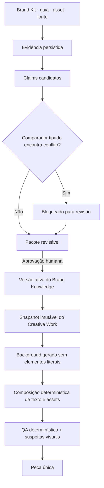

# Brand Cortex: execução determinística e conhecimento com evidência

**Data:** 2026-08-12

**Status:** em execução — S00 e núcleo de S01 concluídos

**Escopo inicial:** Brand Training + protocolo Peça única (`social_post`)

**Nome de produto:** Córtex da Marca

**Nome interno:** `brand-knowledge` / `brand-evidence`

> Este plano complementa os planos históricos de Brand Training e Criar post. Mantém o vínculo por `clientProfileId`, os modos `exact | reference | rule`, a independência de campanhas e o snapshot imutável. Corrige a autoaprovação atual, antecipa medição e adiciona composição tipográfica determinística antes do grafo de conhecimento.

## Objetivo

Fazer a Peça única produzir resultados coerentes com os assets e as diretrizes da marca sem transformar inferências do modelo em verdade permanente.

O sistema deve controlar dois riscos diferentes:

1. **Alucinação epistemológica:** a IA infere uma regra inexistente e ela passa a condicionar gerações futuras.
2. **Alucinação de execução:** a regra está correta, mas o gerador altera copy, fonte, logo, quebra de linha ou outro elemento que deveria ser literal.

A ordem de entrega é, portanto:

1. medir o fluxo atual;
2. fechar a promoção automática de conhecimento;
3. tirar texto, tipografia e assets exatos da responsabilidade do gerador;
4. verificar deterministicamente tudo que for possível;
5. só então publicar conhecimento inferido com evidência e revisão humana.

## Decisões travadas

- O Brand Training pertence a `clientProfileId`; campanhas são consumidores opcionais futuros.
- A V1 afeta apenas Peça única / `social_post`.
- Não será criado Neo4j, RDF, OWL, SPARQL, vector database ou serviço de treinamento de modelo.
- O PostgreSQL atual armazenará um grafo lógico de claims, evidências e versões.
- O modelo pode propor claims; nunca pode ativá-los sozinho.
- `unknown` permanece `unknown`.
- Resultado gerado nunca retroalimenta o Córtex automaticamente.
- Texto obrigatório, logo e fontes oficiais são compostos deterministicamente quando houver material renderizável aprovado.
- O limite operacional permanece em quatro referências visuais até o harness provar ganho líquido com oito.
- GPT Image 2 usa alta fidelidade nos inputs automaticamente; não será criado um parâmetro `input_fidelity` inexistente para esse modelo.
- Nenhuma geração paga, deploy, push ou promoção de produção faz parte da execução automática deste plano.

## Arquitetura mínima



### O que será reutilizado

- `workspaceAssets` para binários e metadados.
- `clientReferences` para vínculo asset ↔ perfil e revisão.
- `BrandTrainingAnalysis.measurement` e `measure-image.ts` para medições Sharp e ΔE.
- `calibrationRules` como referência de estados, caveats, aprovação e promoção — não como armazenamento dos fatos da identidade.
- `human-quality/production-pilot-baseline.ts`, sampling e fixtures para disciplina de evidência.
- `CreativeWorkIdentitySnapshot`, `referenceSelection.reasons` e seleção determinística existentes.
- `composite.ts`, `placement-policy.ts` e Sharp para composição pós-geração.
- `creative-qa.ts` para QA objetivo existente, sem misturar seu veredito com gosto visual.

### Persistência nova mínima

Somente duas tabelas novas são justificadas:

1. `brand_knowledge_claims`: claim estruturado, estado e referências de evidência.
2. `brand_knowledge_versions`: pacote publicado, hash e snapshot compilado.

As evidências continuam nos donos atuais (`clientReferences`, `workspaceAssets`, Brand Kit e usuário). A claim guarda referências tipadas para essas fontes. Não haverá uma tabela genérica de arestas na V1.

## Invariantes

- Nenhum claim ativo sem ao menos uma evidência resolvível e pertencente ao mesmo workspace/perfil.
- Nenhum `candidate`, conflito ou claim rejeitado entra no prompt.
- Claims inferidos exigem aprovação humana mesmo com confiança alta.
- Medição determinística pode provar uma observação, mas não inventar intenção semântica.
- Toda leitura e escrita usa `workspaceId + clientProfileId`.
- O hash da versão é calculado sobre JSON canônico e não depende da ordem retornada pelo banco.
- Um Creative Work confirmado nunca muda quando o Córtex é atualizado.
- Perfis sem versão ativa continuam no fluxo legado.
- Assets antigos autoaprovados continuam legíveis para compatibilidade, mas aparecem como legados e não sustentam claims ativos até revisão humana.
- O LLM pode produzir uma suspeita visual; suspeita não reprova, não corrige e não ensina automaticamente.

## Slices

- [x] **S00: Baseline executável da consistência atual** `risk:high` `depends:[]` `HITL`
  > After this: o mesmo harness mede fixtures e peças existentes, separando copy, tipografia, logo, paleta, custo, latência e avaliação humana sem executar geração paga.
- [x] **S01: Fechar a autoaprovação** `risk:high` `depends:[]` `AFK`
  > After this: um upload novo passa por análise e revisão humana antes de poder condicionar Peça única. A UI específica de legado fica para a slice que introduzir claims/versionamento, quando houver uma ação real para esses registros.
- [ ] **S02: Compor copy e tipografia com fontes reais** `risk:high` `depends:[S00,S01]` `HITL`
  > After this: Peça única pode gerar somente o background e compor headline, body e CTA com arquivo TTF/OTF aprovado, layout limitado, contraste e proveniência reproduzível.
- [ ] **S03: Brand Fidelity determinística primeiro** `risk:high` `depends:[S02]` `AFK`
  > After this: o resultado informa checks comprováveis de texto, fonte, logo, dimensão, safe area e contraste; análises semânticas permanecem suspeitas inconclusivas.
- [ ] **S04: Claims de marca com proveniência** `risk:high` `depends:[S03]` `AFK`
  > After this: Brand Training mostra o que foi aprendido, de qual fonte veio, qual sua autoridade e por que ainda não influencia geração.
- [ ] **S05: Conflitos tipados e publicação versionada** `risk:high` `depends:[S04]` `HITL`
  > After this: o usuário resolve conflitos e publica um pacote versionado; valores próximos são comparados pela semântica correta e nenhuma decisão fica implícita.
- [ ] **S06: Snapshot do Córtex na Peça única e gate final** `risk:high` `depends:[S05]` `HITL`
  > After this: Peça única consome apenas uma versão ativa congelada, exibe a identidade aplicada e o harness decide se o rollout e um experimento 4 × 8 referências podem avançar.

## S00 — Baseline executável da consistência atual

### Comportamento

Criar um harness repetível antes de alterar a geração. Ele deve aceitar fixtures sintéticas e manifestos de peças já existentes. A execução local usa o provider E2E controlado para atravessar seleção, prompt, geração e medição sem chamar provider externo ou pago.

O baseline registra separadamente:

- copy literal correta;
- tipografia comprovada ou desconhecida;
- logo exato/presente;
- crop de conteúdo crítico;
- contraste e legibilidade;
- aderência de paleta como medida, nunca como verdade universal para fotografia;
- contaminação por referência de estilo;
- número e papéis das referências;
- duração, número de chamadas e RSS quando disponíveis;
- tokens/custo apenas quando o provedor ou ledger fornecer dado verificável;
- veredito humano e proveniência `synthetic_fixture | operator_imported | real_customer`.

### Arquivos

- Modificar: `app/src/server/human-quality/production-pilot-baseline.ts`
- Modificar: `app/src/server/human-quality/production-pilot-baseline.test.ts`
- Modificar: `app/src/server/ai/quality-fixtures.ts`
- Criar: `app/src/server/creative-work/brand-consistency-evidence.ts`
- Criar: `app/src/server/creative-work/brand-consistency-evidence.test.ts`
- Criar: `app/scripts/run-brand-consistency-validation.ts`
- Criar: `app/scripts/run-brand-consistency-validation.test.ts`
- Modificar: `app/package.json`

### Aceite

- O comando `npm run validate:brand-consistency -- --manifest <arquivo>` gera JSON versionado.
- Execução sem corpus retorna `human_needed`, não aprovação vazia.
- Fixtures não liberam claim de validação em cliente real.
- O relatório contém `claimsAllowed`, `claimsBlocked`, `withheldClaims` e source composition.
- Métricas ausentes ficam `null`/indisponíveis; não são estimadas silenciosamente.
- A saída diferencia baseline automatizado, avaliação humana e geração paga.

### Verificação

```bash
cd app
npm test -- src/server/human-quality/production-pilot-baseline.test.ts src/server/creative-work/brand-consistency-evidence.test.ts scripts/run-brand-consistency-validation.test.ts
npm run validate:brand-consistency -- --manifest test-data/brand-consistency/fixtures.json
```

## S01 — Fechar a autoaprovação

### Comportamento

Restaurar o contrato originalmente aprovado:

- `createTrainingReference` cria `pending_analysis`.
- A análise muda `pending_analysis → pending_approval`.
- Somente PATCH autenticado com usuário define `approved` ou `archived`.
- GET não promove estados.
- Reanálise de item aprovado preserva revisão humana e campos bloqueados.
- Não haverá bulk demotion: registros antigos permanecem compatíveis. A UX de identificação/revisão de legado será adicionada junto de claims/versionamento, sem badge sem ação nesta slice.

### Arquivos

- Modificar: `app/src/server/repositories/client-reference.ts`
- Modificar: `app/src/server/repositories/client-reference.test.ts`
- Modificar: `app/src/server/jobs/brand-training.ts`
- Modificar: `app/src/server/jobs/brand-training.test.ts`
- Modificar: `app/src/app/api/client-profiles/[id]/training-assets/route.ts`
- Modificar: `app/src/app/api/client-profiles/[id]/training-assets/route.test.ts`
- Modificar: `app/src/app/api/client-profiles/[id]/training-assets/[referenceId]/route.ts`
- Modificar: `app/src/components/brand-training/BrandTrainingAssets.tsx`
- Modificar: `app/src/components/brand-training/BrandTrainingAssets.test.tsx`
- Modificar: `app/src/lib/hooks/use-brand-training.ts`
- Modificar: `app/messages/pt-BR.json`
- Modificar: `app/messages/en.json`

### Aceite

- Nenhuma requisição GET altera banco.
- Upload novo não aparece em `getApprovedTrainingReferences` antes da revisão.
- Aprovação exige análise válida e usuário autenticado.
- Workspace/perfil incorreto responde como não encontrado/negado sem vazar existência.
- Retry do job não duplica análise nem rebaixa item aprovado.
- Nenhuma UI de legado é introduzida antes de existir o fluxo de claims/versionamento que permita agir sobre o item.

### Verificação

```bash
cd app
npm test -- src/server/repositories/client-reference.test.ts src/server/jobs/brand-training.test.ts 'src/app/api/client-profiles/[id]/training-assets/route.test.ts' 'src/app/api/client-profiles/[id]/training-assets/[referenceId]/route.test.ts' src/components/brand-training/BrandTrainingAssets.test.tsx
```

## S02 — Compor copy e tipografia com fontes reais

### Comportamento

Adicionar upload de fonte ao perfil e um plano tipográfico congelado no Creative Work.

V1 aceita somente TTF e OTF, com tamanho limitado e magic bytes validados. O arquivo é persistido em `workspaceAssets`; `clientProfiles.brandFontAssets` guarda apenas os vínculos aprovados:

```ts
type BrandFontAsset = {
  assetKey: string;
  family: string;
  weight: 100 | 200 | 300 | 400 | 500 | 600 | 700 | 800 | 900;
  style: "normal" | "italic";
  sha256: string;
  approvedAt: string;
  approvedByUserId: string;
};
```

Não basta informar `Montserrat` como string. Sem arquivo aprovado, o sistema mantém o comportamento legado e declara `fontExecution: "generative"`; não promete tipografia exata.

Para perfil com fonte renderizável:

1. o prompt pede background sem texto e reserva a área declarada;
2. o job gera a base;
3. o compositor carrega a fonte do object storage em diretório temporário;
4. Sharp/Pango renderiza texto RGBA com `fontfile`, largura, altura, wrapping e alinhamento definidos;
5. o compositor aplica headline, body, CTA e assets exatos;
6. o arquivo temporário é removido em `finally`;
7. o output guarda hashes de copy, fonte e plano.

O layout inicial é limitado e deliberado: três templates por formato (`top`, `center`, `bottom`), escolhidos deterministicamente a partir da direção congelada. Não será criado editor livre.

### Arquivos

- Modificar: `app/src/server/db/schema.ts`
- Criar: `app/drizzle/<next>_brand_font_assets.sql` usando o próximo número livre no momento da implementação (`0083` já pertence à layerization).
- Modificar: `app/drizzle/meta/_journal.json`
- Criar: `app/src/server/brand-training/font-assets.ts`
- Criar: `app/src/server/brand-training/font-assets.test.ts`
- Criar: `app/src/app/api/client-profiles/[id]/brand-fonts/route.ts`
- Criar: `app/src/app/api/client-profiles/[id]/brand-fonts/route.test.ts`
- Modificar: `app/src/lib/hooks/use-brand-training.ts`
- Modificar: `app/src/components/brand-training/BrandTrainingWizard.tsx`
- Modificar: `app/src/components/brand-training/BrandTrainingWizard.test.tsx`
- Criar: `app/src/server/creative-work/typography-plan.ts`
- Criar: `app/src/server/creative-work/typography-plan.test.ts`
- Criar: `app/src/server/creative-work/text-composite.ts`
- Criar: `app/src/server/creative-work/text-composite.test.ts`
- Modificar: `app/src/server/creative-work/contracts.ts`
- Modificar: `app/src/server/creative-work/identity.ts`
- Modificar: `app/src/server/creative-work/prompt.ts`
- Modificar: `app/src/server/jobs/creative-work.ts`
- Modificar: `app/messages/pt-BR.json`
- Modificar: `app/messages/en.json`

### Aceite

- Upload rejeita extensão, tamanho ou assinatura inválida.
- Nenhuma fonte de outro workspace/perfil pode ser usada.
- O usuário confirma que possui direito de uso antes do upload.
- O snapshot guarda `assetKey`, SHA-256, família, peso, estilo e plano tipográfico.
- Texto é escapado antes de entrar em markup Pango.
- Auto-fit tem tamanho mínimo; overflow não é silenciosamente cortado.
- Contraste insuficiente escolhe cor autorizada alternativa ou placa prevista no plano.
- Mesmo buffer, copy, fonte e plano produzem pixels idênticos em teste.
- O prompt não pede ao modelo para renderizar copy quando `fontExecution = deterministic`.
- Perfis sem fonte aprovada continuam funcionando sem falsa promessa de exatidão.

### Verificação

```bash
cd app
npm test -- src/server/brand-training/font-assets.test.ts 'src/app/api/client-profiles/[id]/brand-fonts/route.test.ts' src/server/creative-work/typography-plan.test.ts src/server/creative-work/text-composite.test.ts src/server/creative-work/prompt.test.ts src/server/jobs/creative-work.test.ts
```

## S03 — Brand Fidelity determinística primeiro

### Comportamento

Criar `BrandFidelityResult` separado do veredito objetivo existente:

```ts
type BrandFidelityResult = {
  status: "passed" | "failed" | "inconclusive";
  deterministicFindings: BrandFidelityFinding[];
  visualSuspicions: BrandFidelityFinding[];
  provenance: {
    identityHash: string | null;
    typographyPlanHash: string | null;
    compositionVersion: number;
  };
};
```

Checks determinísticos:

- dimensão e formato;
- copy hash e camadas compostas;
- fonte asset/hash usado;
- logo/asset exato composto;
- safe area e overflow;
- contraste da camada textual;
- cobertura de paleta somente quando a claim publicada declarar limiar aplicável.

Checks residuais por visão:

- presença de elemento semanticamente proibido;
- tratamento fotográfico/ilustrativo;
- coerência de gestalt difícil de medir.

O resíduo retorna `suspected`/`inconclusive`; nunca ativa retry, reprovação ou aprendizado sozinho. O QA objetivo existente continua responsável por fatos, marca errada e contaminação de referência.

### Arquivos

- Criar: `app/src/server/creative-work/brand-fidelity.ts`
- Criar: `app/src/server/creative-work/brand-fidelity.test.ts`
- Modificar: `app/src/server/creative-work/contracts.ts`
- Modificar: `app/src/server/ai/creative-qa.ts`
- Modificar: `app/src/server/ai/creative-qa.test.ts`
- Modificar: `app/src/server/jobs/creative-work.ts`
- Modificar: `app/src/server/jobs/creative-work.test.ts`
- Modificar: `app/src/lib/hooks/use-creative-work.ts`
- Modificar: `app/src/components/quick-tools/create-post/CreativeProposalGrid.tsx`
- Modificar: `app/src/components/quick-tools/create-post/CreativeProposalGrid.test.tsx`

### Aceite

- Falha determinística cita regra, valor esperado, valor observado e fonte.
- Falha do avaliador visual resulta em `inconclusive`, não reprovação.
- `suspected` nunca dispara a correção automática existente.
- Composição comprovada não é reavaliada por OCR/LLM.
- Paleta fotográfica não reprova por simples distância de histograma.
- Resultado é persistido junto da qualidade da saída e aparece como “Fidelidade da marca”.

### Verificação

```bash
cd app
npm test -- src/server/creative-work/brand-fidelity.test.ts src/server/ai/creative-qa.test.ts src/server/jobs/creative-work.test.ts src/lib/hooks/use-creative-work.test.tsx
```

## S04 — Claims de marca com proveniência

### Modelo

Criar um vocabulário fechado, sem chaves livres:

- `palette.colors`
- `typography.families`
- `typography.headline`
- `typography.body`
- `logo.primary_asset`
- `logo.placement`
- `layout.density`
- `layout.hierarchy`
- `imagery.treatment`
- `graphic.treatment`
- `visual.required_elements`
- `visual.prohibited_elements`

Cada claim contém:

- `claimKey`;
- `kind: fact | rule | preference | prohibition`;
- `value` JSONB validado por chave;
- `scope` (`global`, formato e canal opcionais);
- `authority: human | explicit | measured | inferred`;
- `confidence: low | medium | high`;
- `status: candidate | approved | rejected | superseded`;
- `evidenceRefs` tipadas (`brand_kit_field | brand_guide | training_asset | human`);
- `extractorVersion`, `sourceHash`, timestamps e autor da decisão.

`conflict` não será persistido como estado para evitar estado derivado obsoleto. Ele é calculado pelo compilador de revisão.

Guias enviados em `extract-multi` devem ser persistidos em `workspaceAssets` e vinculados por `clientReferences.kind = "brand_guide"`, com `trainingCategory = null`. A extração deixa de perder a origem documental.

### Arquivos

- Modificar: `app/src/server/db/schema.ts`
- Criar: `app/drizzle/0084_brand_knowledge.sql`
- Modificar: `app/drizzle/meta/_journal.json`
- Criar: `app/src/server/brand-knowledge/contracts.ts`
- Criar: `app/src/server/brand-knowledge/contracts.test.ts`
- Criar: `app/src/server/repositories/brand-knowledge.ts`
- Criar: `app/src/server/repositories/brand-knowledge.test.ts`
- Criar: `app/src/server/brand-knowledge/candidate-compiler.ts`
- Criar: `app/src/server/brand-knowledge/candidate-compiler.test.ts`
- Modificar: `app/src/app/api/workspace/brand-kit/extract-multi/route.ts`
- Modificar: `app/src/app/api/workspace/brand-kit/extract-multi/route.test.ts`
- Criar: `app/src/app/api/client-profiles/[id]/brand-knowledge/route.ts`
- Criar: `app/src/app/api/client-profiles/[id]/brand-knowledge/route.test.ts`
- Criar: `app/src/components/brand-training/BrandKnowledgeReview.tsx`
- Criar: `app/src/components/brand-training/BrandKnowledgeReview.test.tsx`
- Modificar: `app/src/components/brand-training/BrandTrainingWizard.tsx`
- Modificar: `app/src/lib/hooks/use-brand-training.ts`

### Aceite

- Claim sem evidência resolvível é rejeitada pelo contrato/repositório.
- O compilador só lê fontes do mesmo workspace/perfil.
- Campo explícito do Brand Kit é distinguível de inferência visual.
- Guia visual continua acessível como evidência após extração.
- A UI mostra claim, valor, autoridade, confiança, fonte e estado.
- Nenhum claim candidato muda prompt ou snapshot nesta slice.
- Reexecução com mesmas fontes/hashes é idempotente.

### Verificação

```bash
cd app
npm test -- src/server/brand-knowledge/contracts.test.ts src/server/repositories/brand-knowledge.test.ts src/server/brand-knowledge/candidate-compiler.test.ts 'src/app/api/workspace/brand-kit/extract-multi/route.test.ts' 'src/app/api/client-profiles/[id]/brand-knowledge/route.test.ts' src/components/brand-training/BrandKnowledgeReview.test.tsx
```

## S05 — Conflitos tipados e publicação versionada

### Comparadores

O compilador escolhe comparador pela `claimKey`:

- Cor: sRGB → Lab e ΔE, reutilizando a matemática de `measure-image.ts`; diferença abaixo da tolerância não cria conflito.
- Família tipográfica: normalização de caixa/espaços; aliases só podem vir de mapa explícito testado.
- Peso/estilo: comparação numérica/enum.
- Asset literal: `assetKey + sha256` exatos.
- Lista de elementos: normalização, deduplicação e comparação de conjuntos.
- Enum estrutural: igualdade exata.
- Texto sem comparador seguro: `human_needed`, nunca decisão aproximada automática.

### Publicação

O usuário revisa um pacote, não dezenas de mutações independentes:

1. compilador lê claims aprováveis;
2. deriva conflitos;
3. UI exige resolver ou excluir cada conflito;
4. servidor valida novamente fontes e hashes;
5. servidor gera JSON canônico e SHA-256;
6. cria `brand_knowledge_versions` como `active` e supersede a versão anterior na mesma transação;
7. claims omitidos continuam candidatos/rejeitados, sem entrar na versão.

### Arquivos

- Criar: `app/src/server/brand-knowledge/comparators.ts`
- Criar: `app/src/server/brand-knowledge/comparators.test.ts`
- Criar: `app/src/server/brand-knowledge/version-compiler.ts`
- Criar: `app/src/server/brand-knowledge/version-compiler.test.ts`
- Modificar: `app/src/server/repositories/brand-knowledge.ts`
- Modificar: `app/src/server/repositories/brand-knowledge.test.ts`
- Criar: `app/src/app/api/client-profiles/[id]/brand-knowledge/publish/route.ts`
- Criar: `app/src/app/api/client-profiles/[id]/brand-knowledge/publish/route.test.ts`
- Modificar: `app/src/components/brand-training/BrandKnowledgeReview.tsx`
- Modificar: `app/src/components/brand-training/BrandKnowledgeReview.test.tsx`
- Modificar: `app/src/lib/hooks/use-brand-training.ts`

### Aceite

- `#D71F2B` e `#D71F2C` não conflitam dentro da tolerância aprovada.
- Valores realmente incompatíveis para mesma chave/escopo bloqueiam publicação.
- Claim inferido exige decisão humana mesmo com confiança alta.
- Publicação falha se evidência mudou desde a revisão.
- Uma única versão fica ativa por workspace/perfil.
- Publicar o mesmo pacote é idempotente pelo hash.
- Histórico anterior permanece legível.
- A UI nunca usa `brand-conflict` como nome deste mecanismo, evitando colisão com `creative-work/brand-conflict.ts`.

### Verificação

```bash
cd app
npm test -- src/server/brand-knowledge/comparators.test.ts src/server/brand-knowledge/version-compiler.test.ts src/server/repositories/brand-knowledge.test.ts 'src/app/api/client-profiles/[id]/brand-knowledge/publish/route.test.ts' src/components/brand-training/BrandKnowledgeReview.test.tsx
```

## S06 — Snapshot do Córtex na Peça única e gate final

### Consumo

Estender `CreativeWorkIdentitySnapshot` de forma retrocompatível:

```ts
type CreativeWorkBrandKnowledgeSnapshot = {
  versionId: string;
  versionHash: string;
  compiledAt: string;
  claims: PublishedBrandClaim[];
  excluded: Array<{ claimId: string; reason: string }>;
};
```

Regras de consumo:

- Somente `toolKind = social_post` consulta a versão ativa.
- O flag servidor `BRAND_CORTEX_SINGLE_PIECE_ENABLED` inicia desligado.
- Flag desligado ou ausência de versão ativa mantém o snapshot legado.
- Flag ligado + versão ativa congela claims, assets, seleção, fontes e planos.
- Claims `exact`/hard alimentam composição e preflight.
- Preferências soft alimentam o prompt com proveniência, sem virar fatos de briefing.
- `referenceSelection.reasons` existente é preservado e exibido; não será duplicado.
- `MAX_REFERENCE_IMAGES` continua 4.

### Gate final

Executar novamente o harness de S00 e produzir uma comparação datada:

- baseline legado;
- Córtex + composição determinística;
- cobertura dos três formatos e padrões de conteúdo;
- taxa de copy/font/logo exatos;
- reprovações objetivas;
- suspeitas/inconclusivos;
- avaliação humana cega;
- p95, RSS, chamadas e custo verificado.

Somente com autorização explícita, executar geração paga e um teste controlado 4 × 8 referências. O teto de oito só vira política se melhorar aprovação humana por custo/minuto sem violar os budgets atuais. Dezesseis permanece fora de escopo.

### Arquivos

- Modificar: `app/src/server/creative-work/contracts.ts`
- Modificar: `app/src/lib/hooks/use-creative-work.ts`
- Modificar: `app/src/server/creative-work/identity.ts`
- Modificar: `app/src/server/creative-work/identity.test.ts`
- Modificar: `app/src/server/creative-work/prompt.ts`
- Modificar: `app/src/server/creative-work/prompt.test.ts`
- Modificar: `app/src/server/creative-work/reference-plan.ts`
- Modificar: `app/src/server/creative-work/reference-plan.test.ts`
- Modificar: `app/src/server/jobs/creative-work.ts`
- Modificar: `app/src/server/jobs/creative-work.test.ts`
- Modificar: `app/src/server/validation/env.ts`
- Modificar: `app/src/components/creative-work/CreativeComposer.tsx`
- Modificar: `app/src/components/creative-work/CreativeComposer.test.tsx`
- Modificar: `app/src/components/quick-tools/create-post/CreativeProposalGrid.tsx`
- Modificar: `app/src/components/quick-tools/create-post/CreativeProposalGrid.test.tsx`
- Modificar: `app/tests/e2e/create-post.spec.ts`
- Modificar: `app/scripts/run-brand-consistency-validation.ts`

### Aceite

- Mesmo snapshot produz o mesmo JSON canônico, hash, prompt e plano de referências.
- Edição posterior da marca não altera trabalhos confirmados.
- Nenhuma claim fora da versão ativa entra na geração.
- Peça única mostra versão aplicada, assets/regras principais e motivos das referências.
- Campanha, Variações, Adaptar formatos e Mudar estilo permanecem inalterados.
- O flag pode ser desligado sem migração ou perda de dados.
- Trabalhos legados continuam carregando.
- O relatório final não confunde teste automatizado, sessão autenticada, avaliação humana, geração paga e produção.

### Verificação

```bash
cd app
npm test -- src/server/creative-work/identity.test.ts src/server/creative-work/prompt.test.ts src/server/creative-work/reference-plan.test.ts src/server/jobs/creative-work.test.ts src/lib/hooks/use-creative-work.test.tsx
npm test -- --run
npm run typecheck
npm run lint
```

O Playwright autenticado e qualquer geração paga exigem autorização e ambiente apropriados.

## Boundary map

### S00 → S02/S03/S06

Produz:

- schema versionado de evidência;
- failure modes e métricas canônicas;
- comando de replay com provider controlado, sem provider externo ou pago;
- baseline datado.

Consome depois:

- proveniência tipográfica de S02;
- `BrandFidelityResult` de S03;
- resultados do rollout de S06.

### S01 → S04/S05

Produz:

- transição `pending_analysis → pending_approval → approved`;
- distinção entre revisão humana e legado;
- invariant de que IA não promove fonte.

S04 só cria claims ativos a partir de fonte explicitamente aprovada ou Brand Kit explícito.

### S02 → S03/S06

Produz:

- `BrandFontAsset`;
- `TypographyPlan` e hash;
- `TextCompositionProvenance`;
- background sem copy quando possível.

S03 valida esses artefatos sem OCR; S06 os congela no snapshot.

### S04 → S05

Produz:

- allowlist de claims;
- candidatos com evidência/autoridade;
- guias persistidos;
- API/UI de leitura.

S05 compara e publica esse material sem executar nova inferência.

### S05 → S06

Produz:

- `BrandKnowledgeVersion` ativa;
- `versionHash` canônico;
- claims publicados e fontes verificadas.

S06 consome somente essa versão, nunca consulta candidatos em tempo de geração.

## Proof strategy

### Classe 1 — unidade determinística

- transições de revisão;
- magic bytes de fonte;
- escaping, wrap, auto-fit e pixel stability;
- ΔE e comparadores;
- JSON canônico e SHA-256;
- isolamento e seleção de claims;
- prompt/snapshot/reference plan.

### Classe 2 — integração local

- upload → análise → revisão;
- upload de fonte → snapshot → composição;
- guia → claim candidato → publicação;
- versão ativa → Creative Work confirmado;
- persistência de fidelity/proveniência.

### Classe 3 — UI autenticada

- estado legado, pendente e aprovado;
- confirmação de licença da fonte;
- revisão de claims e conflitos;
- identidade aplicada na Peça única.

### Classe 4 — corpus humano

- avaliação cega com rubrica versionada;
- amostra cobre 1:1, 4:5, 9:16 e três padrões de conteúdo;
- fixture não prova cliente real;
- inconclusivo não conta como sucesso.

### Classe 5 — geração paga e produção

Somente após autorização. Evidência paga não prova deploy; deploy não prova sessão autenticada; health check não prova geração, qualidade ou cobrança.

## Success criteria

- 100% dos uploads novos exigem revisão humana antes de condicionar geração.
- 100% dos claims publicados possuem fonte resolvível e autoridade explícita.
- 100% das peças com fonte aprovada registram hash da fonte e da copy composta.
- Nenhum conflito aberto é publicado.
- Nenhuma suspeita LLM promove claim ou reprova peça automaticamente.
- O snapshot de identidade é estável e retrocompatível.
- Nenhum dado cruza `workspaceId` ou `clientProfileId`.
- Peça única é o único consumidor habilitado.
- O rollout só avança se houver melhoria humana mensurável sem regressão objetiva, econômica ou de latência.

## Definition of done

- Todas as slices concluídas com seus testes focados.
- Suite normal, typecheck e lint verdes.
- Migrações do Córtex, numeradas no momento da implementação, aplicáveis em banco limpo e banco com dados legados.
- Nenhuma mutation escondida em GET.
- Baseline inicial e relatório pós-implementação comparáveis pelo mesmo schema.
- Revisão humana documentada para S00, S02, S05 e S06.
- Feature flag permanece desligado até o gate final.
- Nenhuma geração paga, push ou deploy executado sem autorização.

## Fora do escopo

- Campanhas ou overlay de campanha.
- Carrossel e outras Quick Tools.
- Editor visual livre.
- Fine-tuning do GPT Image.
- Grafo externo ou busca vetorial.
- Aprendizado automático a partir de peças geradas.
- Aprovação automática por confiança.
- Uso de 16 referências.
- Instalação automática de fontes encontradas apenas pelo nome.
- Verificação jurídica do licenciamento além da declaração do usuário.

## Riscos e respostas

| Risco | Resposta mínima |
|---|---|
| Fonte declarada sem arquivo | Mostrar `generative`; não prometer exatidão |
| Fonte maliciosa/corrompida | Magic bytes, limite, parsing isolado, falha fechada |
| Texto não cabe | Auto-fit com mínimo; bloquear em vez de cortar |
| Fundo não oferece contraste | Cor autorizada alternativa ou placa prevista |
| Falso conflito de cor | ΔE com tolerância testada |
| Falso conflito semântico | `human_needed`; sem fuzzy matching livre |
| Cold start com poucos assets | Brand Kit explícito + composição determinística; claims desconhecidas ficam ausentes |
| Legado autoaprovado | Compatibilidade no fluxo legado e fila clara de revisão |
| Juiz LLM alucina | Resultado residual `suspected/inconclusive`, sem autoridade |
| Custo de muitas referências | Manter quatro; 4 × 8 somente em experimento autorizado |
| Dois sistemas de evidência | Reusar vocabulário/gates de human-quality e armazenar apenas fatos específicos em brand-knowledge |
